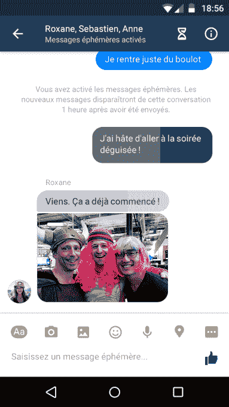

# Facebook Messenger 正在试验消失消息 

> 原文：<https://web.archive.org/web/https://techcrunch.com/2015/11/12/facebook-messenger-ephemeral/>

# Facebook Messenger 正在试验消失消息

Facebook Messenger 正在测试自毁消息。目前法国的一些 Android 和 iOS 用户可以使用这项功能，人们可以发送一小时内消失的消息。BuzzFeed 首先[报道了新闻](https://web.archive.org/web/20221128175521/http://www.buzzfeed.com/alexkantrowitz/facebook-messenger-tests-disappearing-messages-in-france#.cbnnPeaYV)。

在一份新闻声明中，脸书说“消失消息给人们在 Messenger 上交流时提供了另一个有趣的选择。我们期待听到人们在尝试时的反馈。”该公司尚未透露该功能是否以及何时将在其他国家推出。

用户可以通过点击屏幕右上角的沙漏图标来打开聊天中消失的消息。对话线程中的任何其他人都可以关闭该功能。

【T2

虽然短暂的消息可能有助于 Messenger，声称拥有 7 亿用户的[与 Snapchat 更直接地竞争(据报道，脸书](https://web.archive.org/web/20221128175521/http://recode.net/2015/06/12/facebook-messenger-hits-700-million-total-users/)[曾试图以近 30 亿美元收购该应用](https://web.archive.org/web/20221128175521/http://blogs.wsj.com/digits/2013/11/13/snapchat-spurned-3-billion-acquisition-offer-from-facebook/))，但几个顶级消息应用已经推出了类似的功能。

例如，拥有 2 . 11 亿用户的 Line 最近[推出了“隐藏聊天”，](https://web.archive.org/web/20221128175521/https://beta.techcrunch.com/2015/10/12/line-adds-end-to-end-encryption-to-its-mobile-messaging-app/)或在设定时间内消失的加密信息。微信是中国最受欢迎的信息应用，拥有超过 5 亿用户，自 2014 年以来，它允许人们[回忆信息。](https://web.archive.org/web/20221128175521/http://thenextweb.com/apps/2014/06/23/wechat-gets-inspired-by-the-ephemeral-messaging-trend-now-lets-you-recall-sent-messages/)

然而，Facebook Messenger 中短暂消息的主要吸引力不仅仅在于发送敏感信息。正如 TechCrunch 的 Josh Constine 所指出的，消失的消息与现实生活中的对话相呼应，Messenger 试图通过阅读回执和[快速自拍摄像头](https://web.archive.org/web/20221128175521/https://beta.techcrunch.com/2014/04/28/facebook-messenger-video/)等功能来复制这种体验。

这不是脸书第一次尝试短暂的信息传递。2012 年 12 月，就在 Snapchat 刚刚起步的时候，[脸书推出了 Poke](https://web.archive.org/web/20221128175521/https://beta.techcrunch.com/2012/12/21/facebook-poke-vs-snapchat-what-is-the-difference/) ，一项类似的发送自毁照片和视频的服务。

尽管有人猜测它会成为 Snapchat 杀手，但脸书·普克未能获得关注。从那时起，Snapchat 已经获得了大约 2 亿月用户，并建立了一个生态系统，该系统已经超越了消失的照片，包括了更丰富的功能，如直播故事。