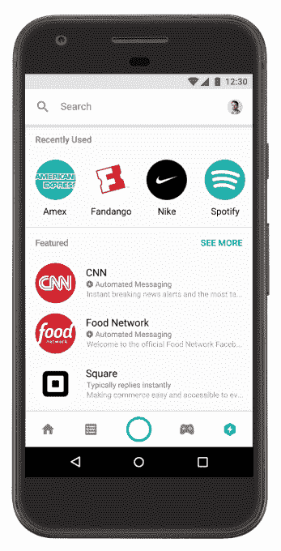

# Facebook Messenger 发布 Discover，与聊天机器人展开较量

> 原文：<https://web.archive.org/web/https://techcrunch.com/2017/06/28/facebook-messenger-launches-discover-as-it-takes-on-chatbots-again/>

# Facebook Messenger 发布了 Discover，它(再次)采用了聊天机器人

脸书还没有完全放弃聊天机器人；今天，该公司推出了 Discover，这是 Messenger 内部的一个中心，用于发现新的有趣的聊天机器人来发送消息。

脸书在 F8 宣布的部分将面向美国用户上线，该公司称这是人们以更有用的方式与企业和品牌互动的机会。你猜对了，这个平台就是一个发现新机器人的平台。在标签中，你可以浏览机器人的类别，查看特色机器人，并检查你最近使用的机器人。

Discover 将使找到机器人变得更加容易，但该功能似乎更多地是为了重新强调聊天机器人这一媒介。

众所周知，Messenger 在尝试新功能时速度很快，甚至比核心的脸书应用程序还要快，去年有大约两周的时间，他们在大力推销机器人的想法。聊天机器人的基本原则非常有趣，但它们太傻了，似乎没有太多用处。

随着这些功能在与朋友的信息线程内移动，脸书希望用户更多地将它们视为实用工具，而不是可以交谈的语音助手式的机器人。

脸书已经开始通过其“M”人工智能助手将聊天机器人式的功能添加到 Messenger 的 DNA 中，但该公司希望建立一个平台，实现用户和企业之间的自动化互动，因为它希望让页面成为品牌的更多默认在线主页，并传递你与他们沟通的方式。

随着 Discover 平台的推出，聊天机器人肯定会受到更多关注；我们将会看到开发者是否会再次尝试这个平台，或者这个趋势是否会消失。