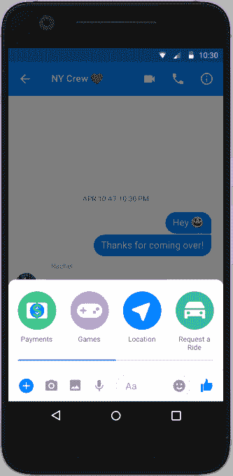
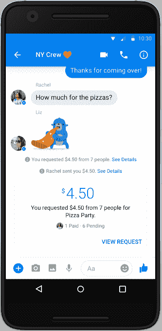

# Facebook Messenger 现在支持团体支付

> 原文：<https://web.archive.org/web/https://techcrunch.com/2017/04/11/facebook-messenger-now-supports-group-payments/>

脸书在 2015 年初在 Messenger 中引入了个人对个人[支付，但今天该公司](https://web.archive.org/web/20230326022543/https://techcrunch.com/2015/03/17/facebook-pay/)[宣布](https://web.archive.org/web/20230326022543/https://newsroom.fb.com/news/2017/04/get-paid-back-announcing-group-payments-in-messenger/)该功能也将扩展到支持团体。支付功能在群聊和私人聊天中基本上是一样的，但现在允许用户通过点击支付图标(美元符号)向群中的每个人或单个成员支付。

首先点击群组对话左下方的加号，即可选择付款图标。这是其他较少使用的功能，如游戏、位置共享、乘车请求等，被藏在一个新的可滚动用户界面中的地方，该界面与本月早些时候[脸书首次推出的信使助手 M 一起推出。](https://web.archive.org/web/20230326022543/https://techcrunch.com/2017/04/06/facebook-messengers-ai-m-suggests-features-to-use-based-on-your-convos/)

脸书建议，这项新功能对于每个人都凑钱购物(比如团体礼物)或者分摊餐馆账单的团体来说会很有用。在这些领域，今天的人们仍然倾向于转向独立的支付服务，如 PayPal、Venmo 或 Square Cash。

除了向其他群组成员付款之外，您还可以在聊天中向群组成员请求付款。

脸书说，要做到这一点，请输入你希望每个人申请的金额，或者在整个团队中平均分配的总额，无论你是否参与计算。您还可以添加一条说明，说明这笔钱的用途(例如“披萨派对”)，然后点击“请求”将其发送到小组对话中。

群聊里会出现一条消息，显示是谁付费了。这些详细信息也可以通过全屏查看请求详细信息来获得。

脸书指出，这项服务可以免费使用，不需要密码。

支付是脸书业务的一个领域，多年来一直没有受到太多关注，尽管这家社交网络有可能为其庞大的用户群收集和存储支付数据——这些信息可以用于脸书的其他领域，比如游戏或电子商务。

[gallery ids="1475305，1475308，1475306，1475307"]

但脸书一直不愿完全承认其在支付领域的雄心，过去在推出 Messenger payments 时曾表示“不是在打造支付业务”相反，它表示，目标只是让 Messenger 本身更有用，从而更有竞争力。如今，这种情况在团体支付中仍在继续——脸书[没有提成](https://web.archive.org/web/20230326022543/https://www.recode.net/2017/4/11/15252854/facebook-messenger-payments-advertising-revenue-business-model)。

然而，支付是当今通讯应用的一个重要功能。Facebook Messenger 的竞争对手——如 [Snapchat](https://web.archive.org/web/20230326022543/https://support.snapchat.com/en-US/ca/snapcash) 和中国的[微信](https://web.archive.org/web/20230326022543/https://pay.weixin.qq.com/index.php/public/wechatpay)——已经支持应用内支付，Kik 本月详细说明了其打算[也在自己的应用](https://web.archive.org/web/20230326022543/https://venturebeat.com/2017/04/07/kik-ceo-payment-is-the-killer-feature-bots-are-waiting-for/)中添加支付功能。

在 Messenger 中增加团体支付功能的同时，有传言称脸书正准备在其另一款即时通讯应用 WhatsApp 中推出数字支付业务[。](https://web.archive.org/web/20230326022543/http://money.cnn.com/2017/04/04/technology/whatsapp-digital-payments-india-upi/)

团体支付从今天开始在美国上线。该功能最初在 Android 和桌面上可用。

*文章更新，包含供货信息。*