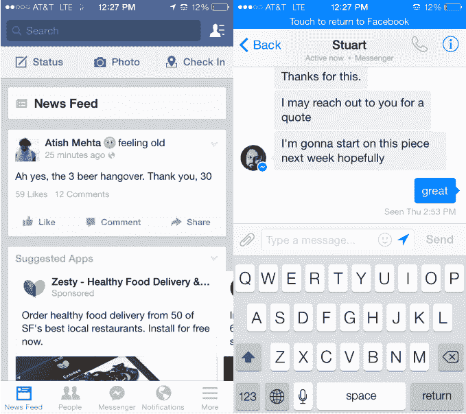

# 脸书强迫所有用户下载 Messenger，将聊天功能从其主要应用中剥离出来

> 原文：<https://web.archive.org/web/https://techcrunch.com/2014/04/09/facebook-messenger-or-the-highway/>

如今，脸书正将其独立应用战略推向一个新的极端。它开始通知用户，他们将不再有在脸书为 iOS 和 Android 发送和接收信息的选项，而是必须下载 Facebook Messenger 才能在手机上聊天。

脸书的主要应用程序一直都有一个功能齐全的消息选项卡。几个月前，也安装了脸书独立 Messenger 应用程序的用户把他们主要应用程序的聊天标签换成了打开 Messenger 的热链接按钮。但这是可选的。如果你想在脸书内部为 iOS 或 Android 发送消息，你只需不下载 Messenger。这将不再是一个选项。

很快，所有 iOS 和 Android 用户都会在他们的脸书应用程序底部有一个打开 Messenger 的热链接。

关于这一变化的通知将从今天开始发送给欧洲的一些用户，在要求下载 Messenger 之前，他们将有大约两周的时间看到多个警告。最终，所有脸书用户都将迁移到这个新协议。你可以打赌一些用户会很生气。

避免这种迁移的唯一方法是要么使用低端 Android，其操作系统太旧，无法运行 Messenger，要么使用脸书的移动网站，要么使用脸书的独立内容阅读器 app Paper。

在 11 月份我和马克·扎克伯格在[的一次台上谈话中](https://web.archive.org/web/20230326022033/https://techcrunch.com/2014/01/29/one-app-at-a-time/)，这位首席执行官透露了对今天变化的解释，脸书的公关团队刚刚让我参考了这个解释:

> “我们在 Messenger 上做的另一件事是，一旦你有了独立的 Messenger 应用程序，我们实际上就把消息传递从主要的脸书应用程序中去掉了。我们这样做的原因是，我们发现，在脸书应用程序中把它作为二等品，会让回复信息有更多摩擦，所以我们希望人们在这方面使用更专注的体验。”

从本质上来说，脸书认为其主要应用程序中的消息传递速度慢，被埋没，整体上不够理想。它的数字可能表明，人们在独立的 Messenger 应用程序上发送的消息更多，体验更好。

但是强迫用户采用一种新的信息行为可能会非常不受欢迎。不是每个人都想在主屏幕上管理多个脸书应用，或者把它们放在一个文件夹里。一部分脸书用户可能更喜欢用一个应用程序来处理脸书的一切事情，即使这意味着它会更慢，需要更多的点击才能获得他们的信息。

脸书因其臃肿的主要应用程序而受到批评，但这一声明似乎是矫枉过正，朝着每个功能都有自己的应用程序的方向大幅摇摆。显然，只需要维护一个移动聊天界面是有好处的。它促进了更快的特性开发和更好的稳定性。一旦用户完成了设置 Messenger 并适应其风格的繁琐工作，他们可能会更喜欢它。就我个人而言，我喜欢 Messenger 干净的外观、有趣的声音和快速的性能。

以下是我们为 Messenger 制作的实践视频以及对其设计师的采访:

然而，单方面的强制迁移正是脸书用户讨厌的那种变化，这只会滋生更多的偏执，认为他们的社交网络可能会在未经他们同意的情况下发生变化。采取一种较慢的“我们最终会改变所有人，所以你最好现在就做”的方法可能比“不管你喜欢与否，你熟悉的聊天界面将在两周内被破坏”更受欢迎。

快速行动的唯一真实解释是，非常时期需要非常手段。脸书正在海外为信息的命运而战。虽然它以 190 亿美元收购了 WhatsApp，但它仍必须与微信、Kik、KakaoTalk 和 Line 等独立的即时通讯应用进行竞争。除非被迫，否则用户可能会坚持使用旧的脸书应用程序的消息传递界面，而不是看到有一些东西可以更好地与这些其他应用程序竞争。不过，这不会让这种变化变得更容易接受。