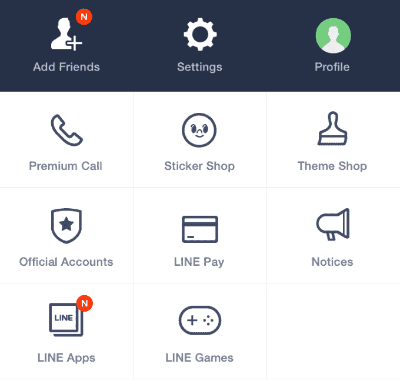
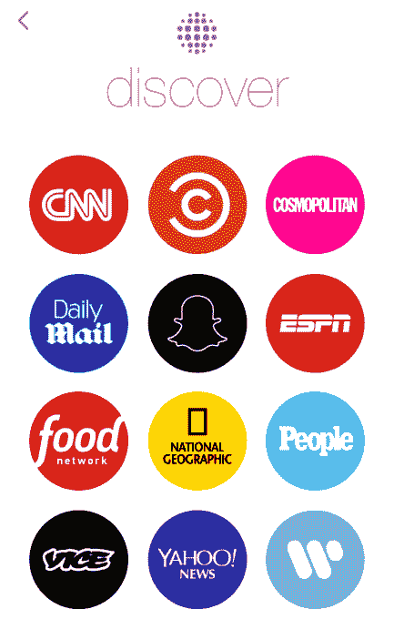
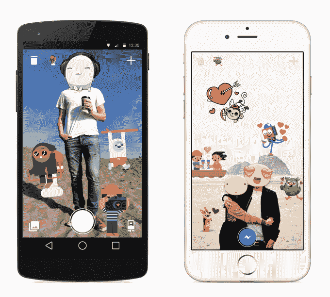

# 脸书计划将 Messenger 变成一个平台

> 原文：<https://web.archive.org/web/https://techcrunch.com/2015/03/19/facebook-messenger-platform/>

多个消息来源称，在下周的 F8 开发者大会上，脸书将宣布第三方通过其 Messenger 应用提供体验的新方式。脸书希望让 Messenger 更有用，因为亚洲的聊天应用微信和 Line 作为平台取得了成功，超越了与朋友发短信的范畴。

【更新:】脸书确实在 F8 发布了它的信使平台。正如我所报道的，它提供了用于创建和共享内容的第三方应用，以及与企业沟通的新方式。

首先，脸书将专注于第三方如何通过 Messenger 建立内容和信息流动的方式。根据早期实验的成功，脸书可能会考虑为 Messenger 带来更多的实用程序。

尽管所有消息来源都说 Messenger 平台是 F8 的主要部分，但尚不清楚第三方整合将采取何种形式。考虑到微信和 Line 所做的事情，有很多机会，包括企业与用户直接沟通或分享内容的方式，或者选择 更丰富的朋友间内容分享。

该平台可能会起步较慢，脸书将与优先合作伙伴合作，但最终可能会向更多开发者开放。脸书拒绝对此事发表评论。

## 避免垃圾邮件

脸书希望重现其早期网络平台努力的最佳部分，而不重复其错误。

脸书的网络画布因游戏而繁荣，因为它允许用户快速将他们的身份和朋友带到第三方体验中。它的 Open Graph 协议将人们的应用程序连接到他们的脸书个人资料。两者都很受欢迎，因为它们帮助开发者找到了感兴趣的受众。在移动时代，这尤其困难，因为应用程序商店已经变得高度竞争和拥挤。

脸书游戏垃圾邮件，大约 2010 年

问题是网络平台上充斥着大量的游戏垃圾邮件，脸书不得不减少其传播力。最终，在脸书对移动业务感到困惑且进展缓慢的时期，随着参与度转向手机，这种趋势逐渐消退。Open Graph 因过度分享而声名狼藉，因为它自动向新闻订阅器发布新闻、音乐和视频消费。

从这些经验中吸取教训，脸书可能会小心翼翼地不让垃圾邮件溜进其相对原始的 Messenger 应用程序。

## 受亚洲单一聊天应用的启发

到目前为止，Messenger 几乎完全是脸书的体验。网站可以集成一个[发送按钮](https://web.archive.org/web/20230404162627/https://developers.facebook.com/docs/plugins/send-button)，让用户将网址私下发送给朋友。但除此之外，Messenger 专注于让用户通过脸书自己的系统发送和接收文本、电话、照片、视频、贴纸、语音剪辑和金钱。

脸书微妙地暗示其聊天应用的新开发者功能将在 F8 推出，因为它告诉我 [Messenger 将在大会上发布公告](https://web.archive.org/web/20230404162627/https://techcrunch.com/2015/01/27/choose-your-f8/)。Messenger 负责人 David Marcus 去年告诉 Wired，他对企业和人们如何直接沟通(T5)很感兴趣(T4)，提到了许多人对按键式电话号码和航空公司客户服务的糟糕体验。脸书之前提供了一个鲜为人知的方法，让用户向脸书商业页面管理员发送私人信息。

对于 Messenger 的平台，脸书据说已经盯上了 Line 和微信。他们率先使用他们常用的即时通讯应用程序作为移动界面的中心，这些界面就像是一个整体的门户网站。Snapchat 是另一个最近探索了[平台方法](https://web.archive.org/web/20230404162627/https://techcrunch.com/2015/01/27/hands-on-with-snapchat-discover-fun-content-for-short-attention-spans/)的消息应用。

Line 的平台页面

日本 messenger Line 包括一个“更多”标签，可以访问贴纸店，购买优质表情符号并通过 Line 分享，Line Pay 最终在实体店进行快速交易，以及精选的 Line 配套应用和游戏集合。这些应用程序包括自制的表情符号制作工具，让你可以将自己的脸发送给朋友，Line Toss 用于照片共享，Line Brush 用于绘画，Line Card 用于发送贺卡，Line Camera 用于制作拼贴画，B612 用于自拍，Line WebToon 用于阅读漫画。

Snapchat 发现

Line 还允许用户关注官方账户，让他们直接从名人、娱乐公司、新闻机构以及保罗麦卡特尼(Paul McCartney)、行尸走肉(Walking Dead)、曼联(Manchester United)和英国广播公司(BBC)等品牌接收内容。与脸书和推特账户上不断涌现的帖子相比，Line 官方账户旨在与粉丝进行低音量、高信号的直接交流。

Snapchat 的 Discover 页面追求优质、精美的内容策略。像喜剧中心、CNN、Vice 和 ESPN 这样的主流媒体可以提供带有插播广告的快照格式的照片、文章和视频。与此同时，WhatsApp 的发送按钮让用户通过 WhatsApp 消息向朋友推送网址，从而为媒体属性带来了巨大的流量。

脸书可以从这些应用中获得灵感。对脸书来说，一个选择是让第三方帮助人们创建和分享更丰富的内容，比如通过 Messenger 美化照片。脸书已经发布了自己的[sticked For Messenger](https://web.archive.org/web/20230404162627/https://techcrunch.com/2014/12/19/facebook-stickers-for-messenger/)配套应用程序，用于在照片上粘贴贴纸并发送给朋友。

或者，脸书可以允许用户关注或访问官方账户。这可能有助于他们及时了解自己喜爱的、可能在新闻订阅中迷失的事物，或者以一种比打电话更有效的方式直接与企业沟通。另一种可能性是，脸书可能会让网络和移动内容更容易通过 Messenger 获得病毒式流量。脸书自己的新闻源可以为人们提供更好的方式，将他们看到的故事推送给 Messenger。

脸书坚持要信使

中国的微信平台更多地以商务为中心。用户可以通过消息应用购买电影票、支付出租车费用等。

虽然据说内容是脸书最初的 Messenger 平台努力的重点，但如果第三方体验获得牵引力，它最终可能会扩展到商业领域。就在本周，脸书增加了一种方式，通过添加借记卡，可以在 Messenger 上进行朋友间的免费支付。有了 Messenger 的原生支付界面，脸书将更容易获得更多的商业机会。

中国的微信在其应用程序中提供商务体验。Via [本尼迪克特·埃文斯](https://web.archive.org/web/20230404162627/http://ben-evans.com/benedictevans/2014/8/1/app-unbundling-search-and-discovery)

拥有超过 5 亿用户的 Facebook Messenger 已经成为世界上最受欢迎的应用之一。虽然脸书的主要应用程序本质上是其网站移植到小屏幕上的版本，但 Messenger 是为移动设备打造的。脸书是你懒洋洋地浏览的东西，没有什么意图，而 Messenger 是为采取行动和完成事情而设计的。对于世界各地的一些人来说，Messenger 已经成为他们使用脸书的主要方式。对那些不喜欢新闻提要的用户来说，改进内容是有意义的。

根据其支付功能产品经理史蒂夫·戴维斯的说法，脸书最近对 Messenger 的[任务是让它“更有用、更有表现力、更令人愉快”。现在，它准备从 1 Hacker Way 的墙外寻求一些帮助。](https://web.archive.org/web/20230404162627/https://techcrunch.com/2015/03/17/facebook-pay/)