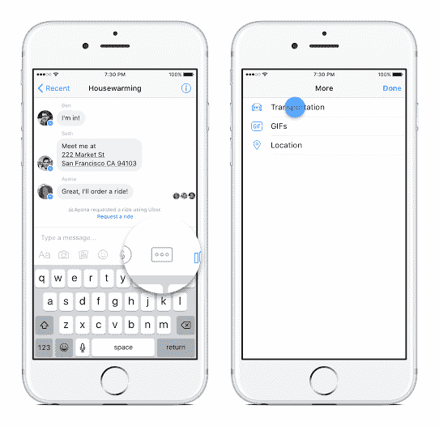
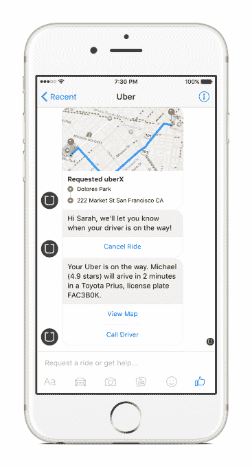
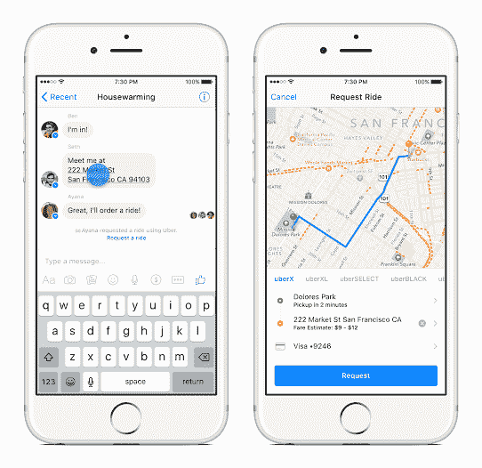

# 你现在可以在 Facebook Messenger 上订购 Ubers(很快还会订购 Lyfts ),证明你已经上路了

> 原文：<https://web.archive.org/web/https://techcrunch.com/2015/12/16/facebook-messenger-transportation/>

Facebook Messenger now 让你订购[【交通】](https://web.archive.org/web/20230326022839/http://newsroom.fb.com/news/2015/12/introducing-transportation-on-messenger/)，从优步开始，还会有更多服务。脸书的妙处在于，通过 Messenger 订车会提醒你聊天圈子里的人你确实搭到了一辆车……而不是你撒谎说你还穿着睡衣。

这并不是拼车应用第一次与信息应用挂钩。在美国以外使用的信息和通话应用微信也允许用户在中国的滴滴等拼车平台上预订汽车。然而，在最近一场持续的中国拼车大战中，微信的母公司[腾讯多次阻止用户](https://web.archive.org/web/20230326022839/https://techcrunch.com/2015/08/23/hey-uber-welcome-to-china/#.gj9gqv:qxmx)在优步预订。

但脸书声称，这种合作不一定是受微信的启发。“对我们来说，我们更多的灵感来自于我们看到用户使用 Messenger 的方式，我们刚刚看到群聊越来越受欢迎，这是为什么 Messenger 如此伟大的最佳使用案例之一，”脸书产品经理 Seth Rosenberg 说。

## 它是如何工作的

在 Messenger 中新的优步功能可以通过点击汽车图标或者在你写消息的下方的三点“更多”菜单中找到“交通工具”来找到。这两个操作都会打开优步的请求乘车选项，您可以在其中添加上车地点、目的地和汽车类型。

[Facebook URL = " https://www . Facebook . com/Dave Marcus/videos/10156429336080195/"/]

每个使用信使运输的人将获得 20 美元的优步信用。优步很少向已经是用户的人发放这种免费积分，但不知何故，脸书说服它创造一个使用信使运输的大激励。

> 我们只是让人们习惯于这样一种想法，即您可以在 Messenger 上发送消息，而不仅仅是向其他人发送消息。塞斯·罗森伯格，脸书产品经理

脸书和优步不愿就新功能可能带来的收入分成发表评论，但脸书确实计划通过 Messenger 获得更多业务。罗森伯格列举了一堆用例，比如最终在应用中预订机票或抢票。“我们只是让人们习惯于这样的想法，你可以在 Messenger 上发送信息，而不仅仅是人，”他说。

该计划与优步的最新增长战略——在其他平台上使用其 API 非常契合。优步[今年早些时候推出了其开发者平台](https://web.archive.org/web/20230326022839/https://devblog.uber.com/tap-a-button-get-a-ride-from-every-app/)，以每名新用户 5 美元的 rev share 报价，吸引企业在其应用程序中嵌入“优步乘车请求按钮”。

根据 Rosenberg 的说法，Lyft 允许在 Slack 中进行类似的整合[，但优步是第一个推出 Messenger 应用程序的运输合作伙伴。](https://web.archive.org/web/20230326022839/https://techcrunch.com/2015/11/03/slack-improves-slash-commands-so-you-can-call-a-lyft-and-more-from-inside-slack/)

优步的请求乘车按钮的公共 API 有一个[政策，禁止合作伙伴将其与竞争乘车服务一起展示](https://web.archive.org/web/20230326022839/https://techcrunch.com/2015/12/02/uber-ride-request-button/)。然而，优步告诉我们，由于 Messenger 运输功能是通过私人整合建立的，因此反竞争政策并不适用，Messenger 可以包括 Lyft 等其他服务。

脸书和优步都直接回避了关于 Lyft 整合的问题，但一位知情人士告诉 TechCrunch，Lyft 将从 1 月份开始通过 Facebook Messenger 提供乘车服务。Messenger 已经与[荷航](https://web.archive.org/web/20230326022839/http://www.tnooz.com/article/klm-facebook-messenger/)合作提供机票预订服务，但是已经推迟到明年年初。

## 信使作为优步的客户服务层

优步还计划使用 Messenger 作为实时客户服务的测试案例——这是优步一直被批评缺少的。“我们将开始通过 Messenger 测试实时支持，以确定这是否是通过这种方式开始使用实时支持的最佳方式，”优步的 API 和战略合作伙伴关系负责人 Rahul Bijor 说。

根据脸书的数据，Messenger 上有 7 亿人，如今在美国的几个城市，通过该应用订购优步的能力已经扩展到其中的一大部分人。优步的一位发言人告诉 TechCrunch，这项新功能很可能会在圣诞节前提供给美国的每个人。这应该会让你在去下一个节日派对的路上更容易在你的优步里找到朋友。

