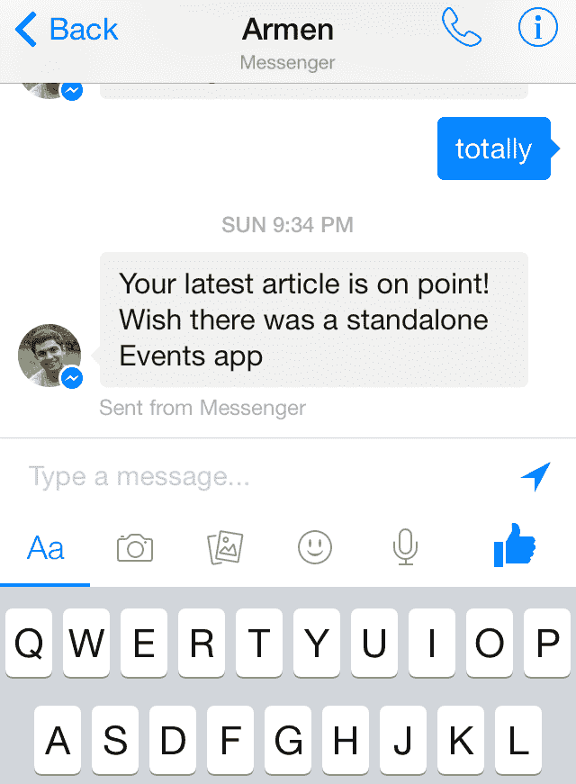
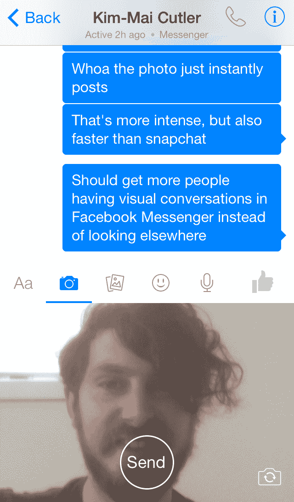

# Facebook Messenger 为 Snapchat 风格的可视对话添加了视频和更快的自拍 

> 原文：<https://web.archive.org/web/https://techcrunch.com/2014/04/28/facebook-messenger-video/>

# Facebook Messenger 为 Snapchat 风格的可视对话添加了视频和更快的自拍

人们喜欢通过照片和视频交流的亲密感。Snapchat 证明了这一点。现在，脸书希望在 Messenger 中进行更多这样的可视对话，所以它在 iOS 今天的[更新中添加了视频共享以及更快的照片上传和相机访问，该更新将于本周推广到 Android。新的信息编辑器将相机、照片卷轴、贴纸和音频信息全部一键搞定。](https://web.archive.org/web/20230131000121/https://itunes.apple.com/us/app/facebook-messenger/id454638411?mt=8)

脸书甚至希望贴纸具有对话性，所以它让它们成为了病毒。当有人给你发送贴纸时，你可以点击并按住它来下载该包。由于“最近的对话”选项卡上有一个新的始终打开的搜索栏，因此可以更快地找到您想与之聊天的人。

到目前为止，Facebook Messenger 只能发送照片，不能发送视频。现在你可以在线发送和观看，但不能在应用程序中录制。WhatsApp 最近透露，其用户每天分享 [1 亿个视频](https://web.archive.org/web/20230131000121/http://blog.whatsapp.com/613/500000000)，这可能在脸书手下点燃了一把火，让这个功能得以发布。

新的自拍系统让 Messenger 有了更直接的感受。轻触可见的相机图标，半个屏幕变成正面相机取景器。再轻触一下，你的自拍照就会立即发出。实际上，这比 Snapchat 要快得多，Snapchat 总是在你拍摄完一张照片后强迫你通过收件人选择屏幕。

新设计牺牲了一些聊天窗口空间，为文本编辑器下面的新附件栏腾出空间。但是通过让多媒体选项立即可用，脸书可以让更多的 2 亿信使用户分享不仅仅是文本。