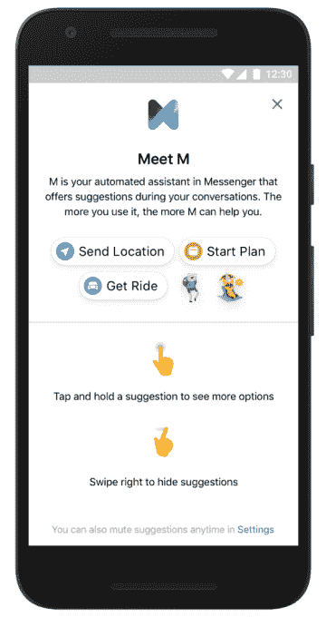
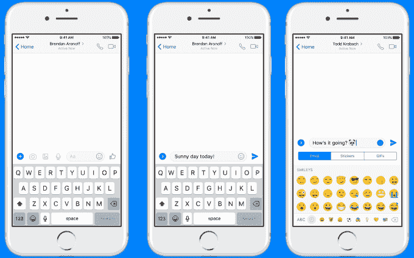

# Facebook Messenger 的人工智能会根据你的召集建议你使用的功能

> 原文：<https://web.archive.org/web/https://techcrunch.com/2017/04/06/facebook-messengers-ai-m-suggests-features-to-use-based-on-your-convos/>

写下“你欠我 20 美元”, Messenger 会建议你使用它的支付功能。如果有人说“再见”，Messenger 会推荐一个“再见”GIF。这就是脸书的新 M 建议的工作方式。

脸书的人工智能助手会在你的 Messenger 对话中，在重新设计的单行消息编辑器上方私下插入这些建议，除非你批准，否则你的朋友不会看到结果。今天，M 条建议在美国向所有 iOS 和 Android 用户推出，更多国家也将推出。

它们旨在展示隐藏在 Messenger 内部的所有功能，因为它努力成为不仅仅是一个短信替代品。除了贴纸和支付，M Suggestions 还可以推荐 Lyft 和优步的位置共享、定时提醒、群聊投票和拼车选项。

## 旧 M 学习，新 M 帮助

你可能还记得 2015 年开始测试的 [M。从那时起，一小部分用户被允许向 M 发送任何请求，它试图满足这些请求，首先依靠 AI 解析问题并检索它已经学习的答案。如果它被难住了，它会求助于一组人类员工来帮助它，然后教它下次自己做这项工作。](https://web.archive.org/web/20230404080710/https://techcrunch.com/2015/08/26/facebook-is-adding-a-personal-assistant-called-m-to-your-messenger-app/)

脸书 M 公司的产品经理洛朗·兰多夫斯基说，问题是“它不能扩展到数百万人”，他是自然语言处理初创公司 Wit 的联合创始人。脸书获得的人工智能。

所以现在，“M 的原始版本将继续帮助我们理解和了解更多关于。。。我们需要建设什么，人们想要什么。”本质上，开放式 M 将继续处理对封闭测试人员集的请求，以便脸书可以确定它的人工智能可以可靠地完成什么任务，以及什么文本表明什么意图。然后，它会慢慢地把这些能力带给 M 建议。

BuzzFeed 和 [The Information](https://web.archive.org/web/20230404080710/https://www.theinformation.com/how-messenger-and-m-are-shifting-gears) 报道称，成熟的 M 个人助理将会改变方向，更多地成为脸书人工智能的训练基地。

## 脸书第一个大规模的私人助理

m 建议将脸书的人工智能向更广泛的受众开放。随着新的 Messenger composer 的重新设计，许多不同功能的按钮被折叠在一个可扩展的菜单中，但 M 建议将帮助您找出它们。

M 不会把同样的体验应用到每个人身上，而是会了解每个用户的习惯，并为他们进行个性化定制。如果你总是忽略 M 条建议，你会看到的更少。或者，如果你从来不使用它的支付功能，而是不断发送贴纸，它只会建议你使用后者。

如果你真的讨厌 M，你可以使用 Messenger 设置将它完全静音，或者关闭某些类型的推荐。尽管它只是一个人工智能，而不是人类，但有些人可能会被脸书扫描他们的信息内容以提供这些建议的行为吓到。

[gallery ids="1473793，1473796，1473792，1473794，1473795，1473791"]

目前，我的建议主要集中在 Messenger 的内部功能上。但纳入 Lyft 和优步的叫车服务表明，它在推荐外部开发者服务方面可能有更大的雄心。脸书目前在 bot discovery 方面有一个很大的问题，去年推出了自动消息代理，但没有一个简单的方法来找到可用的代理。m 建议可能会向你推荐机器人，让你加入到你的对话中。

虽然有很多问题 M 有一天可以帮你解决，但现在它要处理的是脸书持续时间最长的问题之一:特性太多，你不知道该怎么处理。