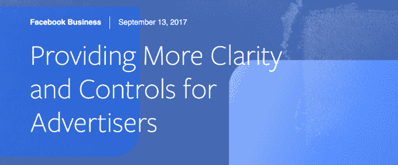

# 脸书禁止将暴力、色情、毒品和仇恨货币化

> 原文：<https://web.archive.org/web/https://techcrunch.com/2017/09/13/facebook-monetization-2/>

脸书希望内容创作者赚钱，但不能以牺牲其建立的家庭友好型社交网络或其广告客户的诚信为代价。所以今天[脸书为](https://web.archive.org/web/20221209055708/https://media.fb.com/2017/09/13/standards-and-guidelines-for-earning-money-from-your-content-on-facebook/#more-6590)[制定了正式的规则](https://web.archive.org/web/20221209055708/https://www.facebook.com/business/news/providing-more-clarity-and-controls-for-advertisers)哪些内容不能通过品牌内容、即时文章和插播视频广告赚钱。这些包括对死亡或煽动性社会问题的描述，甚至作为新闻或宣传活动的一部分。

这是一件大事，因为它可以塑造为 [Facebook Watch](https://web.archive.org/web/20221209055708/https://beta.techcrunch.com/2017/08/09/facebook-watch/) 创作的内容风格，这是一个新的原创节目中心，出版商在这里赚取 55%的广告收入。

脸书还计划给广告商更多透明度，让他们知道谁在哪里看到他们的广告，这样他们就知道他们的品牌不会被放在令人不快的内容旁边。

在接下来的几个月里，脸书将开始展示活动前分析，分析哪些出版商有资格在他们的即时文章、视频广告插播和场外观众网络库存上开展广告商的活动。下周将会推出完整的名单，到 10 月份。在接下来的几个月里，脸书将提供所有展示广告位置的活动后报告。

最后，脸书正在采取更多措施，对广告欺诈进行第三方验证。全球营销解决方案副总裁 Carolyn Everson 写道，脸书承认它被指责为“给我们自己的作业打分”。此前[发生了几起丑闻](https://web.archive.org/web/20221209055708/http://techmeme.com/search/query?q=facebook+metrics&wm=false)涉及 bug 扰乱向客户报告的广告指标，广告公司高管声称[视频广告的可视率只有 20%到 30%](https://web.archive.org/web/20221209055708/https://digiday.com/marketing/facebook-video-ad-viewability-rates-low-20-percent-agencies-say/) ，远低于行业基准。

这也是脸书加入可信责任组织(TAG)“反欺诈认证”计划的原因。它还在未来 18 个月内寻求媒体评级委员会(Media Ratings Council)对其广告印象报告、第三方可视性和两秒钟最小观看时间视频广告购买的认可。它还致力于将 DoubleVerify 和 Meetrics 添加到现有的 24 家第三方广告测量合作伙伴名单中。

这些认证和分析可以让脸书的广告客户相信，他们的广告没有显示在不良内容旁边，实际上正在被浏览，正在被正确计数。这反过来可能会说服他们向脸书注入更多现金，该公司上个季度收入 93.2 亿美元，利润 38.9 亿美元。

## 不可模仿的内容

今天货币化规则的正式化统一了脸书现有的社区标准、页面条款和支付条款，并对不能货币化的内容进行了更具体的说明。脸书表示，如果广告从内容中删除，它将通知出版商，他们可以对决定提出上诉。

以下是脸书列出的禁止内容类型:

**盗用儿童角色**–描述家庭娱乐角色参与暴力、色情或其他不当行为的内容，包括以喜剧或讽刺方式定位的视频。例如，角色遭受严重的人身伤害，参与恶劣或令人震惊的行为，或参与吸烟或饮酒等行为。

**悲剧&冲突**——关注真实世界悲剧的内容，包括但不限于对死亡、伤亡、身体伤害的描述，即使目的是为了提高意识或教育。例如，自然灾害、犯罪、自残、医疗条件和绝症等情况。

**有争议的社会问题**——煽动性、煽动性、贬低或贬低他人、团体或事业的内容不符合广告条件。对个人或团体进行攻击的内容通常不适合做广告，即使是在新闻或宣传的背景下。

**暴力内容**–描述针对人或动物的威胁或暴力行为的内容，其中这是焦点，没有额外的背景。例子包括打斗、流血、殴打动物或人的内容，或者在视频游戏过程中过度的图形暴力。

**成人内容**–重点是裸体或成人内容的内容，包括以露骨或暗示的姿势描绘人物，或过度暗示或性挑逗的活动。

**禁止的活动**–描述、构成、促进或推动销售或使用非法或违法产品、服务或活动的内容。示例包括以协同犯罪活动、吸毒或故意破坏为特征的内容。

**露骨内容**–描述过度生动的图像、血液、开放性伤口、体液、手术、医疗程序或血块的内容，旨在引起震惊或恐惧。

**药物或酒精使用**–描述或宣传过度饮酒、吸烟或药物使用的内容。

**不恰当的语言**–内容不应包含过度使用贬损性语言，包括旨在冒犯或侮辱特定人群的语言。

最有趣的是，脸书并没有区分美化这些内容的出版商和分享这些内容以提高知名度或谴责的出版商。相反，这一切都被混为一谈。这可能会微妙地迫使出版商放弃报道世界上从战争到社会正义等更偏离主题的内容，因为他们知道自己无法从中赚钱。

同样，虽然脸书[试图避免成为一家媒体公司](https://web.archive.org/web/20221209055708/https://beta.techcrunch.com/2016/12/21/fbonc/)，但对不能货币化的内容设定这些激进的规则，类似于对其批准的内容做出编辑决定。尽管只要遵守脸书的标准政策，出版商仍可自由分享部分内容，但金钱激励可能会激发自我审查。