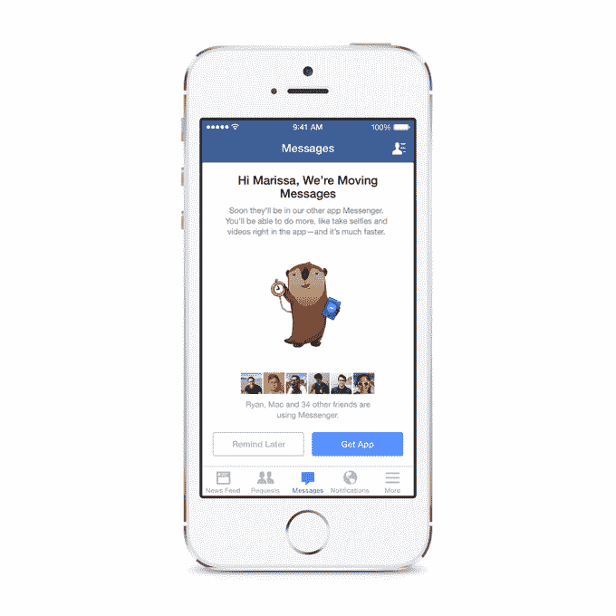
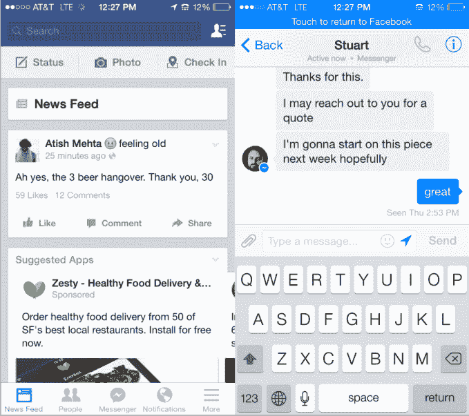

# 脸书强迫全球用户下载 Messenger 进行手机聊天

> 原文：<https://web.archive.org/web/https://techcrunch.com/2014/07/28/facebook-moving-messages/>

在接下来的几天里，[脸书](https://web.archive.org/web/20230404163624/http://www.crunchbase.com/organization/facebook)将停止在其主要的 iPhone 和 Android 应用程序中发送消息，并强制其全球所有用户[下载其独立的 Messenger 应用程序](https://web.archive.org/web/20230404163624/https://www.facebook.com/mobile/messenger)。脸书首先[在四月份开始要求欧洲用户](https://web.archive.org/web/20230404163624/https://techcrunch.com/2014/04/09/facebook-messenger-or-the-highway/)使用 Messenger，但是在看到参与方面的“积极成果”后，它向所有人推出了该计划。脸书告诉我，Messenger 上的用户回复速度提高了约 20%，不支持多个版本的手机聊天将有助于其主要应用和 Messenger 变得更好。

移动网络、iPad、功能手机、Windows Phone、纸质和桌面用户仍然可以像以前一样在他们的主要脸书应用程序或网站上发送消息，暂时不会被强制迁移。

以前，人们可以通过脸书智能手机应用程序的信息标签聊天。他们也可以选择下载 Messenger，这将把 Messenger 标签变成一个通知中心和快捷方式，点击一下就能让用户快速切换到 Messenger。

不过，很快，iPhone 和 Android 用户将被迫进入这种反复无常的状态。在聊天最终在主要应用程序中停止工作之前，他们会收到一些下载 Messenger 的可选通知。脸书还将向人们发送一封电子邮件，解释这一变化将产生的影响，以及为什么会发生这种情况。

通知中那个挥舞着时钟的小水獭很可爱，但他肯定会惹恼一些人。

脸书拒绝发表关于这一变化的博客帖子，这可以被视为试图避免过多的媒体关注。相反，它会直接通知用户，并通过官方声明联系我:

> “在接下来的几天里，我们将继续通知更多人，如果他们想要发送和接收脸书消息，他们需要下载 Messenger 应用程序。正如我们所说，我们的目标是将开发工作集中在使 Messenger 成为最好的移动通讯体验上，并避免拥有不同的脸书移动通讯体验的混乱。每月有超过 2 亿人使用 Messenger，我们将继续努力，让它成为一种更具吸引力的联系方式。”

脸书在其主要应用程序中用 Messenger 快捷方式取代了“信息”标签(左图)，用户可以快速切换到 Messenger，并可以选择返回(右图)

虽然强制迁移的理由可能是合乎逻辑的，但这并不意味着它会得到用户的认可。

有些人可能只是不想担心管理两个不同的脸书应用程序。其他人可能会喜欢允许消息多任务处理的聊天头界面，这样他们就可以在他们正在做的事情上聊天。

但脸书反驳说，人们在使用 Messenger 时会发送更多的照片、群发信息、视频、贴纸和音频剪辑。这可能意味着他们有更好的体验。随着 Messenger 上的 2 亿用户每天发送 120 亿条消息，脸书希望围绕该应用统一努力，并跳过在其主要应用程序中维护并行版本的代码。

在这个动手演示和采访中，您可以观看 Messenger 的设计者解释他们为什么构建快速切换快捷方式:

Messenger 确实是一种更干净、更快捷、更有趣的发送消息的方式。过去几个月情况越来越好。它最近增加了[录制视频分享](https://web.archive.org/web/20230404163624/https://techcrunch.com/2014/04/28/facebook-messenger-video/)，以及一个光滑的分屏自拍按钮，用于快速捕捉 [Snapchat 风格的照片和视频](https://web.archive.org/web/20230404163624/https://techcrunch.com/2014/06/12/snapchatssenger/)。在版本 8 中，它是一个成熟稳定的独立应用，不像新生的 [Swarm 应用，Foursquare 强迫用户下载](https://web.archive.org/web/20230404163624/https://techcrunch.com/2014/05/15/foursquares-swarm-and-the-rise-of-the-invisible-app/)才能签到。

然而，这一严厉的举措仍然会让那些已经厌倦脸书的人感到厌恶。由于有大量的其他消息应用程序和短信可用，他们有很多地方可以进行移动聊天。

根据数据，如果有足够的时间让尘埃落定，这一举措可能是一个聪明的方法，可以提高消息的使用，并让用户适应脸书蓬勃发展的独立应用程序家族，其中也包括纸张和弹弓。最终它也可以为脸书赚钱，因为上周首席执行官马克·扎克伯格证实[信使最终将通过允许支付](https://web.archive.org/web/20230404163624/https://techcrunch.com/2014/07/23/facebook-messenger-payments/)来货币化。

但目前，脸书可能正在伤害公众对自己的看法，并强化这样一种看法，即它随心所欲地改变，而不考虑用户的需求。扎克伯格似乎满足于玩长线游戏。