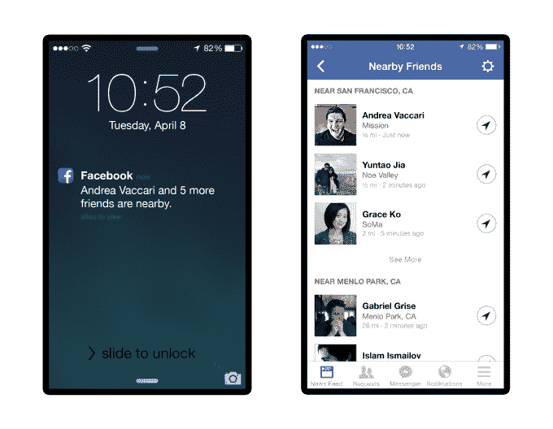

# 脸书推出“附近的朋友”,可选择实时位置共享，帮助您结识 

> 原文：<https://web.archive.org/web/https://techcrunch.com/2014/04/17/facebook-nearby-friends/>

今天，脸书开始推出一项新的选择加入功能，名为[附近的朋友](https://web.archive.org/web/20221211115834/http://newsroom.fb.com/news/2014/04/introducing-a-new-optional-feature-called-nearby-friends/)。它可以让朋友知道你离他们大概有多远，并且你可以在有限的时间内与他们分享你的确切位置。虽然这肯定会引起隐私问题，但随着未来几周在美国推出 [iOS](https://web.archive.org/web/20221211115834/https://itunes.apple.com/us/app/facebook/id284882215?mt=8) 和 [Android](https://web.archive.org/web/20221211115834/https://play.google.com/store/apps/details?id=com.facebook.katana) ，附近的朋友可能会让人们在现实世界而不是网上与朋友共度更多时间。

以下是对“附近的朋友”如何运作、如何建立、其隐私含义、如何影响竞争格局及其对脸书的长期机遇的深入分析。但这是 tl。灾难恢复版本:

附近的朋友是由安德里亚·瓦卡里领导的格兰西位置分享应用团队创建的，脸书于 2012 年收购了该团队。它为脸书的 iOS 和 Android 应用程序添加了附近的朋友列表。如果你靠近朋友，它还会发送通知，如果有人告诉你他们的准确位置，你会在地图上看到。

瓦卡里告诉我，“这个想法是为了让人们很容易发现你身边的人，然后见面共度时光。”它希望为那些偶然相遇的人提供便利，在那里你会遇到一个朋友，最后一起吃顿饭或出去玩。这是脸书将人们联系起来的使命的真实体现，也是对脸书孤立我们的批评的反驳。



这项功能可能会给 Foursquare 和 Google Latitude 等尚未普及的其他位置共享应用带来麻烦，因为脸书已经将其内置于其核心的 iOS 和 Android 应用中，这些应用拥有庞大的用户群。它还可能挑战 Highlight、Banjo、Sonar、Connect 和更多初创公司的朋友聚会功能。【披露:我为一位大学朋友的秘密社交位置共享初创公司提供建议，该公司位于旧金山，代号为‘Signal’。AOL 和 TechCrunch 的编辑已经批准了这个顾问角色。]据脸书称，让附近的朋友开着会导致电池电量耗尽，但不像其他一些定位应用那么糟糕。

至于隐私，附近的朋友是选择加入的，所以你可以忽略它，如果你不想使用它，永远不必使用它。它只对 18 岁以上的人开放。它使用了一种互惠隐私模式，因此只有当你和朋友都打开它时，你才能看到你和他们的距离，只有当他们有意与你分享时，你才能看到他们的确切位置。虽然您可以选择特定的朋友列表或群组来分享您的亲密关系，但许多人可能只是让他们所有的朋友都可以看到，这是一个非常广泛的网络。这一点以及忘记关闭附近的朋友是多么容易导致无意中的“过度分享”。[ **更新**:脸书证实[将利用你附近朋友的位置历史向你投放广告](https://web.archive.org/web/20221211115834/https://beta.techcrunch.com/2014/04/18/facebook-location-advertising/)。]

如果人们使用提供的工具管理他们的隐私，附近的朋友可以帮助他们与更多的朋友聚会，参加周二的晚餐，周五晚上的聚会，或者周六在公园里。

## 附近的朋友如何工作

一旦你获得了附近朋友的首次展示，你会在 iOS 或 Android 的“更多”下的脸书导航菜单的应用列表中看到它。在那里，您可以选择打开附近的朋友，并选择是否要与您所有的朋友或特定的朋友列表或群组共享您的附近。

然后，您将能够看到附近的朋友列表，该列表以 1 英里为增量显示与您共享您的邻近关系的任何人的距离(< 0.5 英里、0.7 英里、1.8 英里)，这些人也选择加入并启用了附近的朋友。该列表还显示了某人最后一次查询位置的时间戳，如果你在大城市，它还会显示他们的邻居。

在这些朋友的名字旁边有一个位置图标，你可以点击它向那个人发送你的实时位置。你将有机会选择分享你的位置多长时间(一个小时，几个小时，直到明天，直到我手动停止)，并包括一条 40 个字符的消息，说明你正在做什么或想做什么，也许还可以请求他们向你发送他们的确切位置。否则你可以给某人发一条脸书消息，让他们把他们的位置发给你。任何与您共享其精确坐标的人都会显示在地图视图上。

使脸书附近的朋友不同于竞争对手，并可能给它一个优势的是，它的中心是广播的邻近性，而不是位置。比起我们在地图上的位置，我们更愿意分享我们离某人有多近，这基本上是一样的。如果有人在附近，你会知道，并可以 ping 他们的准确位置和会议。广播位置令人毛骨悚然，所以我们不太可能分享它，并可能导致尴尬的插播，有人试图在你不希望他们来看你的时候来看你。该产品只有在很多人使用的情况下才能发挥作用，而且对接近度的关注使得它足够私密，人们可能会使用它。

这里有一个来自脸书的短片，展示了附近的朋友是如何工作的:

```
为了得到你的位置，脸书会频繁地提取你的 GPS 坐标。为了最大限度地减少电池消耗，它会读取你的加速度计，而不是像你静止不动时那样频繁地拉动位置。脸书的测试显示附近的朋友每小时减少 0.3%到 0.4%。这低于 Foursquare 此前表示的每小时 0.7%的电量消耗，脸书认为它比谷歌纬度更有效，尽管大 G 尚未公布任何具体的电池统计数据。瓦卡里告诉我“电池节能是我们开发产品的核心原则之一。”
如果你没有打开附近的朋友，脸书可能会通过展示一些有趣的新闻故事来哄你选择加入，比如“你的 3 个朋友现在就在附近，打开附近的朋友，看看他们是谁以及有多近”。如果你打开了它，你会看到你附近好友列表的摘要。
![nearby_friends[1]](img/c8efcc0572fc67ff7c82493afd27ab3b.png)
如果你打开了附近的朋友，脸书还会偶尔向你发送通知，告知你有一个选择加入的朋友就在附近。它智能地查看那个人经常去的地方，以便如果你住在一个街区之外，他们每次去工作时都不会 ping 到你，它读取他们的位置和加速度计，以确保他们只是开车经过，但实际上已经停下来，并可能可以出去闲逛。
附近朋友的一些常见用例包括:“哪些朋友也在公园里？”"这场音乐会上还有其他人吗？""附近有谁能和我一起喝咖啡？"“我在一个新城市，我有哪些朋友在这附近？”但也有更多的利基可能性。为了安全起见，您可以在旅行时打开与家人共享永久精确位置的功能。当你飞到一个机场，你可以看看你的朋友是否也在那里，你可以一起搭车。
脸书最近强调了其对独立应用的新关注，推出了新的[创意实验室计划和论文](https://web.archive.org/web/20221211115834/https://beta.techcrunch.com/2014/01/30/facebook-creative-labs/)。但是“附近的朋友”内置在脸书的核心应用中，因为瓦卡里说它只有在“系统中有很多人的情况下”才有效。一个独立的应用程序会让我们有机会做出更大的决定…但在主应用程序中进行，我们保证你会在那里找到你的大多数朋友。”然而，瓦卡里表示，它仍有可能在未来成为自己的应用。目前，附近朋友的成功可能取决于脸书愿意在 feed 中推广产品的程度。它现在被埋在导航菜单中，旁边是[附近的地方](https://web.archive.org/web/20221211115834/https://beta.techcrunch.com/2012/12/17/facebook-nearby/)，Yelp 的竞争对手脸书去年推出的，大家都忘记了。
瓦卡里承认在我们的采访中他有点紧张，因为他已经为附近的朋友工作了两年。Glancee 曾试图开发一个社交发现应用程序来结交新朋友，但意识到“在结识新朋友之前，与你已经认识的人联系很重要，包括不是你最亲密朋友的人。”当脸书来敲门时，他看到了利用现有的社交图来建立一个让人们真正面对面交流的产品的机会。他希望人们可以利用附近的朋友与他们最好的朋友，以及他们喜欢但没有足够近的人一起发短信。
商业潜力？
脸书说，现在，附近的朋友不会被用于广告定位。但是不可否认的是，位置数据对于社交网络来说是多么有价值。想象一下，如果你在新闻订阅中看到的广告是一个街区外的餐馆或商店的广告。这些肯定会与用户更相关，对企业更有效。
[ **更新**:脸书告诉我“目前它没有被用于广告或营销，但将来会被用于。”下面是我们关于脸书将如何从你的位置数据中赚钱的后续报道。]
隐私安全吗？
作为一个不断分享你与朋友的距离或你的确切位置的功能，脸书试图让它尊重我们的隐私。它是选择加入的，所以没有人会发现自己在没有故意打开它的情况下分享他们的坐标。你可以随时轻敲几下就关掉它。您可以设置谁可以看到您的邻近，他们必须与您共享他们的邻近才能看到您的邻近，您必须明确共享确切的位置，除非您设置为无限期共享，否则您的确切位置将在一天内消失。
当我直截了当地问瓦卡里这个功能是否有足够强的隐私性时，他说“是的，我们认为有。默认情况下，产品的构建方式是安全的。默认情况下，位置不精确。我们希望你知道，这是一个见面的机会，而不是(你的朋友)在哪里。”

但是仅仅因为脸书建造了安全选项并不意味着人们会使用它们。
人们应该创建一个亲密朋友的列表，他们愿意分享他们的亲密关系，并选择它作为隐私设置。然而，大多数人不会，只会和他们所有的朋友分享。这将包括老板、同事、家庭成员，以及他们见过一次面但接受了好友邀请的人。
人们会忘记关掉它。他们会无限期地分享他们的确切位置，并计划在一起度假后关闭它，但不会记得这样做。
幸运的是，由于该应用程序基于邻近度，最糟糕的情况可能是你的老板在凌晨 2 点看到你在靠近酒吧区的某个地方，或者不在你的公寓附近。或者配偶看到你下班后没有离家更近——也许是因为你和朋友一起喝啤酒，但也许是因为你……这带来了一个问题，那就是伴侣们通过强迫一方不断分享他们的确切位置，从本质上跟踪对方。瓦卡里说，有很多利基应用程序可以做到这一点。但是如果有人已经安装了脸书，那就简单多了。
附近的朋友将是对我们自己保护自己能力的考验。脸书为我们提供了所有必要的隐私选项，并设置了尊重的默认值。熟练使用，附近的朋友可以像 Foursquare 和所有其他签到产品一样解锁现实世界的互动。比起金钱、权力或成功，我真的相信与你爱的人共度时光是通往幸福的最佳途径。我们有很多分享和消费记忆的工具。最后，脸书建立了一个功能，将帮助我们创建它们。

```