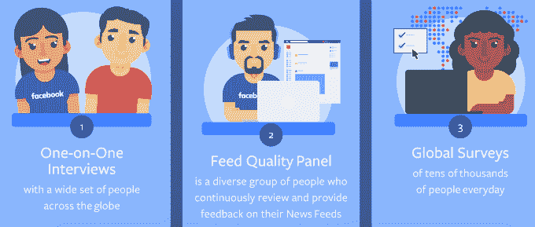

# 预测信息内容的脸书 feed 变化可能会重新调整新闻的优先顺序

> 原文：<https://web.archive.org/web/https://techcrunch.com/2016/08/11/facebook-news-feed-algorithm/>

新闻媒体可能会找回一些被 6 月脸书供稿算法改变偷走的魔力，该算法改变了[对朋友比对出版商](https://web.archive.org/web/20230404065142/https://techcrunch.com/2016/06/29/facebook-news-feed-change/)的偏好。今天，脸书[将开始预测信息丰富的故事](https://web.archive.org/web/20230404065142/http://newsroom.fb.com/news/2016/08/news-feed-fyi-showing-you-more-personally-informative-stories/)，如果它们“与人们的兴趣相关，如果它们让人们参与更广泛的讨论，如果它们包含新闻”，就将它们突出显示给人们。

脸书调查了成千上万的人，看他们发现了哪些有价值的新闻。它得出结论，这些是让人们以这种方式看待一个职位的品质。然后，它建立了一个个性化的新闻订阅模型，以促进未来的故事，这些故事与评级良好的故事有共同点，并与用户已经参与的内容相匹配。

“这可能是一篇时事新闻，”脸书写道。但由于每个人对信息内容都有自己的主观看法，它也可能是“一个关于你最喜欢的名人的故事，一条当地新闻，一部即将上映的电影的评论，一份食谱，或者任何能告诉你的东西。”

脸书告诉我，这不是一个剧烈的变化，更多的是对已经足够好的故事进行重新排序，使其出现在你的提要中，而不是注入或删除某些故事。该公司写道，“我们预计大多数页面在新闻 订阅中的分布不会有任何重大变化。有些页面的推荐流量可能会略有增加，有些页面可能会略有下降。”

此举可能会平息出版商的一些担忧，即来自你朋友的空洞内容会显得比重要新闻文章更重要。他们仍在评估两个月前“朋友和家人第一”的重大变化的影响。然而，有趣的是，一些用户报告他们订阅源中发布者的帖子明显减少。

## 脸书如何一步步预测信息含量

脸书的[博客文章](https://web.archive.org/web/20230404065142/http://newsroom.fb.com/news/2016/08/news-feed-fyi-showing-you-more-personally-informative-stories/)宣布了今天的更新，这有点含糊不清，但我敦促该公司详细说明它是如何建立这一新的预测模型的。

首先，它管理了众包调查及其 Feed Quality 计划，要求用户根据他们看到的故事的相关性、娱乐性和信息量从 1(真的没有信息量)到 5(真的有信息量)进行排名。它将信息量为 4 和 5 的帖子输入其预测模型，教它寻找什么。

然后，根据用户与帖子作者的关系、他们在已经活跃的评论卷轴上评论帖子的频率以及他们通常点击的帖子类型，为每个用户个性化该模型。所有这些信号都与现有的机器学习算法相结合，脸书使用这些算法来扫描你参与的帖子内容，以识别他们关心的话题。

新闻源使用这个模型来扫描他们能看到的所有可能的故事。它预测帖子将提供个人信息，然后获得更多的可见性。

脸书说，既然每个人都认为什么是有价值的是不同的，这种变化不一定会全面提高新闻的可见性。不过，与脸书最近宣布将绕过网络广告拦截器(这是出版商讨厌的事情)类似，今天的更新可能会改善脸书与新闻行业的关系。那些真正关心新闻的人可能会看得更多。

详细说明这些新闻源的变化可能会引起依赖它来获得推荐流量的企业的担忧。但这战胜了持续的暗中怀疑，即脸书正在像过去一样秘密改变饲料的物理定律。