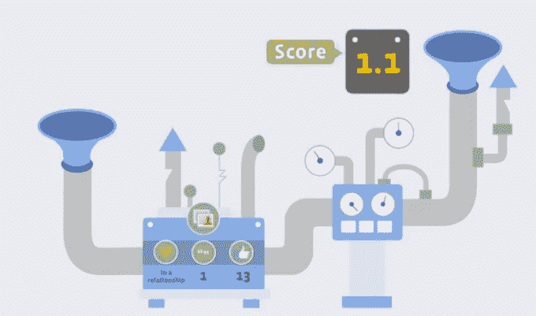
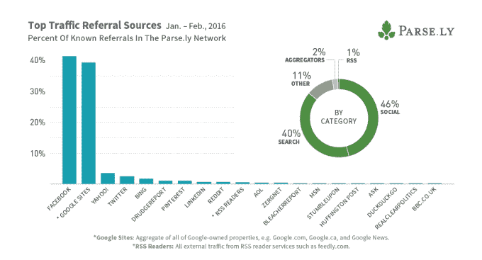
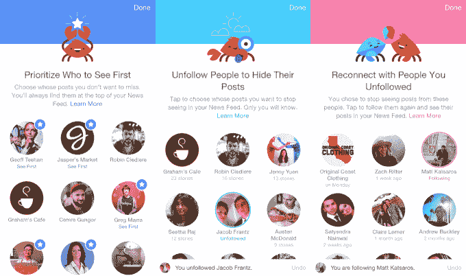
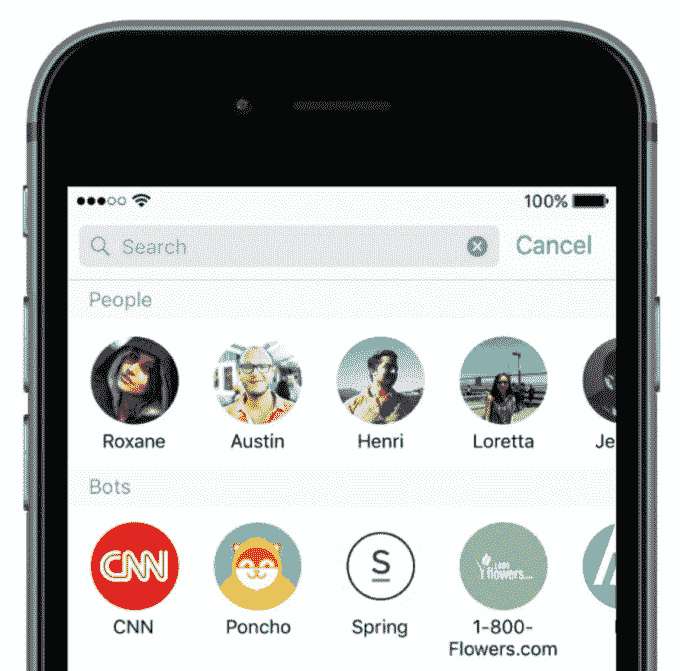

# 脸书在“新闻订阅价值”和排名变化中将朋友置于出版商之上

> 原文：<https://web.archive.org/web/https://techcrunch.com/2016/06/29/facebook-news-feed-change/>

在保守趋势的惨败之后，脸书正在将自己推向新的透明度标准。该公司正在[发布](https://web.archive.org/web/20230404035945/http://newsroom.fb.com/news/2016/06/building-a-better-news-feed-for-you/)一份正式的“新闻订阅价值”文件，详细说明它如何决定在你的订阅中显示什么——这是用户中的一个常见问题。

这些核心价值观是:朋友和家人第一，feed 应该提供信息和娱乐，脸书是一个所有想法的平台，真实的交流胜过垃圾邮件，你可以控制隐藏或突出你想要的东西，脸书将不断迭代以改善体验。

脸书今天也改变了排名[,将“朋友和家人第一”的价值观付诸实践。新闻提要现在将显示来自朋友的帖子，这些帖子比来自像新闻媒体这样的页面的帖子更靠前。页面的覆盖面和推荐流量应该会下降，特别是如果他们依赖于直接点击他们的帖子，而不是他们的追随者的再分享。](https://web.archive.org/web/20230404035945/http://newsroom.fb.com/news/2016/06/news-feed-fyi-helping-make-sure-you-dont-miss-stories-from-friends/)

脸书的 Adam Mosseri 解释说，虽然新闻提要是由计算机算法进行排名的，但“新闻提要是由人设计和建造的系统，这些人有价值观，这些价值观反映在我们如何定期做出决定。”通过公开巩固这些价值观，用户可能会相信，脸书在决定向他们展示最佳内容时，并没有不可告人的动机。

## 人类的感觉，算法的理想

脸书每天在构建你的新闻源时，会从数千个潜在故事中进行选择。它永远不会向你展示一切。尽管人们平均每天花 50 分钟在脸书的房产上，但内容太多了。

脸书如何计算在新闻提要中显示什么的粗略公式

事实上，随着时间的推移，选择出现的内容变得越来越困难，因为越来越多的用户和发布者加入了社交网络，他们分享的频率也越来越高。对空间的竞争导致对任何特定内容的触及范围不可避免地减少，引发了对脸书有目的地选择能为其赚钱的故事的指控，或者是为了被看到而恶意推动页面付费广告的指控。

但实际上，脸书的首要目标是创建一个让人们满意的 feed 既包括从点击量和花费时间来衡量的参与量，也包括根据它不断为用户样本提供的调查来衡量的质量。

莫塞里在脸书近 10 年的大部分时间里都在为其新闻 feed 工作，上周他在脸书的门洛帕克总部与记者坐下来讨论了 Feed 的工作方式，以及公司的价值观如何决定它的发展。

[更新:我们已经删除了莫塞里讲话的音频记录，我们将很快添加一个全文转录的链接。]

## 付诸实践的价值观

### 以下是脸书提出的每一个价值观是如何付诸实践的:

### ***亲朋好友第一***

脸书建立在将人们与他们的朋友和家人联系起来的理念之上。这仍然是今天新闻订阅的驱动原则。我们的首要任务是让您与您想联系的人、地点和事物保持联系——从您在脸书的朋友开始。这就是为什么如果它来自你的朋友，它会出现在你的 feed 中，句号——你只需要向下滚动。为了帮助确保您不会错过您可能关心的朋友和家人的帖子，我们将这些帖子放在您的新闻订阅源的顶部。我们向你学习，并随着时间的推移而适应。例如，如果你倾向于喜欢你姐姐的照片，我们将开始把她的帖子放在靠近你的订阅源顶部的位置，这样你就不会错过她在你不在时发布的内容。

*我们的研究还表明，除了朋友和家人，人们对新闻订阅还有另外两个强烈的期望:*

*● **你的饲料要通知**。人们希望他们订阅源中的故事对他们有意义——随着时间的推移，我们了解到人们重视他们认为有价值的故事。一个人觉得有益或有趣的东西可能与另一个人觉得有益或有趣的东西不同——这可能是一篇关于当前事件的帖子、一个关于你最喜欢的名人的故事、一条当地新闻或一份食谱。我们一直致力于更好地了解对您个人而言什么是有趣和有益的，因此这些故事会出现在您的订阅源中的较高位置。*

*● **你的饲料要招待**。我们还发现，人们喜欢把他们的订阅作为一种娱乐。对一些人来说，这是跟随一个名人或运动员；对于其他人来说，这是观看直播视频和与朋友分享有趣的照片。我们努力理解和预测脸书上哪些帖子让你觉得有趣，以确保你不会错过这些帖子。*

**什么意思**

这里的潜台词是，脸书把用户的利益放在出版商、开发商、广告商甚至自己的盈利之上。这是因为脸书知道，如果它不优先考虑人们，他们不会继续回来。没有受众，出版商无法产生推荐流量，开发者无法获得应用安装，广告无法产生销售，脸书将会枯萎。

最近，天平似乎向有利于新闻出版商的方向倾斜了太多。在选举周期和大型出版商学习如何制作视觉刺激的视频之间，feed 开始感觉由新闻媒体而不是普通人主导，现在脸书正在收拾残局。Parse.ly 称脸书为出版商提供了 41.4%的推荐流量，甚至超过了谷歌的 39.5%。它粉碎了所有其他的流量来源。

不过，脸书实际上是在告诉沉迷于其推荐的出版商，“那是你的问题”。当需要限制交通流量时，脸书肯定会采取外交手段。但导致 Facebook Instant Articles 崛起的相同情况将决定这里的事情，尽管它们赋予脸书对出版商更大的权力:脸书需要出版商的内容，但它不需要任何一家特定的出版商，因为独立媒体永远不会联合起来抵制，因为一些独立媒体可能会结痂并仍然在那里发布，他们都受社交网络的支配。

“我预计出版商的阅读量会有小幅下降，但幅度会很大，”莫塞里说。“我们试图让人们更多地与朋友和家人联系起来，因为人们告诉我们，他们对它更感兴趣，他们觉得它正在被淹没。”

同样有趣的是，脸书清楚地描述了它成为公用事业的目标如何取代它成为娱乐来源的愿望，尽管两者都很重要。莫塞里解释说:“信息丰富并不一定意味着硬新闻……还有其他信息丰富的东西。了解球类运动是有益的。学习如何做烘肉卷…是有益的。(我真的很喜欢烘肉卷三明治)……所以这是获取信息内容的一种广泛途径。”

脸书希望不仅仅是大量的病毒视频或迷因。用户可能会被吸引去点击肤浅的内容，但这可能会让人觉得过于琐碎，最终无法令人满意。让用户了解朋友的生活和时事使得脸书不那么容易被替代或跳过。

### ***所有想法的平台***

我们不负责挑选世界应该阅读哪些问题。我们的工作是将人们和想法联系起来，并将人们与他们认为最有意义的故事联系起来。我们的诚信取决于包容所有观点和看法，并使用排名将人们与他们认为最有意义和最有吸引力的故事和来源联系起来。我们不喜欢特定种类的资源或想法。我们的目标是提供我们得到的反馈中个人最想看到的故事类型。我们这样做不仅是因为我们相信这是正确的事情，也因为这对我们的业务有好处。当人们看到他们感兴趣的内容时，他们更有可能花时间在新闻订阅上，并享受他们的体验。值得注意的是，虽然我们欢迎多种观点，但我们也坚信人们在使用脸书时应该感到安全，因此我们有社区标准来定义我们认为在平台上不可为的行为。我们认为，在不使脸书成为人们遭受攻击、仇恨或其他有害行为的地方的情况下，实现包容性是可能的。

**什么意思**

脸书在传达这样的信息:新闻反馈是我们利益的反映，而不是某个傀儡主人在控制他们。尽管有这些指控，脸书认为压制保守趋势或任何其他类型的内容只会给那些想看的人带来不满意的体验。通知和娱乐群众，饲料将不断突出显示你。

那么，为什么现在披露这些新闻提要值呢？显而易见的答案是，脸书在媒体上被指责压制保守趋势，部分原因是这些趋势是如何选择的缺乏透明度。在今天的提要变化可能伤害出版商之前，它需要围绕提要的透明度。

“我们意识到我们需要做得更好，做得更多，”莫塞里说。虽然他多年来一直在公开谈论 News Feed，而这家公司也一直在宣布算法上的变化，但莫塞里承认:“我们在成熟度以及如何进行有效沟通方面还处于上升阶段，这只是一个里程碑，并不是终点。我们还有很多事情要做。”

实际上，这意味着尽管脸书的决策可能偏向于其宣称的价值观，“我们不会试图决定一个观点、一个议程或一位政治家应该得到更多的分配。但这不是我们的职责，”莫塞里说。

***可信通信***

*我们社区的力量取决于真正的沟通。我们得到的反馈告诉我们，最能引起共鸣的是真实的故事。这就是为什么我们努力工作来理解人们认为哪种类型的故事和帖子是真实的——这样我们就可以在 News Feed 中显示更多的故事和帖子。我们还致力于了解人们认为哪些类型的报道具有误导性、耸人听闻和垃圾邮件性质，以确保人们较少看到这些报道。我们社区的力量取决于真正的沟通。我们得到的反馈告诉我们，最能引起共鸣的是真实的故事。这就是为什么我们努力工作来理解人们认为哪种类型的故事和帖子是真实的——这样我们就可以在 News Feed 中显示更多的故事和帖子。我们还致力于了解人们认为哪些类型的报道具有误导性、耸人听闻和垃圾邮件性质，以确保人们较少看到这些报道。*

**这意味着**

垃圾邮件在脸书并不好用。人们看穿了这个猜谜游戏。

莫塞里告诉记者:“我们通过各种方式一遍又一遍地发现，人们更喜欢真实可信的内容，而不是那些自认为不真诚或见不得人的东西。公开发布更多原始真实时刻的公众人物往往比发布更多经过处理和打包的内容的公众人物表现得更好。”

人们和出版商接触大量受众的最佳方式是真实地发布帖子，而不是试图欺骗受众喜欢或点击。与人交谈，就像他们是人而不是机器人顾客一样。名人和出版商听起来越像朋友，他们就能得到越多的反馈。这是脸书推动视频直播的一个重要原因——它迫使人们脱离剧本，保持真实。

### **你掌控你的体验**

*最终，你知道什么对你最有意义——这就是为什么我们开发了控件，让你可以定制你看到的东西。“取消关注”、“隐藏”和“先看”等功能可以帮助您设计自己的体验，当您使用这些功能时，我们会将您的行为作为反馈，帮助我们更好地了解哪些内容对您最重要。例如，如果你对某人隐瞒了一个故事，那就意味着你以后不太想听那个人的故事了。随着新闻源的发展，我们将继续构建易于使用且功能强大的工具，为您提供最个性化的体验。*

**什么意思**

虽然新闻源的算法对你看到的内容做出最终决定，但这些决定都是基于你提供给它的数据。从你的朋友和关注的人，到你点击的内容，到你隐藏或标记为垃圾邮件的帖子。虽然这看起来不可思议，但是提高你的新闻订阅的最好方法就是教它。隐藏和不关注无聊或烦人的事情。喜欢某样东西，如果你真的喜欢它，而不是仅仅浏览过去。

### **常数迭代**

我们认为我们的工作只完成了 1 %,并一直致力于改进。当我们寻找改进的方法时，我们将继续征求反馈。我们将尽可能开放—尽可能在新闻提要 FYI 中提供解释，并寻找机会分享我们的工作方式。

**什么意思**

[脸书](https://web.archive.org/web/20230404035945/https://techcrunch.com/2016/04/21/facebook-news-is-new/) [调整](https://web.archive.org/web/20230404035945/https://techcrunch.com/2016/02/01/facebook-news-feed/)[新闻](https://web.archive.org/web/20230404035945/https://techcrunch.com/2014/04/10/how-to-show-up-in-news-feed/) [进给](https://web.archive.org/web/20230404035945/https://techcrunch.com/2013/08/23/facebook-feed-changes/)不间断以确保其与上述数值一致。如果某些东西失去平衡，脸书就有用户消失的风险。新闻提要不断演变，以挫败旨在利用它的策略，因此，即使你看到一些东西比你认为的更引人注目，它也可能会在下一次排名更新时被放回原处。

脸书收集了大量关于人们想看什么的行为和调查数据。这是 200 人的新闻订阅团队能够跟上超过 10 亿每日访客的兴趣的唯一方法。

“另一个……人情味……是我们评价成功的方式。”Mosseri 说。“当我们发起变革时，我们会看到人们的行为是否有所不同。我们看他们做什么，说什么。他们喜欢的多还是评论的多？他们会花更多的时间吗？他们分享的更多吗？等等。”

在新闻订阅的早期，脸书提供了滑动条，这样用户可以准确地选择出现的内容，但后来逐渐淘汰了这些控件。

问题是，行为数据本身可能偏好实际上并不令人满意的点击诱饵。这就是为什么“我们也看人们怎么说。我们每天在世界各地用 30 多种语言进行数万次调查。我们会询问人们对某个故事有多感兴趣，或者对他们的经历有多满意。我们一直用这些答案来指导我们的决策，这是一种人情味，但却是非常个人化的。”

## 用户>出版商、企业、开发商、广告商

这可能是一颗难以下咽的苦药丸，但企业需要正视这样一个事实:它们在脸书人心中并不是第一名。如果有的话，很快就没有用户留给脸书分享了。

脸书正在保护来自出版商的新闻源，但也必须保护信使免受聊天机器人的攻击

2010 年，脸书侥幸躲过了这场灾难。来自 Zynga 的 FarmVille 等游戏的垃圾邮件泛滥成灾，惹恼了非游戏玩家，将他们从脸书赶走。虽然 Zynga 受益于你让朋友帮你的虚拟奶牛挤奶，但它伤害了用户，脸书为了平台的长期健康对 feed 进行了彻底的改变，以阻止游戏垃圾邮件。

虽然没有这么彻底，但脸书今天对新闻出版商也在做同样的事情，而且更加坦率和透明。与此同时，该公司必须小心保护其 Messenger 应用程序免受今年 F8 开发者大会上发布的聊天机器人大军的攻击。

脸书的未来不仅依赖排名算法，还依赖人工智能。如果脸书可以理解你的订阅源中可能的帖子的语义，并将它们与你过去喜欢的内容类型进行匹配，它就可以预测哪些状态会通知你，哪些照片会让你开心，哪些视频会让你开心。