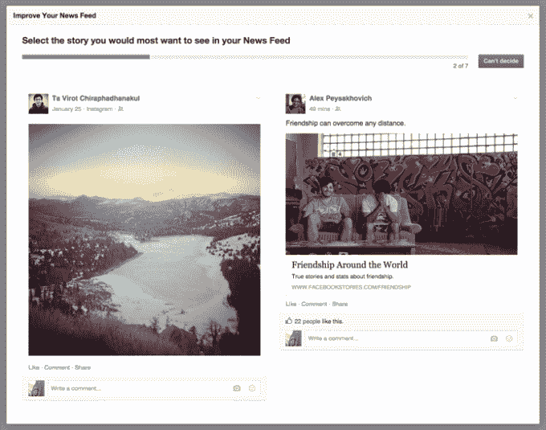
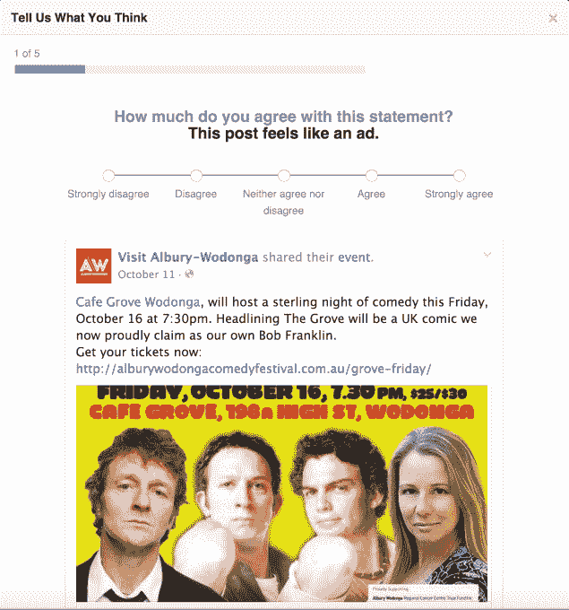

# 为了对抗 Clickbait，脸书的 Feed 优先考虑调查结果

> 原文：<https://web.archive.org/web/https://techcrunch.com/2016/02/01/facebook-news-feed/>

到目前为止，脸书对新闻报道进行排名的重点是你点击、喜欢、评论和分享的内容。但是由于新的定性调查[的洞察力，用户给每一个 feed 故事一至五颗星，脸书](https://web.archive.org/web/20230404151908/http://www.slate.com/articles/technology/cover_story/2016/01/how_facebook_s_news_feed_algorithm_works.3.html)[现在严重依赖第二个信号](https://web.archive.org/web/20230404151908/http://newsroom.fb.com/news/2016/02/news-feed-fyi-using-qualitative-feedback-to-show-relevant-stories/)——你想看到的。这可能会降低耸人听闻的头条新闻的知名度，或者公然吸引你参与。

结果应该是一个更容易阅读的提要，而不仅仅是更容易点击。如果一张照片或状态更新很有趣或有趣，它不一定需要你的触摸才能展示给更多的人。分享值得一看的内容的网页和新闻发布者可能会获得推荐流量和覆盖范围，而那些旨在欺骗你点击的人可能会忍受下降。

脸书也进行了调查，询问人们更喜欢 T4 的两个新闻提要调查中的哪一个

脸书还进行了调查，了解人们是否认为某些帖子是广告，或者他们更愿意看到两个帖子中的哪一个

这种算法调整使得脸书的信息在近十年后仍保持新鲜。让垃圾邮件发送者淹没在蹩脚的营销、诽谤性的标题或不停的帖子中是太聪明了。与此同时，该算法确保无论你添加多少好友，订阅源都保持相关。

最重要的是，你几乎不用做任何工作。随着时间的推移，Twitter 正在遭受这个问题的困扰。不断从你的 tweet 流中剔除过度分享者，整理列表，并决定你发现的每个账户是否值得它占用的空间，这是一件苦差事。这一点，以及缺乏来自你现实世界朋友图表的固定受众，为主流用户树立了一个障碍，损害了 Twitter 的增长前景。

脸书还开展了一项调查，调查人们是否认为网页上的某些促销广告实际上是广告

但是，脸书最近开始直接询问人们他们想看什么，而不是仅仅看典型用法发出的隐含信号。当他们滚动时，用户被要求根据他们喜欢看到帖子的程度从一颗星到五颗星对帖子进行排名。平均每天约有 1500 篇帖子有资格出现在用户的 feed 中，而对于重度 Facebookers 用户来说，这一数字高达 1 万，因此排序算法至关重要。

这就是看到一个被遗忘的高中同学回复编织教程的故事和你最好的朋友订婚的区别。这就是当你不得不查看脸书时，和每天不断回来，一边和朋友联系一边吸收广告之间的区别。