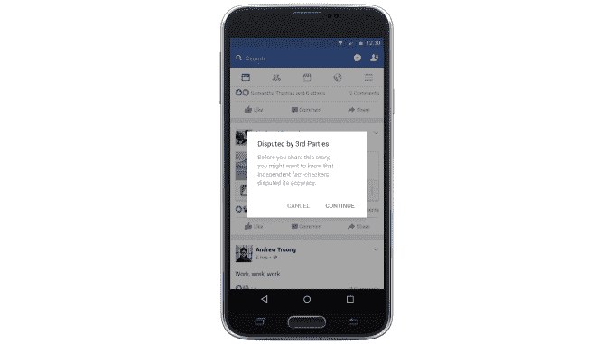
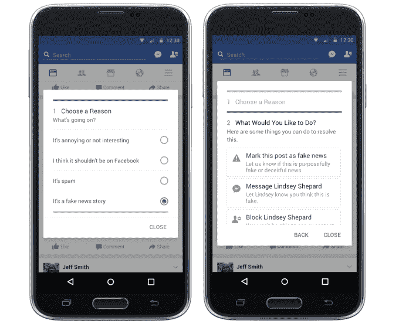

# 在外部事实审查员的帮助下，脸书现在对假新闻进行标记和降级

> 原文：<https://web.archive.org/web/https://techcrunch.com/2016/12/15/facebook-now-flags-and-down-ranks-fake-news-with-help-from-outside-fact-checkers/>

Snopes、FactCheck.org、Politifact、ABC News 和 [AP](https://web.archive.org/web/20230404155745/https://blog.ap.org/announcements/the-fight-against-fake-news) 将帮助脸书实现马克·扎克伯格做出的六个[承诺中的四个](https://web.archive.org/web/20230404155745/https://www.facebook.com/zuck/posts/10103253901916271)，打击假新闻，而不让它成为“真相的仲裁者”[它将使假新闻帖子不那么显眼](https://web.archive.org/web/20230404155745/http://newsroom.fb.com/news/2016/12/news-feed-fyi-addressing-hoaxes-and-fake-news/)，将事实审查员的警告附加到供稿中的假新闻，使报道恶作剧更容易，并扰乱假新闻垃圾邮件发送者的经济激励。

“我们不想进入观点的灰色地带，”脸书新闻供稿副总裁 Adam Mosseri 告诉我。“我们在这项工作中特别关注的是最坏的情况——通常是垃圾邮件发送者为了经济利益而故意分享的明显骗局。”

脸书现在将提到事实核查服务，这些服务遵循 [波因特的国际事实核查网络事实核查人员的原则准则](https://web.archive.org/web/20230404155745/http://www.poynter.org/fact-checkers-code-of-principles/)由用户和算法标记的最恶劣和最具病毒性的假新闻文章。这些包括无党派和公平；来源、方法和资金的透明度；以及致力于改正错误。脸书从上面的五个开始，但希望这个列表能增长到几十个，以迅速就故事的准确性达成共识。

如果他们确认某篇报道是假的，他们会通过一个专门为他们建立的特别报道网站通知脸书，网站上还会有一个链接，指向一篇揭穿这篇文章的帖子。然后，脸书会在新闻提要的下方显示这些链接的帖子。如果用户将要分享一个可疑的链接，它还会附上一个警告标签，注明“受到[一个或多个事实检查员]的质疑”，并附有一个链接，指向新闻订阅源故事和状态编辑器中的揭穿帖子，此外还禁止有争议的故事被转化为广告。

脸书将只发送最受欢迎的潜在假新闻，以避免淹没事实审查员；如果出版商不同意他们的标签，他们将不得不和第三方交涉。莫塞里证实，这些事实核查服务不会从脸书获得任何报酬，但可能会从揭穿帖子链接中获得流量和品牌推广。

至于为什么服务部门会免费做事实核查工作，Mosseri 说，“我们遇到了很多积极的情况。我们相信，我们正在做的事情与他们的使命是一致的。”至于他们过于激进地将报道贴上虚假标签的风险，Mosseri 说。“我认为他们争论的问题将会非常公开，这将使他们处于健康的审查之下。因此，如果他们开始争论，试图获得流量，人们会看到他们在争论什么，如果有任何问题，就叫他们出来……我认为实际上双方都有制衡。”

除了警告，脸书还通过新闻订阅右上角的下拉菜单让用户更容易举报假新闻。它将分析人们在阅读文章后是否会明显减少分享文章的可能性，并以此作为一个信号，表明一篇文章的价值很低，应该在新闻提要中显示得不那么突出。

试图伪装成合法出版商(想想 TechCrunch.co 而不是真正的 TechCrunch.com)的垃圾脸书页面将会减少他们的报道。脸书将继续检测人们评论“假”或“骗局”的链接，以降低排名和转介给事实审查员。

最后，脸书正试图打击有目的的假新闻传播者。它将不再允许广告中的域名欺骗，以前垃圾邮件发送者说广告会导致合法的出版商而不是他们自己的网站。脸书还将扫描涉嫌造假者的登陆页面，如果他们主要是广告覆盖的垃圾网站，可能会对他们采取执法行动。

莫塞里承认，“我们有多种信仰，这些信仰并不矛盾，但确实有些紧张，”他指的是在避免言论自由审查和需要阻止错误信息之间的平衡。“我们相信给予人们发言权……但我们也相信我们有责任减少假新闻在脸书的传播。”

扎克伯格提到脸书仍在努力的两个改进领域是更好的自动检测假新闻的分类器，以及防止假新闻出现在链接下方的“相关文章”中。这些更新将首先在美国推出，因为许多事实检查员都在美国，但是，Mosseri 说，“我们将尽快在国际上推广这一点。”

**更新**:扎克伯格现在[发布了](https://web.archive.org/web/20230404155745/https://www.facebook.com/zuck/posts/10103338789106661?pnref=story)关于今天更新的一些想法，并指出(重点是我的):

> “脸书是一种新型平台，不同于之前的任何平台。我认为脸书是一家技术公司，但我认识到我们有更大的责任，而不仅仅是建立信息流通的技术。虽然我们不撰写您阅读和分享的新闻故事，但我们也认识到我们不仅仅是一个新闻发布者。**我们是一种新的公共话语平台——这意味着我们有一种新的责任**让人们能够进行最有意义的对话，并建立一个人们可以获得信息的空间。”

至于脸书将如何在后端处理这一切，莫塞里说，“这既涉及算法，也涉及人类。”具体来说，由脸书员工组成的“一个小团队”将帮助检查伪装成真正出版商的虚假新闻网站，但“没有人参与进来，没有人(来自脸书)会对这些故事的真假发表意见。”算法将统计假新闻信号，并对发送给事实审查员的内容进行优先排序。

扰乱假新闻，从提要中剔除最明显的案例，对于让世界准确了解信息至关重要。事实上，44%的美国成年人表示，他们从脸书获得新闻，其 18 亿用户使恶作剧在该平台上的影响巨大。脸书将不得不在不显得左倾的情况下执行这些变革，因为其领导层和员工以自由主义著称，这加剧了对其趋势以压制保守故事为特色的指责。

如果脸书的多管齐下的方法可以减少假新闻的流行，而不成为专横的真相警察，它可能会消除其未来作为核心互联网公用事业的最大威胁之一。