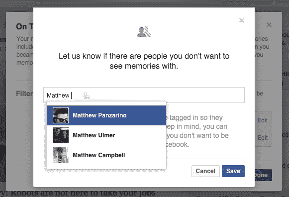

# 脸书现在帮助你摆脱“记忆”

> 原文：<https://web.archive.org/web/https://techcrunch.com/2015/10/13/facebook-now-helps-you-get-rid-of-memories/>

# 脸书现在帮助你摆脱“记忆”

如果你看过电影《美丽心灵的永恒阳光》,那么你应该很熟悉主动清除大脑中某些记忆的概念。你在网上记录的东西不断地激发我们的记忆，甚至有服务故意这样做。Timehop 和 Google Photos 有它的元素，脸书的“这一天”功能也有。

每天提醒过去那一天发生的事情会很棒。它也可以吮吸严重的屁股，引发你的抑郁症。我没开玩笑。我遇到过让我落泪的事或人。

今天，脸书推出了控制功能，让你过滤掉一些不好的记忆。只需进入你的[“这一天”页面](https://web.archive.org/web/20230324115539/https://www.facebook.com/onthisday)，然后点击“偏好”然后，您可以输入一个日期或人，以便在下一次该日期或人即将被推到您毫无防备的面前时过滤掉内容。

你可以完全关闭这个功能的通知，永远不看它们，但是有时候回忆五年前的今天发生了什么是很酷的。只是当它可能引起悲伤的时候就不会了。话又说回来，有时候记住是件好事……因为让我们看到让我们心烦的事情会提醒我们，我们也是人。