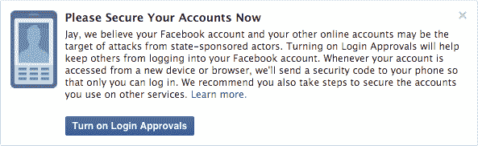

# 脸书现在警告用户，如果他们是国家支持的攻击的目标

> 原文：<https://web.archive.org/web/http://techcrunch.com/2015/10/19/facebook-now-warns-users-if-theyre-a-target-of-state-sponsored-attacks/>

在[谷歌为 Gmail 用户实施类似功能](https://web.archive.org/web/20230316050751/https://googleonlinesecurity.blogspot.com/2012/06/security-warnings-for-suspected-state.html)几年后，脸书[说](https://web.archive.org/web/20230316050751/https://www.facebook.com/notes/facebook-security/notifications-for-targeted-attacks/10153092994615766)如果它怀疑用户是政府支持的攻击目标，它将开始提醒用户。也就是说，如果网络认为用户的账户已经成为目标，或者已经被代表一个民族国家的攻击者破坏，脸书将弹出一个通知，警告他们发生了这一事件，并指示他们打开“登录批准”——这是一个额外的安全机制，可以更好地保护他们的脸书账户。

通过登录批准，用户可以帮助阻止其他人登录他们的帐户。激活此功能(其工作方式有点像其他二元身份认证系统)后，当用户的脸书帐户被新设备或新网络浏览器访问时，用户会收到警报。当这种情况发生时，脸书会发送一个安全码到你的手机上，所以只有你——作为手机的主人——能够输入密码并登录。

理想情况下，这个额外的保护层是所有脸书用户都应该默认打开的，但许多人不知道这个选项的存在，或者他们不想在尝试从新设备登录时经历额外的步骤。

脸书首席安全官 Alex Stamos 在解释新的警告信息时指出，该公司一直在采取措施保护其怀疑已被攻破的账户，但现在它决定在认为攻击是政府支持的情况下显示这一新的警告。

“我们这样做是因为这些类型的攻击往往比其他攻击更先进、更危险，我们强烈鼓励受影响的人采取必要的行动来保护他们所有的在线帐户，”斯塔莫斯说。

脸书不会透露它如何确定一次攻击是国家支持的，而不是另一种类型的黑客，但它表示，只有当它有证据“强烈支持”它的结论时，才会显示信息。换句话说，如果你看到这条消息，你可能需要做的不仅仅是保护你的脸书帐户——你的计算机也可能感染了恶意软件，这让攻击者有了进入的途径。

脸书建议，如果有必要的话，那些看到这个新警告信息的人也要采取措施重建或更换他们的系统。

虽然谷歌早在 2012 年就实施了自己的系统来检测和警告国家支持的攻击，但看到脸书现在做同样的事情并不奇怪。虽然该网站主要是一个社交网络，但它也有通信功能，包括你可以在网站上访问的邮箱，以及通过 Messenger 的即时消息程序。

这些产品的使用逐年增加——例如，Messenger 经常是 App Store 上排名第一的免费应用。此外，脸书上的更多活动已经变得私人化，就像在封闭的脸书群中的帖子，用户必须被管理员接受才能阅读他人的条目和分享。

实施这一新增安全功能的决定只是脸书为更好地保护用户账户而采取的最新举措之一。最近，[该公司推出了安全检查工具](https://web.archive.org/web/20230316050751/http://newsroom.fb.com/news/2015/07/enhancing-security-with-a-quick-checkup/)，当你的账户被新设备或浏览器访问时，它还会发出登录警告。该工具还能帮助用户在未使用的浏览器和应用程序上注销脸书。