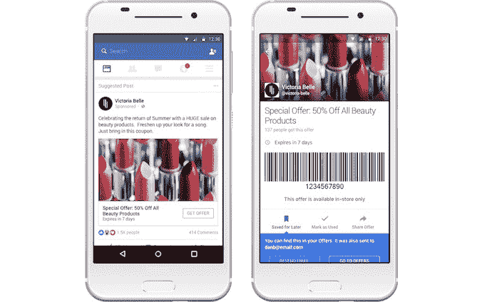

# 脸书优惠针对移动设备进行了改进，现在您可以在专门的区域跟踪保存的优惠券 

> 原文：<https://web.archive.org/web/https://techcrunch.com/2016/08/30/facebook-offers-gets-revamped-for-mobile-now-lets-you-track-saved-coupons-in-a-dedicated-section/>

随着脸书优惠计划的改造，脸书在销售点跟踪广告直到客户购买的目标今天得到了很大的推动。现在，为了更加方便移动用户，脸书允许企业创建两种优惠——顾客可以在线兑换和在店内兑换——同时也让顾客更容易在收银台找到他们需要的优惠券。

早在 2012 年推出的脸书优惠活动是脸书广告商通过旨在利用社交网络病毒效应的活动来接触客户的一种方式——也就是说，由于人们与朋友分享交易，优惠活动可能会接触到比目标受众更广泛的受众。

现在，脸书表示，它让广告商更容易接触到手机用户。优惠可以设计为在线使用或在销售点使用，它们可以通过优惠广告或通过企业的脸书页面共享。这些广告将出现在手机和网络上的新闻提要中，并可以像其他创意一样进行定制，例如使用轮播广告。

同时，企业可以使用优惠页面编辑器在他们的脸书页面上共享优惠。

对于页面访问者来说，现在还将有一个新的“优惠”标签，这样你就可以在一个位置浏览企业过去的优惠。这将更容易找到当前的优惠券和折扣，而不必向下滚动页面来查看您可能错过了什么。

脸书说，当然，在线跟踪要约的兑现很容易，企业可以在 ads 报告产品中获得索赔的数量。

从历史上看，更大的挑战是将脸书的广告与现实世界的购买联系起来。在过去，脸书已经通过[将广告商与数据提供商合作伙伴连接起来，如 Datalogix、Epsilon、Acxiom 和 BlueKai](https://web.archive.org/web/20221025223507/https://beta.techcrunch.com/2013/02/27/facebook-ad-data-providers/) 来解析消费者的离线购买列表。最近，它宣布[与 POS systems Square 和 Marketo 合作，这将帮助脸书更好地了解广告何时导致购买——甚至是商店访问](https://web.archive.org/web/20221025223507/https://beta.techcrunch.com/2016/06/14/facebook-knows/)，这要归功于一项将 GPS、信标、Wi-Fi、无线电信号和手机信号塔与实体商店的坐标相匹配的功能。

如今，脸书正在内部引入类似水平的跟踪。通过新的优惠书签，购物者将能够快速找到折扣，然后在收银台展示他们的手机，商家可以扫描提供的条形码或二维码。这明确地将脸书的广告和购买联系起来。

同时，在网上购物时，顾客可以很容易地复制优惠代码，以便在结账时使用，并查看条款和条件。

该公司表示，它现在正在研究独特的优惠代码，允许广告商为个人创造特定的优惠，以防止大规模分销，或选择群体——例如，像企业的最佳客户。

脸书还表示，它将提醒人们在优惠过期前使用它们，并在他们下次访问桌面时提醒他们在手机上声称的优惠。

脸书指出，在线优惠广告现在已经上线，而店内广告将在未来几周内推出。