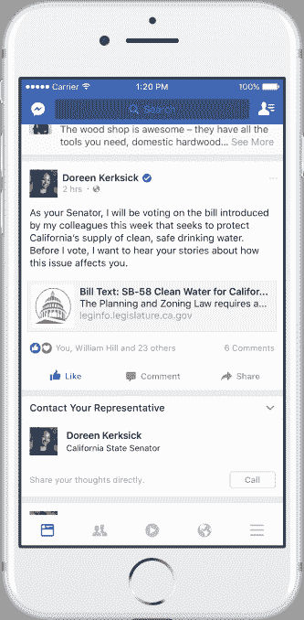
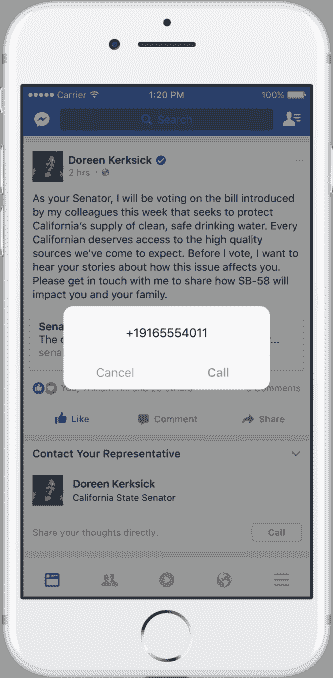
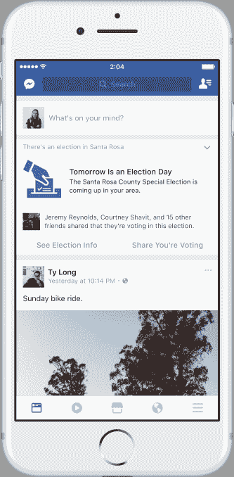

# 脸书正式推出用于联系政府代表的“市政厅”,增加地方选举提醒 

> 原文：<https://web.archive.org/web/https://techcrunch.com/2017/03/27/facebook-officially-launches-town-hall-for-contacting-government-reps-adds-local-election-reminders/>

本月早些时候， [TechCrunch 报道了](https://web.archive.org/web/20230206065207/https://techcrunch.com/2017/03/14/facebooks-new-town-hall-feature-helps-you-find-and-contact-your-government-reps/)脸书推出了一个名为“市政厅”的新功能，这将使社交网络的用户能够轻松定位、关注和联系他们的地方、州和联邦政府代表。该公司今天证实，该功能对所有美国用户的桌面和移动设备都可用，现在将包括新闻提要集成。除了这条新闻，脸书还宣布首次推出地方选举提醒，鼓励用户在州、县和市政选举中投票。

脸书首席执行官马克·扎克伯格最近写了一份近 6000 字的宣言，其中他讨论了[在未来几天对社交网络的一些雄心](https://web.archive.org/web/20230206065207/https://techcrunch.com/2017/02/16/building-the-world-we-all-want/)。其中之一是利用网络增加公民参与——这是对脸书在当今政治格局中所扮演角色的默认。

美国总统大选后，该公司被指控帮助唐纳德·特朗普获胜，没有采取任何措施防止假新闻和虚假信息在其网络上传播。它的算法向用户展示更多他们喜欢的东西，让人们在应用程序中停留更长时间，也被指责让人们停留在“泡沫”中，他们认为每个人都和他们想的一样，这加剧了两极分化。

扎克伯格起初淡化了对“假新闻”在脸书传播的担忧，称该网络是一个技术平台，而不是一家媒体公司。他后来[改变了](https://web.archive.org/web/20230206065207/https://techcrunch.com/2016/12/21/fbonc/) [他在这个](https://web.archive.org/web/20230206065207/https://www.facebook.com/zuck/posts/10103338789106661?pnref=story)上的立场，该公司从此开始推出[各种事实核查措施](https://web.archive.org/web/20230206065207/https://techcrunch.com/2017/01/16/facebook-takes-its-fake-news-fight-to-germany/)来打击假新闻。

在信中，扎克伯格还表示，他希望脸书在一个“参与投票的人有时不到我们人口的一半”的世界里，专注于增加公民参与

随着“市政厅”的加入，脸书向这一目标迈进了一步。该功能让用户更容易知道谁在政府中代表他们，并通过该政治家在其脸书页面上列出的任何方式进行联系。

该功能最近在手机和桌面的“更多”菜单中对一部分用户开放。

[gallery ids="1469262，1469266，1469265，1469264"]

当你启动它时，你会看到一份当地、州和联邦级别的销售代表名单，你可以点击访问他们的脸书页面或给他们发信息、打电话或发电子邮件。

然而，并不是所有的销售代表都通过脸书提供他们的联系信息。脸书还没有从外部来源获取丢失的电话号码或电子邮件，比如 T2 官方政府网站 T3。

不过，该公司告诉我们，这是它希望及时解决的问题。

今天，所有美国脸书用户都可以使用 Town Hall，它的一些功能现在将集成到新闻订阅源中。

如果你喜欢或评论由你选出的官员之一发表的帖子，评论下方的一个新功能将邀请你给代表打电话、发信息或发电子邮件。这样做后，用户将被提示分享他们联系过代表的帖子，以此鼓励他们的朋友也这样做。

脸书说，这个联系你的代表的帖子并不是对所有人都显示的，而是只显示给那些已经通过赞或评论参与了民选官员帖子的人。

但脸书做出这一决定可能是为了避免其新闻内容变得过于政治化。这可能会激怒那些将这些股票解读为脸书自己指示他们采取特定政治行动的人。

此外，脸书表示，现在将为地方选举提供选举提醒。

自 2008 年以来，该公司已经在全国选举的新闻提要顶部运行提醒——它说这增加了选民投票率。在这里，脸书引用了它自己的内部研究和《自然》杂志上的一项研究，该研究发现它的 2010 年信息影响了现实世界的 340，000 次投票。

为了实现这一功能，脸书不得不升级其公民数据基础设施，以自动化全美数千次选举的提醒。

新的地方选举提醒将出现在美国人口超过 10，000 人的地区的所有州、县和市政选举中，并将包括初选和大选。

所有这三个特性从今天开始在网络和手机上公开发布。

*图片来源，top: Marcbela (Marc N. Belanger)(自有作品)【公共领域】，via[Wikimedia Commons](https://web.archive.org/web/20230206065207/https://commons.wikimedia.org/wiki/File%3ARandolph_Town_Hall.JPG)；其他:脸书*

*更新帖子以澄清项目何时出现在 feed 中。*