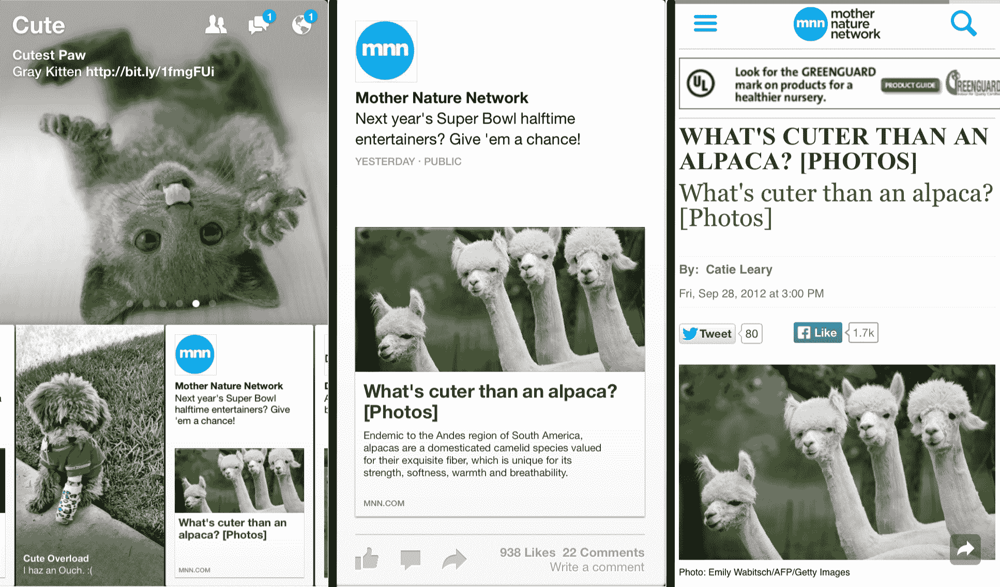

# 脸书开源了更多纸质应用 TechCrunch 背后的技术

> 原文：<https://web.archive.org/web/https://techcrunch.com/2014/10/15/facebook-open-sources-more-of-the-tech-behind-its-paper-app-user-interface/>

# 脸书开源了更多纸质应用背后的技术

它看起来不像脸书的 iOS 版纸质应用程序[曾经在用户中流行过](https://web.archive.org/web/20230111054458/http://mythoughtson.it/is-paper-from-facebook-to-be-tossed/)，但是许多开发者将它视为现代移动应用程序的一个范例[。](https://web.archive.org/web/20230111054458/http://www.wired.com/2014/03/facebook-paper/)

为了写论文，脸书开发了各种各样的专有库，并慢慢地将其中一些提供给外部开发人员。例如，今年早些时候，脸书开源了 [Pop 动画引擎](https://web.archive.org/web/20230111054458/https://techcrunch.com/2014/04/28/facebook-open-sources-the-animation-engine-that-powers-its-paper-app/)，它为该应用程序的大部分用户界面提供了动力， [Shimmer](https://web.archive.org/web/20230111054458/https://github.com/facebook/Shimmer) 为应用程序和它为纸张开发的其他几个库添加了闪闪发光的效果。今天，它也让开发人员可以使用 AsyncDisplayKit 库。

这是一个有点笨拙的名字，但它是一种允许应用程序以每秒 60 帧的速度运行的技术，该应用程序具有大量复杂的动画，如纸张。它本质上是对苹果自己的一些技术的替代。苹果自己的用于处理文本和图像的 UIKit 视图经常需要几十到几百毫秒才能呈现出来。这使得在应用程序中渲染流畅的动画变得非常困难，有时甚至是不可能的。

随着时间的推移，开发人员已经找到了通过破解他们自己的解决方案来解决这个问题的方法，但正如脸书指出的那样，这些“单独的解决方案往往表现不同，使得很难对更高层次的改进和应用程序行为进行推理。”

这就是 AsyncDisplayKit 的用武之地。它建立在苹果自己的技术基础上，但尽管苹果的标准技术运行在应用程序的主线程中，因此会阻止应用程序响应用户输入，但脸书的解决方案不会阻止主线程。

不出所料，AsyncDisplayKit 与 Pop 动画引擎结合使用效果非常好，但是不要求也使用 Pop。事实上，正如脸书指出的，“它与 UIKit Dynamics 和传统的应用程序设计一样强大”

代码现在可以在 [GitHub](https://web.archive.org/web/20230111054458/https://github.com/) 上获得。