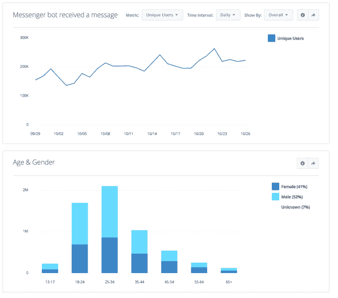

# 脸书向 Messenger TechCrunch 上 34，000 个机器人的开发者开放 analytics 和 FbStart

> 原文：<https://web.archive.org/web/https://techcrunch.com/2016/11/14/facebook-opens-analytics-and-fbstart-to-messengers-34000-bot-developers/>

脸书今年一直在努力将 Messenger 发展成为一个机器人平台。现在有 34，000 个这样的机器人存在，可以自动为你提供新闻和娱乐，让你购物，等等——扩展了 Messenger 的用途，不仅仅是和朋友聊天。如今，这一策略得到了显著的推动:[脸书表示](https://web.archive.org/web/20230129103711/https://analytics.facebook.com/blog/bots-for-messenger-adding-analytics-and-fbstart-program)它现在将允许开发者在其免费分析平台上跟踪机器人，以及广告和应用程序。与此同时，脸书也向 bot 开发者开放其开发者项目 [FbStart](https://web.archive.org/web/20230129103711/http://www.fbstart.com/) 。

这两者都有可能给机器人制造商更多的理由来制造和监控他们的新部件是如何工作的。

Josh Twist 是 Facebook Messenger 机器人项目的产品经理，他是一名居住在西雅图的英国人，但今天在伦敦的一次开发者活动上首次亮相这些工具，他告诉我，在开发者提出大量请求后，脸书扩展了 analytics 和 FbStart 工具。

“让机器人支持 messenger 是机器人开发者最常要求的功能，”他说。这不应该是一个太大的惊喜。Messenger 可能拥有超过 10 亿用户，但从长远来看，机器人是否会成为一项有粘性且有用的服务，还是昙花一现，还有待观察。

脸书已经为其平台上的其他开发者提供了分析，自今年早些时候首次亮相以来，机器人已经引起了巨大的兴趣。这种兴趣不仅仅来自对它们如何工作感到好奇的用户；开发者也非常想知道机器人是否真的是下一个大事件。

Twist 告诉我，目前，分析将涵盖专为 Messenger 构建的机器人。但是考虑到机器人如何进入其他通信平台，从 Viber 的竞争消息应用[到 Slack](https://web.archive.org/web/20230129103711/https://techcrunch.com/2016/11/09/viber-follows-messenger-with-the-launch-of-public-accounts-for-businesses-and-brands/) 这样的企业级平台[，如果脸书将其机器人分析扩展到 Messenger 之外的其他平台，不要感到惊讶。](https://web.archive.org/web/20230129103711/https://techcrunch.com/2016/07/19/slack-now-with-600-apps-on-its-platform-pours-2m-into-11-slackbot-startups-via-its-slack-fund/)

“这是我们已经讨论过的事情，并没有排除它，”他说。“这是完全可能的，因为我们已经支持其他应用平台的分析。但是现在我们优先支持信使机器人。

当然，分析对于开发人员来说是一个必不可少的工具，既可以跟踪某个东西的工作情况，也可以跟踪其他孩子的反馈。在这里，脸书表示，将包括的功能是跨移动和桌面设备的接触，以及跨应用程序和网站的客户旅程测量。

开发者还将能够查看关于发送的消息、接收的消息以及阻止或取消阻止你的应用的人的报告。他们还将获得关于机器人人口统计的匿名数据报告，其中包括年龄、性别、教育、兴趣、国家和语言等细节，以找出谁在使用你的机器人。

与此同时，FbStart 目前有大约 9000 名会员，他们从脸书获得对他们的应用程序、广告和机器人的反馈，以及来自亚马逊、Dropbox 和 Stripe 等合作伙伴的脸书广告积分和其他免费工具。如果脸书正在寻找扩大这些队伍的方法，聘用 3.4 万名开发人员可能是一种方法。

Twist 指出，虽然有很多独立的机器人开发者第一次来到脸书，但也有很多与其他脸书服务如应用和广告的交叉。

那些综合利用这些功能的人——例如使用[最近功能](https://web.archive.org/web/20230129103711/https://techcrunch.com/2016/11/08/facebook-opens-sponsored-messages-to-all-advertisers-in-newest-version-of-messenger/)将一个人从新闻源广告引导到你的 Messenger 体验中——将能够看到这些努力的效果，并在此基础上进行潜在的更多广告购买。