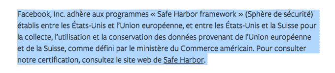

# 脸书下令停止追踪非法国用户

> 原文：<https://web.archive.org/web/https://techcrunch.com/2016/02/09/facebook-ordered-to-stop-tracking-non-users-in-france/>

脸书在欧洲面临更多隐私问题。现在，法国数据保护机构 CNIL 已经向该公司发出了正式通知，要求其整顿秩序，遵守欧洲数据保护法，否则可能会被提交给 CNIL 特别委员会，该委员会可能会选择对该公司进行制裁。

CNIL 给了脸书三个月的时间做出必要的改变。德新社[昨天说，如果它这样做让德新社满意，它将不会面临任何制裁。](https://web.archive.org/web/20230130101823/http://www.cnil.fr/english/news-and-events/news/article/the-french-data-protection-authority-publicly-issues-formal-notice-to-facebook-to-comply-with-the-fr/)

TechCrunch 了解到脸书正在审核来自 CNIL 的订单。一位发言人就该行动发表了以下声明:“我们相信我们遵守了欧洲数据保护法，并期待与 CNIL 合作，回应他们的关切。”

这些担忧是多方面的，并且是在[脸书于 2014 年秋季](https://web.archive.org/web/20230130101823/https://techcrunch.com/2014/11/13/facebook-debuts-privacy-basics-and-updates-policies-to-reflect-more-personalized-ads/)修改其隐私政策后引发的一项调查中发现的。具体来说，CNIL 对脸书收集没有脸书账户的互联网用户的浏览活动感到不满。

“事实上，”CNIL 的通知写道，“该公司没有告知互联网用户，当他们访问脸书的公共页面(如公共活动或朋友的页面)时，它会在他们的终端上设置 cookie。该 cookie 向脸书传输与提供互联网用户访问的脸书插件(如按钮)的第三方网站相关的信息。”

它还指出，脸书收集有关性取向、宗教和政治观点的用户数据，“没有得到账户持有人的明确同意”。它也没有在注册表单上告知用户“关于他们的权利和他们的个人数据的处理”。

CNIL 声称，脸书还“在没有适当通知互联网用户并征得其同意的情况下”设置广告 cookies，并指出，用户没有被提供任何工具来阻止为有针对性的广告汇编信息——它说，“因此侵犯了他们的基本权利和利益，包括他们尊重私人生活的权利”。

也许最令人惊讶的是，脸书还被指控继续使用现在非法的安全港数据传输机制，该机制于去年 10 月被欧洲法院宣布无效，也就是整整四个月前。

虽然欧洲和美国显然已经达成了一项新的协议(称为[EU-美国隐私保护](https://web.archive.org/web/20230130101823/https://techcrunch.com/2016/02/02/europe-and-us-seal-privacy-shield-data-transfer-deal-to-replace-safe-harbor/))，但该协议尚未生效，因此希望跨大西洋数据传输合法化的公司还不能依赖该协议。上周CNIL 负责人，同时也是欧洲 DPA WP29 集团的负责人，重申安全港不是一个选项——强调继续使用无效框架的公司“处于非法状态”，可能面临 DPA 的制裁。

安全港袭击事件后，欧盟委员会在去年秋天详细介绍了替代数据传输方法，因此脸书显然没有转而使用这些替代方法之一来管理其欧洲到美国的数据传输，这相当令人惊讶。我们已经就这一点询问了脸书，并将根据任何回应更新这个故事。

**更新:**脸书声称它实际上并没有*而不是*使用安全港来传输数据——提到了它去年的评论，其中它说:“脸书，像成千上万的欧洲公司一样，依靠欧盟法律规定的许多方法来合法地从欧洲向美国传输数据，除了安全港。”

**更新 2:** 然而，CNIL 的一位女发言人指出[脸书法航的隐私政策页面](https://web.archive.org/web/20230130101823/https://fr-fr.facebook.com/about/privacy)仍然包含了下面一段提及其使用安全港的内容…哎呀…

CNIL 继续补充说，由于“违法行为的严重性和脸书服务所涉及的个人数量”，它已经公开了对脸书的正式通知——指出该网站在法国有超过 3000 万用户。

在此之前，比利时数据保护机构[于去年夏天](https://web.archive.org/web/20230130101823/https://techcrunch.com/2015/06/15/facebook-faces-privacy-lawsuit-from-belgian-watchdog/)对脸书提起诉讼，该机构也关注其如何追踪非用户。比利时的法律行动导致了对脸书的每日罚款威胁，如果它不修改其跟踪 cookies 的操作——它随后做了,[转而要求用户登录查看网站上的页面](https://web.archive.org/web/20230130101823/http://www.bbc.co.uk/news/technology-34987422)。

除了法国和比利时数据保护部门的调查，脸书还受到西班牙、荷兰和德国(汉堡)数据保护部门的调查。这个由五名 DPA 组成的工作组成立于 2015 年 3 月，旨在明确调查其新的隐私政策。

CNIL 指出，所有相关部门的调查"正在国家一级并在国际行政合作框架内进行"。因此，脸书在欧洲面临的与修改隐私政策相关的问题似乎还远未结束。

新的 EU-美国隐私盾也至少需要两个月才能获得 WP29 的批准，因此对于需要将跨大西洋数据传输合法化的公司来说，没有快速解决方案(尽管有一系列替代机制可以使用，如标准合同条款和示范合同)。