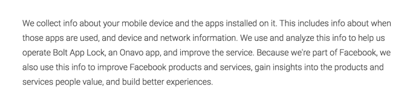

# 脸书旗下的 Onavo 悄悄推出 Bolt App Lock，这是一款锁定其他应用的数据跟踪应用 

> 原文：<https://web.archive.org/web/https://techcrunch.com/2018/03/09/facebook-owned-onavo-quietly-launches-bolt-app-lock-a-data-tracking-app-that-locks-other-apps/>

2013 年被脸书收购的数据安全应用程序制造商 Onavo 为了深入了解移动用户在各种应用程序中的活动，悄悄推出了一款针对安卓用户的新应用程序，名为 [Bolt App Lock](https://web.archive.org/web/20221203051202/https://play.google.com/store/apps/details?id=com.onavo.lynx&hl=EN) 。Bolt App Lock 不是提供 VPN，而是一种工具，让你使用 PIN 码、模式或你的指纹锁定任何你不想让其他人能够打开的应用程序。

帮助用户锁定其他应用程序的应用程序是 Android 上一个受欢迎的类别，今天你[可以在这里找到](https://web.archive.org/web/20221203051202/https://play.google.com/store/search?q=password%20protect%20apps&c=apps) [几十个类似的解决方案](https://web.archive.org/web/20221203051202/https://play.google.com/store/search?q=lock%20apps&c=apps)——尽管大部分来自不知名的公司，比如 Keepsafe 或诺顿。像这个领域的其他应用一样，Bolt 应用允许你锁定其他包含个人信息的应用，如私人照片或支付细节。

在脸书的资源支持下，Onavo 似乎已经建立了一个更完善、更现代的应用程序替代方案。

但 Onavo 和脸书的主要兴趣并不在个人安全上。这是为了在用户的手机上找到一种方法，以监控移动活动，并了解哪些新应用程序可能会分散脸书社交网络的注意力。

这是在 Google Play 上[应用列表的底部披露的，它解释说，作为一家脸书公司，Onavo 将“收集关于你的移动设备和其上安装的应用的信息”，并与脸书分享这些信息。](https://web.archive.org/web/20221203051202/https://play.google.com/store/apps/details?id=com.onavo.lynx&hl=EN)

*上图:Bolt App Lock 关于数据收集的披露*

移动应用使用数据帮助脸书更好地与 Snapchat 等竞争对手竞争，例如，当它看到 Instagram 推出的类似故事的功能如何减缓 Snapchat 的用户增长时。这也可能有助于脸书更新的[收购](https://web.archive.org/web/20221203051202/https://techcrunch.com/2017/10/16/facebook-acquires-anonymous-teen-compliment-app-tbh-will-let-it-run/)时髦的青少年赞美应用 tbh，这[很快导致](https://web.archive.org/web/20221203051202/https://techcrunch.com/2017/12/05/as-tbh-popularity-wanes-facebook-launches-did-you-know-social-questionnaire/)一个新的脸书 Q & A 功能，灵感来自 tbh。

为了吸引用户使用 Onavo VPN，[脸书最近开始直接在 iOS](https://web.archive.org/web/20221203051202/https://techcrunch.com/2018/02/12/facebook-starts-pushing-its-data-tracking-onavo-vpn-within-its-main-mobile-app/) 的脸书主导航中的“保护”菜单项下为该应用做广告点击后，链接会将你带到 App Store 上 Onavo Protect 的下载页面。该公司过去也曾在脸书安卓应用中推出过类似的“保护”链接。(我们目前没有在 Android 上看到该选项，但随着脸书的应用程序不断调整和更新，你的里程数可能会有所不同。)

[gallery ids="1604986，1604985，1604984"]

但是为了获得这种洞察力，脸书需要一个愿意安装 Onavo 应用的用户群。不过，如今这可能更难实现。

TechCrunch 爆料了 [Onavo 出现在 iOS](https://web.archive.org/web/20221203051202/https://techcrunch.com/2018/02/12/facebook-starts-pushing-its-data-tracking-onavo-vpn-within-its-main-mobile-app/) 上的消息后，多家网点直接警告用户不要安装该应用。*(参见，例如:Gizmodo 的“[”不要，我重复一遍，不要下载 Onavo，脸书的吸血鬼 VPN 服务](https://web.archive.org/web/20221203051202/https://gizmodo.com/do-not-i-repeat-do-not-download-onavo-facebook-s-vam-1822937825)”或 Wired 的“[不要相信脸书希望你使用的 VPN](https://web.archive.org/web/20221203051202/https://www.wired.com/story/facebook-onavo-protect-vpn-privacy/)。))*

在对 Onavo Protect 的反弹平息之前，Bolt App Lock 这样的新应用可能会给脸书提供一种不同的方式来扩大 Onavo 的用户群，从而扩大脸书对移动用户数据的访问。

根据传感器塔的数据，Bolt App Lock 于 2018 年 3 月 5 日推出。它还没有作为该公司的产品之一出现在 Onavo 的主页上。该应用可在 Google Play 上免费下载[。](https://web.archive.org/web/20221203051202/https://play.google.com/store/apps/details?id=com.onavo.lynx&hl=EN)

这款应用也没有像 Onavo Protect 那样出现在脸书的应用中，至少目前没有。我们问脸书这是否是最终的计划，但没有得到回复。

美国东部时间 2018 年 3 月 9 日下午 4 点更新:脸书发言人表示，这是一次“小规模、短暂的测试”随后，谷歌从 Google Play 上移除了这款应用。