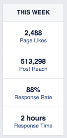
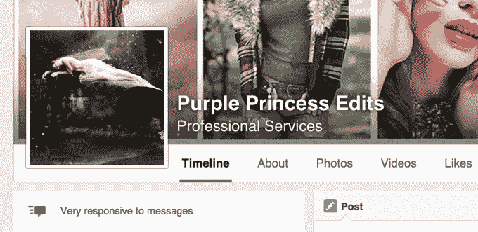

# 脸书页面现在可以显示他们对客户信息的回复速度

> 原文：<https://web.archive.org/web/https://techcrunch.com/2015/06/15/facebook-pages-can-now-show-how-quickly-they-respond-to-customers-messages/>

# 脸书网页现在可以显示他们对客户信息的回复速度

一段时间以来，脸书一直在努力为页面管理员改善以客户服务为中心的功能，最近的[推出了“保存的回复，](https://web.archive.org/web/20230404075227/https://techcrunch.com/2015/06/02/facebook-tests-saved-replies-a-tool-that-lets-pages-respond-to-customers-with-canned-messages/#.s2agxy:9kQa)”这一功能允许页面管理员用录音(预先写好的)回复来快速回复收到的查询。现在，管理员将能够吹嘘他们回答客户问题的速度，因为许多脸书管理员报告说看到了“响应率”功能。新增内容将向页面管理员显示页面的响应信息，如果响应率高，还会通过封面照片下方的图标显示给页面访问者。

并不是所有的脸书页面都有这个功能，这通常意味着一个阶段性的展示或测试。这个功能以前在野外被[发现过](https://web.archive.org/web/20230404075227/http://www.adweek.com/socialtimes/some-facebook-page-admins-see-response-rate-response-time/620440)，但是这个月我们从更多的管理员那里听说他们已经让它出现了，脸书最近也发布了官方文档详细说明这个功能是如何工作的，这表明这不仅仅是一个测试。

页面管理员告诉我们，在 6 月份，他们开始看到一个“回复率”指标，所有帮助管理他们在脸书页面的人都可以看到。另一个新功能是跟踪响应时间——允许企业主查看他们在处理来自客户的信息方面做得如何。

当然，该功能只对那些有[允许人们接触页面](https://web.archive.org/web/20230404075227/https://www.facebook.com/help/307375982614147)的页面可用。

据一位页面管理员称，新指标出现在他们管理的几个页面上，但没有出现在那些粉丝少于 1000 人的页面上。(但是，这不是一个确定的指标。)

同时，当一个页面有很高的回复率时，这些信息会在屏幕左侧封面照片正下方的绿色消息图标旁边向访问者公开显示。

脸书的帮助[文档](https://web.archive.org/web/20230404075227/https://www.facebook.com/help/475643069256244)解释说，想要获得这个“非常响应消息”图标的页面所有者需要在过去的七天里满足两个特定的指标:他们必须对 90%的消息做出响应，他们需要保持所有回复的平均响应时间为 5 分钟。

虽然只是一个小的增加，但此举正值脸书试图使其社交网络平台对企业主和商人更具吸引力之际。就在上周，该公司[向那些维护由 Shopify 支持的在线商店的人开放了其“购买按钮](https://web.archive.org/web/20230404075227/https://techcrunch.com/2015/06/10/never-leave)”的访问权限。这些商家能够在他们的脸书页面上发布帖子，并运行推广帖子广告，其中包括行动号召，即鼓励消费者“购买”他们正在销售的商品。脸书当时表示，它希望了解该功能如何推动销售，以及哪种产品卖得好。随着脸书继续推出旨在帮助商家销售的功能，它也希望协助整个销售过程的其他部分，包括客户支持，这是有道理的。

上周，我们向脸书询问了更多关于“回复信息”图标的信息，但该公司尚未置评。