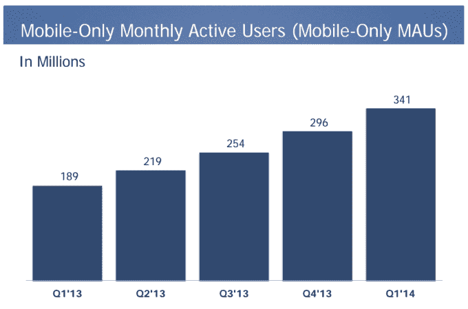

# 脸书超过 1B 手机用户，Q1 2 亿 Messenger 用户 

> 原文：<https://web.archive.org/web/https://techcrunch.com/2014/04/23/facebook-passes-1b-mobile-monthly-active-users-in-q1-as-mobile-ads-reach-59-of-all-ad-sales/>

脸书的另一个移动里程碑:该公司在 Q1 的收益报告中称，其手机和平板电脑月活跃用户已经突破 10 亿大关。准确的说是 10.1 亿。这是脸书移动设备接近桌面设备的一个标志:桌面设备和移动设备的总 mau 达到 12.8 亿。

该公司在财报电话会议上指出，这还不包括 Instagram 用户和 Facebook Messenger 用户，他们各自的月用户数都超过了 2 亿(Instagram 是在一个月前宣布成为 T2 的)。

它也不包括 WhatsApp 的用户，也不包括首席执行官马克·扎克伯格在财报电话会议上所说的移动战略的“第三步”——指的是其创意实验室的努力和 Paper 等应用程序，“以及我们可能在某个时候宣布的其他东西，”他说。与脸书和其他更成熟的应用相比，这些应用的使用“可能需要几年时间”才能达到有意义的比例。"

本季度脸书手机日活跃用户为 6.09 亿。脸书将 DAU 定义为“在某一天，通过我们的网站或移动设备登录并访问脸书，使用我们的 Messenger 应用程序，或通过第三方网站或与脸书集成的应用程序与他或她的脸书朋友或关系分享内容或活动的注册脸书用户。”

(MAU 的定义是“在测量之日起的过去 30 天内，通过我们的网站或移动设备登录并访问脸书、使用我们的 Messenger 应用程序、或通过与脸书整合的第三方网站或应用程序采取行动与他或她的脸书朋友或关系分享内容或活动的注册脸书用户。”因此，该指标捕捉到的人数越多，数字就越高。)

有趣的是，纯移动用户比一年前增加了近一倍，目前达到 3.41 亿。如果脸书整合 WhatsApp 的使用，以及 Instagram 更广泛的移动用户数量，这一数字可能会飙升至 8 亿以上，WhatsApp 在新东家发布季度收益的前一天[及时宣布](https://web.archive.org/web/20221225001123/http://blog.whatsapp.com/index.php/2014/04/500000000/)，其“WhatsApp 的定期活跃用户”已经达到 50 万的里程碑

“我们在巴西、印度、墨西哥和俄罗斯等国家增长最快，我们的用户每天分享超过 7 亿张照片和 1 亿个视频，”WhatsApp 在宣布这一消息的博客帖子中指出。

脸书的用户已经超过 10 亿，一年内增长了 34%，这一消息一方面标志着该公司的一个无情趋势——越来越多的人通过手机和平板电脑而不是台式电脑访问社交网络，随着脸书进军更多发展中市场，这一趋势只会越来越大，在这些市场，手机通常是用户连接互联网的主要链接。

另一方面，达到 10 亿美元也算是一种证明:脸书在上个季度宣布，将在移动通讯服务 WhatsApp 上支付 190 亿美元(T2)，以帮助其更深入地联系和扩大其移动用户群，特别是 WhatsApp 表现良好的市场，新兴和快速增长的经济体。从某种意义上来说，脸书是在手机上下了赌注。

### 移动用户货币化

尽管我们尚未看到脸书最终决定如何利用其 WhatsApp 用户群赚钱，但它已经收获了一些丰厚回报的一个领域是其现有产品的广告，特别是其脸书本身。

移动广告仍然是该公司的一大动力。他们现在占所有广告销售额的 59%，相当于 14 亿美元。一年前，他们占所有广告收入的 30%。预计脸书将在本月底的 F8 开发者大会上宣布一个移动广告网络，在今天的收益电话会议上，首席运营官·雪莉·桑德伯格证实了这个网络的“早期测试”。(注意:这不是[第一次](https://web.archive.org/web/20221225001123/https://techcrunch.com/2012/09/18/facebook-mobile-ad-network/)我们[听说这个](https://web.archive.org/web/20221225001123/https://techcrunch.com/2014/01/22/facebook-mobile-targeting/)，但显然这可能真的真的现在就要出来了。)

有趣的是，听起来无论脸书未来有什么计划来推动更多的移动广告，它都不一定会以一种大规模的方式将 Instagram 纳入等式，至少现在是这样。“Instagram 是一个很好的广告产品，因为有大量的需求，图片也很有视觉吸引力。我们已经看到了一些很好的结果，”桑德伯格在电话中提到，他用李维斯(Levi's)的一个广告活动和户外空间的牛仔照片作为未来的标志。但这并不以继续扩大用户群为代价。“我们不认为有必要或迫切增加这一点，”她在提到 adds 时说。“我们想慢慢地、有意识地让它成长。”

### 美好的未来

就脸书的移动未来而言，在财报电话会议上突出的一点是，无论这些增长杠杆将是什么，听起来它们都将继续保持本土体验。“HTML5 没有错……但苹果和谷歌都让在自己的平台上提供良好的体验变得更加容易，”扎克伯格说。“很多人通过移动网络访问人们，所以我们会继续开发，但在可预见的未来，我们会继续……致力于我们现有的原生应用体验。”

更成熟的原生应用程序体验仍在继续发展。例如，尽管收购了 WhatsApp，但我们可能会从脸书原有的内部努力中看到更多。扎克伯格在一个季度前——在 WhatsApp 海啸之前提到,“今年上半年，我们将有更多的 Messenger 产品推出。考虑到 Messenger 的增长，这并不奇怪。在过去的 15 个月里，它增加了大约 1 . 5 亿用户。

事实上，脸书最近更积极地推动信使号。2013 年 11 月，如果用户安装了独立的聊天应用，脸书开始将其主要应用的用户快捷化为 Messenger，如果你与不使用 Messenger 的人聊天，你会获得一个链接，邀请那个人这样做。最终，计划似乎是将聊天功能从主应用中剥离出来，以增加 Messenger 的下载量。

补充报道乔希
