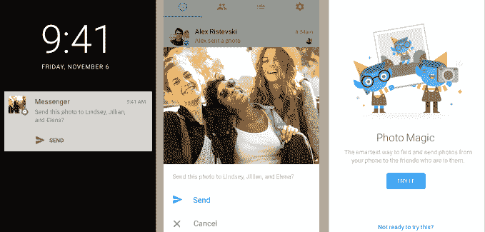
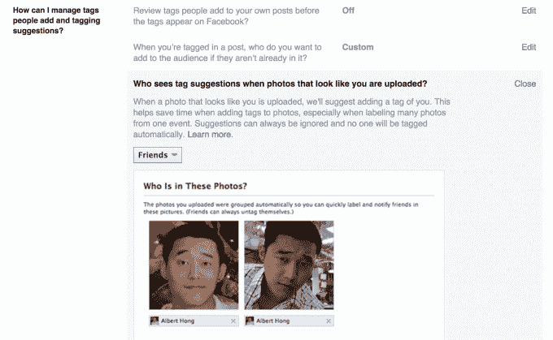
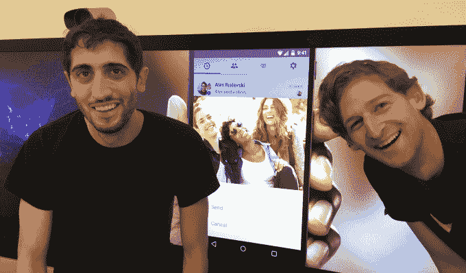

# Fb Messenger 的面部识别“照片魔法”提醒您向朋友发送他们的照片 

> 原文：<https://web.archive.org/web/https://techcrunch.com/2015/11/09/facebook-photo-magic/>

我们又忙又懒，所以我们忘记给朋友发我们拍的照片。但是 [Facebook Messenger](https://web.archive.org/web/20221225221903/http://messenger.com/) 的最新功能 Photo Magic 通过面部识别扫描你新拍的照片，并立即通知你可以选择将照片发送给照片中的朋友。该测试今天在澳大利亚的 [Android](https://web.archive.org/web/20221225221903/https://play.google.com/store/apps/details?id=com.facebook.orca&hl=en) 上推出，本周晚些时候在 [iOS](https://web.archive.org/web/20221225221903/https://itunes.apple.com/us/app/messenger/id454638411?mt=8) 上推出，如果人们喜欢的话，还会推广到其他国家。首席信使[大卫·马库斯说](https://web.archive.org/web/20221225221903/https://www.facebook.com/Davemarcus/posts/10156318681930195?pnref=story)它将很快在美国上市。

“我们看到的是，在 Messenger 中私下发送照片确实很流行。产品管理总监 Peter Martinazzi 告诉我:“上个月，Messenger 内部发送了大约 95 亿张照片。“它的发展速度甚至超过了 Messenger，后者的发展速度非常快。”这对 Messenger 来说是一个特别重要的用例，因为它直接与脸书在社交领域为数不多的真正对手之一 Snapchat 竞争。

因此，脸书使用了同样的面部识别技术，为其照片标签建议和独立的 Moments 应用程序提供支持，以照片魔法推动这一趋势。如果你不想被识别，你可以选择退出[相同的隐私控制，关闭标签建议](https://web.archive.org/web/20221225221903/https://www.facebook.com/settings?tab=timeline&section=suggestions&view)。

但是，如果测试范围更广，人们继续使用它，这个功能可以用一张照片开始对话。这为人们提供了一种丰富的联系方式，同时将他们吸引到 Messenger 中，远离短信或其他聊天应用。这反过来又锁定了脸书的生态系统，增加了人们使用其主要应用程序观看新闻广告的可能性。

## 自拍，怎么了，还有朋友

脸书研究了人们通过 Messenger 发送的最常见的照片类型，并将其分为三大类:

*   自拍——人们通过发送自己的照片来表达自己的现状或对信息的情绪反应
*   最近怎么样——用户可以快速拍摄他们周围发生的事情，给别人一个了解他们世界的窗口
*   朋友——人们给他们的朋友拍照，然后分享给他们，这样他们也有了

但最后一类涉及到脸书的宿敌:摩擦。因为我们和朋友在一起，所以我们经常会分心，想要活在当下。我们推迟了打开相机胶卷、选择照片、将其传递给信息应用程序、手动选择照片中的人作为收件人并发送照片的麻烦。

Martinazzi 抱怨说，这种流动意味着“我不得不暂停我正在做的任何事情。”产品经理 Lexy Franklin 说，团队问“我们怎样才能让它更快更简单？神奇的是它在现实世界中的样子。”

## 让摩擦力消失

当用户第一次看到有趣的小照片魔法精灵介绍新功能并打开它时，脸书给他们一个潮湿的入职体验，向他们展示它是如何工作的。

脸书将扫描他们的相机胶卷，直到找到包含他们朋友的照片，并建议他们将照片发送给这些人。将出现一个预览窗口，显示照片、收件人以及包含附带信息的选项，并带有发送或取消按钮。如果发送，Photo Magic 会将照片作为 Messenger 群组线程发送给 pic 中的每个人。

从那时起，Messenger 将在用户拍摄包含其朋友的照片后几秒钟内弹出推送通知。他们可以直接从提醒中发送，或者在决定发送照片或忽略消息之前深入研究。Android 更灵活的系统架构意味着通知总是会即时发生。在 iOS 上，如果你给朋友拍照，但最近没有打开 Messenger，所以它不会在后台运行，你可能会有几分钟的延迟。

上周末，Martinazzi 自己证明了人们在分享照片方面有多糟糕。他和他的室友决定剪彼此的头发，并在路上拍照，但 Martinazzi 从来没有拍到他被轧坏的头发，因为他的朋友“手里还拿着剃刀”。照片魔术会让他的室友分享每一张照片，然后继续玩理发师游戏。

富兰克林坚持认为，“我们真的构建了整个照片魔术体验，所以你完全可以控制。”你可以[选择不识别你的脸](https://web.archive.org/web/20221225221903/https://www.facebook.com/settings?tab=timeline&section=suggestions&view)，或者关闭通知。这是脸书独立应用战略的一个好处:它可以将最好的功能重新整合到核心的脸书和 Messenger 应用中，并知道人们会如何使用它们。

是的，照片魔法每次只会节省几秒钟。但是如果你想对脸书的规模进行惊人的检验，可以这样想。即使 Photo Magic 在通过 Messenger 发送的三分之一的照片上每张照片只节省 5 秒钟，它也可以每月为人们节省 500 年的时间。

## 工程酷

[脸书在六月](https://web.archive.org/web/20221225221903/https://techcrunch.com/2015/10/15/how-facebook-moments-is-solving-the-other-peoples-photos-problem/)推出了它的 Moments 应用程序，它通过面部识别扫描你所有的旧照片，按照照片中的人将它们捆绑起来，并建议你把你所有的照片发给人们。照片魔术更具有时间性，仅处理您拍摄的最后一张照片。

但是通过这些时刻，脸书了解了私人照片分享应该如何运作，以及确保没有人收到错误的照片是首要任务。对于 Messenger 及其 7 亿用户来说，这是一个成熟的时刻。曾几何时，当 Messenger 被认为是一个辅助应用程序时，脸书抄袭了它的功能，就像主应用程序的贴纸一样。但现在 Messenger 在手机上是强制性的，它正在从脸书的年轻单身农场团队获得功能。

照片魔法确实有局限性。很多人用爆火或者拍一堆照片，把最好的发过来。Photo Magic 只会扫描并建议你发送最后一张。一个担忧是，当你继续拍摄照片时，照片魔法可能会让你受到通知的困扰，但该团队表示，他们正在考虑如何改善这些情况，例如在适当的时候推迟通知。

我强迫脸书的 Peter Martinazzi 和 Lexy Franklin(从左到右)摆出产品截图中的相同姿势

快速分享照片是短信最不擅长的一件事。尽管脸书在信息传递方面可能有竞争对手，但没有一个像旧的默认那样强大。照片魔术清楚地表明，人们应该与更现代的东西交流。

尽管 Snapchat 已经成为年轻一代的视觉交流方式，Google Photos 也提供免费存储，但脸书正依靠其工程和个人数据优势击退他们。

谷歌可能知道你照片中的*是什么*，但它不知道*是谁*。Snapchat 可能很酷，但它无法将姓名、面孔和社交联系联系在一起。脸书正利用这些优势来减少照片分享的干扰。说真的，还有什么比回到现实生活更酷的呢？