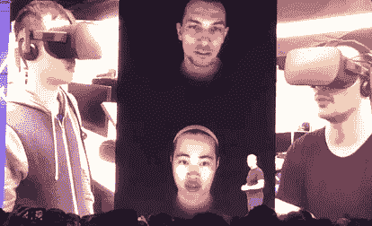
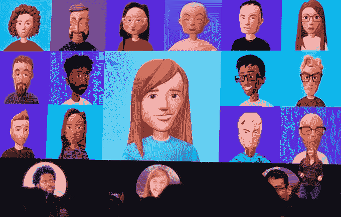

# 脸书制作照片般逼真的虚拟形象来模仿虚拟现实用户的脸

> 原文：<https://web.archive.org/web/https://techcrunch.com/2018/05/02/facebook-photo-realistic-avatars/>

# 脸书用照片般逼真的化身来模仿虚拟现实用户的脸

脸书希望你在虚拟现实中看起来和行动起来都像你自己，即使你在现实世界中戴着耳机。这就是为什么它正在开发一种新技术，使用一张照片将某人的脸映射到虚拟现实中，并使用传感器来检测面部表情和动作，以动画显示该化身，这样它看起来就像你头上没有 Oculus。

首席技术官迈克·斯科洛普夫在脸书 F8 会议第二天的主题演讲中预演了这项技术。最终，这项技术可以让你将现实世界的身份带入虚拟现实，这样你就可以被朋友认出来。这对虚拟现实的潜力至关重要，它可以让我们消除距离的障碍，与世界另一端的人共处一室。如果没有被耳机遮挡或被静态头像忽略的情感，这些社交虚拟现实体验将会平淡无奇。但是，如果脸书可以将你的面部表情与你的面部表情联系起来，虚拟现实就可以引发类似于与某人面对面的情感。

这些年来，脸书在阿凡达方面一直稳步前进。最初的普通蓝色面孔最终获得了个性化的特征、肤色和栩栩如生的特征，并成为一个真实人物的精致和令人回味的数字代表。尽管如此，它们还是不太像照片。

不过，脸书正在慢慢接近这一目标，它利用人脸肖像上的手绘特征来训练人工智能如何将照片转化为准确的头像。

与此同时，脸书试图想出新的方法将情感转化为头像。早在 2016 年末，脸书就展示了其[“虚拟现实表情手势”](https://web.archive.org/web/20230313144433/https://techcrunch.com/2016/10/06/vr-emoji/)，用户可以挥舞拳头让他们的头像变得疯狂，或者耸耸肩做出困惑的表情。

尽管如此，脸书虚拟形象的最大问题是，他们被困在 Oculus 和社交虚拟现实的世界里。10 月份，[我呼吁脸书打造一个 Snapchat 广受欢迎的 Bitmoji 头像](https://web.archive.org/web/20230313144433/https://techcrunch.com/2017/10/10/facemoji/)的竞争对手，我们仍在等待。

VR 头戴设备并没有像一些人预期的那样获得爆炸性的用户采用，很大程度上是因为它们内部缺乏足够令人信服的体验。有僵尸射手，解谜室和沉船探索，但大多数人很快就厌倦了。游戏和媒体在某种程度上失去了新鲜感，而社交网络却没有。想象一下 14 年前你在玩什么或者看什么，然而我们还在用脸书。

这也是公司需要在 VR 内部钉钉情感的原因。这是让媒体有影响力和让人上瘾的关键。

