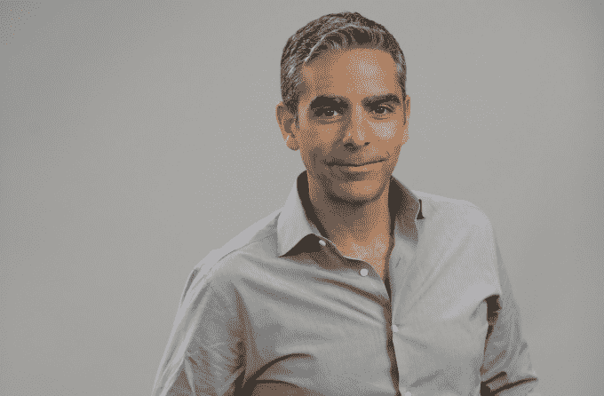
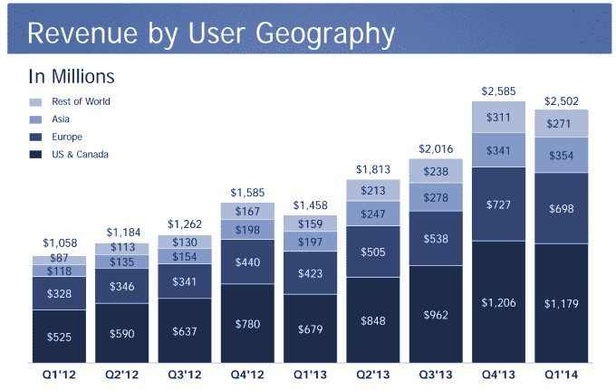

# 脸书挖走了 PayPal 总裁 David Marcus 来运营 Messenger，或许用支付来赚钱

> 原文：<https://web.archive.org/web/https://techcrunch.com/2014/06/09/facebook-poaches-paypal-president-david-marcus-to-run-messenger-maybe-monetize-it-with-payments/>

脸书不在 Messenger 或 WhatsApp 上显示广告。相反，付费可能是在聊天上赚钱的关键，尤其是在广告费率较低的发展中国家。如果这就是战略，脸书刚刚找到了一位完美的高管来领导这项任务。挖走了贝宝的总裁大卫·马库斯来管理其信使部门。

脸书暗示，马库斯将在广告之外寻找 Messenger 如何带来收入，并在招聘公告中写道，“大卫是技术行业中广受尊敬的领导者，拥有打造伟大产品和寻找创造性方法将其转化为伟大业务的记录。”目前，易贝首席执行官约翰·多纳霍将担任 PayPal 临时总裁。

三年前，当以 2.4 亿美元现金收购了他的移动支付公司宗时，Marcus 加入了 PayPal。宗让用户通过运营商付费的移动支付在网上购物。

在《脸书邮报》宣布他的举动时，[马库斯写道](https://web.archive.org/web/20230404170209/https://www.facebook.com/Davemarcus/posts/10154268140035195):“当我正在思考我的下一步时，马克·扎克伯格和我走到了一起。Mark 分享了一个关于移动通讯的令人信服的愿景。起初，我不知道另一个大公司的演出对我来说是不是一件好事，但马克的热情，以及脸书平台无与伦比的影响力和消费者参与度最终说服了我。所以…是的。我很高兴能去脸书领导信息产品。”

脸书此前曾表示，希望其独立应用在开始让用户获利之前，至少能触及[1 亿用户。Messenger 现在有](https://web.archive.org/web/20230404170209/https://techcrunch.com/2014/04/23/test-grow-monetize/) [2 亿](https://web.archive.org/web/20230404170209/https://techcrunch.com/2014/04/23/facebook-passes-1b-mobile-monthly-active-users-in-q1-as-mobile-ads-reach-59-of-all-ad-sales/)用户，最近收购的 WhatsApp 有 [5 亿](https://web.archive.org/web/20230404170209/http://blog.whatsapp.com/613/500000000)，所以他们都绝对有资格。两家公司都一直专注于增长，并在激烈的信息领域排除竞争。但由于货币化计划可能需要一段时间来制定，然后加速，所以脸书现在开始考虑这个问题是明智的。

脸书已经进军支付领域。《金融时报》四月份报道称，脸书已经在爱尔兰申请了电子货币许可证，允许其在欧洲处理点对点的资金转移。

利用 Marcus 的专业知识，有一天可以帮助脸书从发展中国家和世界上试图通过 Internet.org 连接到网络的部分地区获得大量收入。在这些市场中，购买力的绝对值更小，因为货币价值更低，生活成本更低，公民收入更低。这使得它很难从广告中获得可观的收入。脸书只有 11%的收入来自美国、加拿大、欧洲和亚洲以外的所有国家。

但是在发展中国家，人们确实会花钱的一件事是支付和汇款费用。数字和实物商品的移动支付开始在发展中国家流行起来。与此同时，许多移民将他们赚到的钱寄回给本国的家人，但却被迫忍受高额的费用。脸书可以利用其无处不在的移动应用，包括 Messenger 和 WhatsApp，来扰乱移动支付和汇款领域的现有参与者，为自己赚取这些费用。

脸书和 WhatsApp 已经知道了人们的社交图，所以他们可以聊天。将支付分层到顶层可能相对简单。它可能看起来有点像信使和 Venmo 的结合，Venmo 是一个光滑的点对点支付应用程序，是贝宝和它的母公司 Braintree 一起收购的。就像您现在选择发送带有信息的照片一样，您最终可以添加汇款。

在发达国家，这可能有助于朋友们满足于集体晚餐或共乘出租车。但在发展中国家，如果通过脸书汇款比现有的解决方案成本更低、更容易，它可能会变得流行。我可以想象扎克伯格与马库斯分享的移动信息愿景是“信息直接、私下地将人们联系起来”。除了文本和媒体，人们通过这种方式相互传递的另一件大事就是金钱。通过将 Messenger 扩展到付款服务，脸书消除了收发现金的障碍，拉近了家人、朋友和同事的距离。”