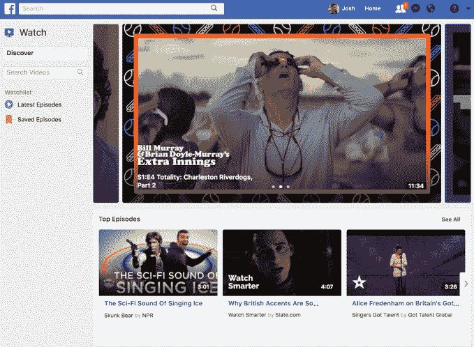

# 脸书停止补贴直播，在手表上推出前置广告

> 原文：<https://web.archive.org/web/https://techcrunch.com/2017/12/14/facebook-pre-roll-ads/>

每个人最不喜欢的广告都来到了脸书，但六秒钟的预播放只会出现在你有意观看的原创视频中，而不会出现在新闻提要中。在多年回避预投影片后，脸书开始接受预投影片，试图让视频创作者获得可持续的报酬。脸书视频负责人 Fidji Simo 告诉 TechCrunch，它将不会恢复对直播新闻视频广播公司的直接补贴，证实了 [Digiday 关于它停止支付包括 140 名出版商和名人的 5000 万美元合同的报道。](https://web.archive.org/web/20230404164741/https://digiday.com/media/facebook-plans-to-stop-paying-publishers-to-make-news-feed-videos/)

“很多交易……本来都是暂时的，”Simo 说。“我们资助内容已经有一段时间了。我们认为我们将推出一种新的格式，我们试图帮助出版商学习如何让这些内容发挥作用。”脸书推出了一系列新的观看节目预付费协议，其中包括一些定期直播节目。但当被问及为 BuzzFeed 的西瓜橡皮筋广播等内容提供资金的直播付费是否会被允许在明年年初用完，并且不再续签时，Simo 说“是的”

相反，脸书将鼓励直播新闻视频广播公司使用品牌内容赞助和插播广告。但现在视频必须至少长三分钟才有资格，广告插播至少一分钟，而旧规则要求视频至少长 90 秒，中间插播至少 20 秒。

从更积极的方面来看，脸书将会升级获得稳定收视率的观看原创视频节目的新闻订阅，它将在新闻订阅中向关注节目创作者页面的用户显示节目，即使他们还没有观看或订阅节目本身。这可能有助于脸书开发几个旗舰节目，因为在 Watch 中没有什么低质量、通常是无脚本的内容。脸书说，它计划在未来用更大的预算资助更少的节目。

## 谁赢谁输

脸书正试图平衡用户、内容出版商、广告商和自身之间的微妙关系。前滚动广告的增加应该会让出版商高兴，他们希望确保即使用户在一分钟后退出，他们也能从内容中获得报酬。这给了广告商更多的灵活性，如果电视节目变得流行，还能为脸书赚一大笔钱。

对于用户来说，前置广告肯定会令人讨厌，但如果有人故意去观看标签来观看特定的视频系列，不得不忍受广告感觉很正常。脸书明智的做法是将预滚动排除在人们偶然发现视频的新闻源之外，但必须先查看广告会破坏轻松的滚动体验。

然而，这里最大的输家是接受脸书直播和点播新闻视频补贴的出版商，他们组建了庞大的员工团队来制作昂贵的内容，现在正被赶向其他可能还不够成熟的货币化选择，以支付账单。以前，这些出版商只需制作娱乐视频，由脸书付费。现在，这些视频必须插入赞助内容，或者在显示广告插播之前至少吸引人们的注意力一分钟。结果，我们可能会看到视频发行商裁员。

这是一场更大的新闻行业危机的征兆，几年前，出版商努力弥补展示广告费率的下降，渴望从脸书的新闻订阅中获得额外的推荐流量。但是正如我所写的，出版商已经成为脸书智能管道中的哑内容，沦为脸书可以轻易换掉的代笔人。出版商应该专注于在他们的网站和电子邮件列表上建立自己的受众，而不是依赖脸书善变的中介渠道。

现在，脸书正在改变其视频战略，从补贴更适合新闻报道的新闻视频，转向更长、更具戏剧性的观看视频，同时推广更多来自朋友的用户生成内容，而不是来自新闻媒体的文章。没有同样庞大的团队和利润，出版商可能不够敏捷，无法优雅地进行调整。这就是为什么当脸书抛出下一个病毒礼物时，出版商应该保持怀疑，专注于他们的长期战略，而不是跳过新的箍。

*关于这个问题的更多信息，请看下面我的慷慨陈词视频:*