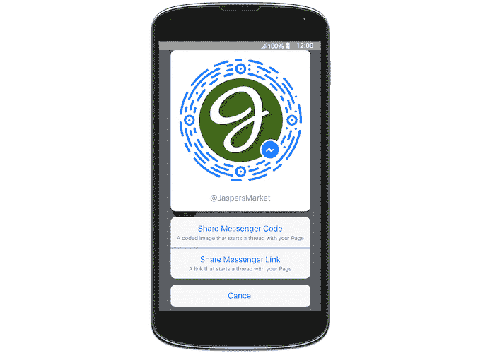
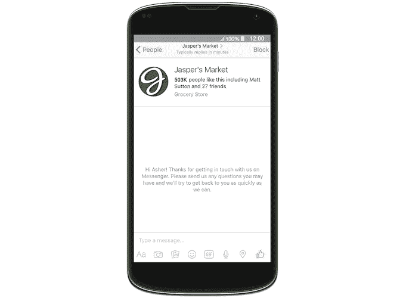

# 脸书用新的页面工具推动企业使用 Messenger，包括 Snapchat 式的可扫描代码

> 原文：<https://web.archive.org/web/https://techcrunch.com/2016/04/07/facebook-pushes-businesses-to-messenger-with-new-tools-for-pages-including-snapchat-like-scannable-codes/>

人们开始注意到[脸书现在在 Messenger](https://web.archive.org/web/20230304205109/https://www.facebook.com/business/news/find-and-contact-businesses-on-messenger) 中建议业务聊天的一天后，社交网络官方[宣布了](https://web.archive.org/web/20230304205109/https://www.facebook.com/business/news/find-and-contact-businesses-on-messenger)一套工具和更新，旨在帮助脸书用户更好地与使用其平台的业务联系。作为这些变化的一部分，企业现在将看到他们的脸书页面用户名在整个网站上得到更大力度的推广，他们已经获得了两种新的方式让人们开始与他们聊天:Messenger 链接，这是一种短 URL，以及可扫描的 Messenger 代码。

“像脸书用户一样，一些脸书网页也有虚假网址,”脸书解释道，比如 facebook.com/JaspersMarket.那些有虚假网址的网页已经有了用户名——它是网址斜杠后面的部分(比如@ JaspersMarket)。

今后，这些用户名将直接放在企业的脸书页面上，直接放在页面标题下面，前面有@符号。那些没有唯一用户名的页面会想要创建一个，当然那些之前没有太关注自己虚荣心 URL 的页面可能想在这个功能上线之前做一些改变。

[gallery ids="1303853，1303852"]

鉴于这一功能现在将与脸书连接客户和企业的更大计划相结合，网页所有者获得他们希望在网络上代表他们的用户名将是至关重要的。这可能会引发对一些更常见名称的各种“土地争夺战”，这些名称还没有被一家企业通过声称对一个虚荣的网址拥有所有权的方式抢去。

脸书指出，这些独特的用户名将能够被设置和编辑，该功能将在“未来几周”推出

随着这一宣布，脸书还首次推出了信使链接和代码，这将有助于客户更容易地通过脸书的信使服务开始与企业对话。

Messenger 链接基本上是短而易记的网址，利用了页面的用户名和脸书自己的网址缩写。这些将是“m.me/username”格式，当点击时，它们将立即在 Messenger 中打开与有问题的企业的聊天。今年早些时候，TechCrunch 报道称短链接正在开发中。

类似地，Messenger 代码也可以用于打开聊天窗口，但它是唯一的代码，人们可以使用手机上的摄像头在 Messenger 中扫描。扫码是 Snapchat 作为向其竞争对手的网络应用添加朋友的一种方式而普及的，所以有趣的是，脸书现在也在朝着这个方向迈出一步。

然而，在这种情况下，代码是针对脸书的商业客户。脸书说，这些代码也可以用在广告、网站和其他营销材料中。这些供下载的 Messenger 代码图像将通过页面的收件箱发送。

话虽如此，可扫描代码和短链接并不仅限于企业——脸书[今天](https://web.archive.org/web/20230304205109/https://www.facebook.com/davidm/posts/10156878445465195)更低调地宣布，人们——意思是*用户*——也将获得这一功能。这是一个合乎逻辑的下一步——毕竟，一旦产品被开发出来，将它的使用局限于商业是没有意义的。然而，现在更大的焦点似乎是让页面上船。

这个额外的花絮是由信使报的负责人 David Marcus 通过《脸书邮报》披露的，他说企业和“人”都将拥有用户名、链接和代码。(然而，这并不是脸书第一次使用二维码——它曾[在失败的匿名应用房间](https://web.archive.org/web/20230304205109/https://techcrunch.com/2014/10/23/facebook-rooms/)中使用过二维码邀请系统。

马库斯在他的帖子中还提到，Messenger 现在每月有超过 9 亿的活跃用户，每月有超过 10 亿条消息在人和企业之间发送。

最后，脸书表示，它将很快允许企业定制他们的“Messenger Greetings”，这是一个新功能，在发送任何消息之前，在企业和客户之间的消息线程中弹出一个注释。这里的想法是，企业可以为那些伸出手来聊天的人定下基调或传递重要信息。

我们应该指出，这不是脸书第一次为企业提供定制、保存和自动化与客户沟通的方式。去年，[公司推出了一款名为“保存回复”的工具，](https://web.archive.org/web/20230304205109/https://techcrunch.com/2015/06/02/facebook-tests-saved-replies-a-tool-that-lets-pages-respond-to-customers-with-canned-messages/)可以让页面用固定信息回复客户。

脸书今天没有解决 Messenger 中为一些用户显示的“建议业务”部分，这表明该功能不是面向所有人的，或者仍然只是一个测试。

然而，有一点是清楚的，那就是脸书致力于帮助页面和企业从更大的社交网络向即时聊天服务转型。

这种推动发生在越来越多的用户转向私人通讯应用来社交和花时间在手机上的时候。并不是所有脸书的企业都把与客户交流或聊天作为优先事项，而是专注于维护和更新他们的页面。随着新工具在“未来几周”推出，脸书给这些企业一个警告，移动通讯不能再被忽视了。