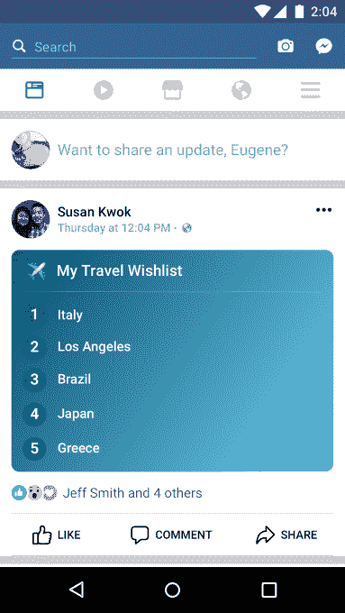
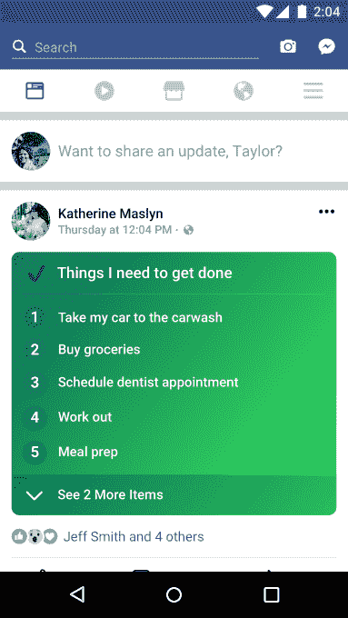

# 脸书推出新列表功能 TechCrunch，推动更多个人更新

> 原文：<https://web.archive.org/web/https://techcrunch.com/2018/02/13/facebook-pushes-for-more-personal-updates-with-launch-of-new-lists-feature/>

脸书的状态更新框获得了一个名为列表的新功能，今天开始推出。这是自一年多前推出彩色背景(T0)以来对输入领域的首次重大更新，也是鼓励脸书用户分享更多个人内容的一种方式。这个功能，就像它听起来的那样，让用户可以列出他们选择的任何东西——新年决心、待办事项、尝试的餐馆、旅行想法等等。

用户可以用彩色背景创建自己的列表，并用表情符号装饰它们。

这些列表的设计理念是，朋友们可以互相复制对方的列表，分享他们对手头主题的看法。

该功能尚未广泛提供，因为它是一个缓慢的全球推出今天开始，我们知道。

该附加内容作为“你在想什么？”的一部分出现(状态更新)框作为投票、感觉/活动、照片/视频、签到、GIF 和其他项目旁边的另一个选项。

这些功能的目标是推动用户发布更多的个人更新，如关于他们生活的故事，他们在做什么，他们在想什么。这类帖子曾经是脸书的谋生之道，并诱使朋友们重新登录，看看其他人在说些什么。但是这些年来，脸书的新闻 Feed 充斥着视频、链接、新闻、迷因、来自脸书页面的更新，当然还有广告。

《今日脸书》正试图解决其新闻提要中非个人内容过多的问题。

最近，它表示正在调整新闻推送算法以[显示更多来自用户朋友和家人](https://web.archive.org/web/20221127182113/https://beta.techcrunch.com/2018/01/11/facebook-time-well-spent/)的帖子，减少来自品牌和出版商的帖子。但这种策略的一个问题是，这些年来，人们发布的个人内容越来越少。

来自 2016 年 12 月发布的信息的一份[报告称，个人更新在这一年中下降了 15%，从 2014 年年中到 2015 年年中下降了 21%。](https://web.archive.org/web/20221127182113/https://www.theinformation.com/facebook-struggles-to-stop-decline-in-original-sharing?shared=eeb2ca)

最重要的是，脸书的年轻用户群也在下降。根据本周 eMarketer 的一份报告[，脸书在 2017 年失去了大约 280 万 25 岁以下的美国用户，今年将再失去大约 210 万。](https://web.archive.org/web/20221127182113/https://www.recode.net/2018/2/12/16998750/facebooks-teen-users-decline-instagram-snap-emarketer)

为了扭转这一趋势，脸书一直在开发吸引年轻用户的功能。例如，它[在 2017 年 10 月收购了病毒应用 tbh](https://web.archive.org/web/20221127182113/https://beta.techcrunch.com/2017/10/16/facebook-acquires-anonymous-teen-compliment-app-tbh-will-let-it-run/) ，然后迅速推出了[的 a Q &功能，类似于 tbh 在新闻提要中的](https://web.archive.org/web/20221127182113/https://beta.techcrunch.com/2017/12/05/as-tbh-popularity-wanes-facebook-launches-did-you-know-social-questionnaire/)。列表也是对年轻用户有吸引力的东西，尽管它们可以帮助任何人吸引更多的注意力——就像现在的彩色背景一样。

脸书没有给出何时完成推出的预计时间，但列表将从今天开始出现在部分用户中。