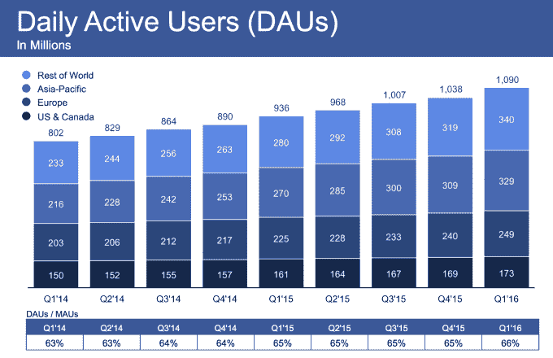
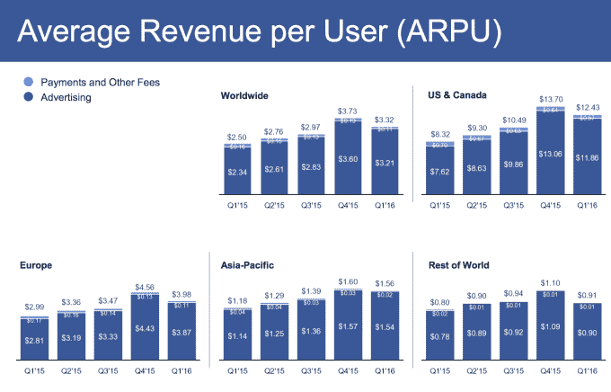

# 脸书用户增至 16.5 亿，收入超过 Q1 预测的 53.8 亿美元

> 原文：<https://web.archive.org/web/https://techcrunch.com/2016/04/27/facebook-q1-2016-earnings/>

在其他科技公司苦苦挣扎之际，脸书继续保持连胜，月用户数达到 16.5 亿，并以 53.8 亿美元的收入和 0.77 美元的每股收益超过了 Q1 2016 年[财报](https://web.archive.org/web/20230407012540/http://investor.fb.com/releasedetail.cfm?ReleaseID=967167)中的估计。收益公布后，脸书的股价攀升超过 8%，在盘后交易中达到 117 美元以上。

收入同比增长 52%，脸书仍在高效运营，在 Q1 创造了 15 亿美元的利润，同比增长 195%。每用户平均收入同比增长 32%。

## 用户增长加速

脸书从上个季度的 15.9 亿月用户增长了 3.77%，并且在第四季度假期期间实现了 58.41 亿美元的收入。这与第四季度 2.58%的季度用户增长率相比是一个巨大的进步，几乎与第三季度 4.02%的强劲增长 [一样高。](https://web.archive.org/web/20230407012540/https://techcrunch.com/2015/11/04/facebook-earnings-q3-2015)

作为参考，Twitter 本季度只能增加[500 万](https://web.archive.org/web/20230407012540/https://techcrunch.com/2016/04/26/twitter-reports-mixed-q1-on-sales-of-595m-ep-of-0-15-and-a-sluggish-310m-maus/)用户。脸书的新增用户是 Twitter 的 12 倍，尽管其规模只有 5X。

分析师预计收入为 52.5 亿美元，每股收益为 0.62 美元，脸书轻松超过了预期。脸书还增加了一种新的股票类别，让公众在没有投票权的情况下购买股票，这可能会破坏马克·扎克伯格对公司方向的铁腕控制[，包括对人工智能、虚拟现实和互联网连接的长期押注。](https://web.archive.org/web/20230407012540/http://newsroom.fb.com/news/2016/04/marknote/)

尽管许多人关注的是月用户数，但脸书的日用户数更准确地反映了它的健康状况。与 2015 年第四季度的 10.4 亿相比，它在 Q1 的日活跃用户数达到了 10.9 亿，增长了 4.8%，甚至超过了其每月用户数。脸书的粘性，即 DAU 与 MAU 的比率，从上个季度的 65%增长到 66 %,这意味着每天访问它的月用户比以前更多了。

总体而言，脸书的应用家族战略正在发挥作用。脸书现在有 16.5 亿用户，Messenger 有 9 亿，Instagram 有 4 亿。这些应用的用户现在平均每天花 50 分钟在这三个上面。

## 发展中国家每用户收入增长缓慢

移动是脸书赚钱的地方，与上季度 80%的广告收入相比，移动现在占了脸书广告收入的 82%。如果算上脸书不断萎缩的支付，移动广告占脸书总收入的 79%。

脸书收入的一个问题是，世界其他地区(包括脸书核心增长来源的发展中国家)的平均用户收入大幅下降。

它降至每用户 0.91 美元，预计低于第四季度假期的 1.10 美元，但也低于第三季度的 0.94 美元。该地区的 ARPU 仅增长了 13.75%，而全球范围内为 32%。这表明，脸书在发展中国家增加用户的速度可能快于其有效盈利的速度。

脸书还表示，T4 预计虚拟现实(包括其 Oculus 部门)不会对 2016 年的收入产生实质性影响。

随着发展中国家的许多用户超越台式电脑，直接使用智能手机，脸书的纯移动用户数量增长到 8.94 亿，比上个季度的 8.23 亿增长了 8.62%。 尽管脸书在一些早期市场已经达到饱和，但它在发展中国家仍在稳步增长。每月移动用户增长到 15.1 亿，这意味着 91%的脸书用户通过移动设备访问。

虽然没有在财报中公布，但 Facebook Messenger 可能已经达到 10 亿用户，这种无处不在的情况有助于它击败竞争对手和短信标准。虽然该公司在 LiveRail 视频广告部门遇到了一些问题，但在第 12 年仍显示出强劲的用户增长和收入势头。