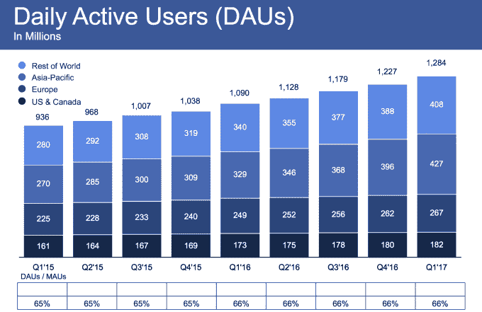
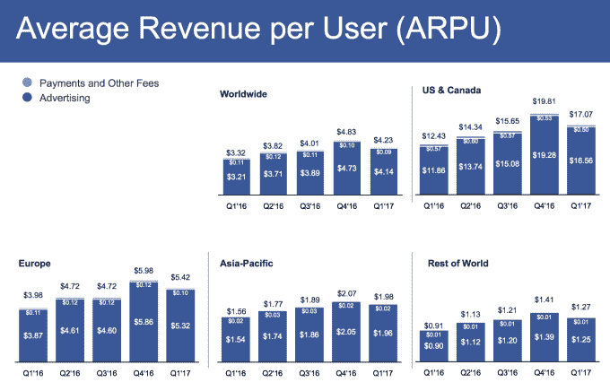

# 脸书以 80.3 亿美元的收入击败 Q1，更快增长至 19.4 亿用户

> 原文：<https://web.archive.org/web/http://techcrunch.com/2017/05/03/facebook-q1-2017-earnings/>

脸书又经历了一个强劲的季度，超出了 2017 年初的预期。它在 Q1 的收入为 80.3 亿美元，实际每股收益为 1.04 美元，而预期每股收益为 0.87 美元。它从 19.4 亿用户中获得了这一收入，高于上一季度的 18.6 亿用户，比上一季度的 3.91%增长了 4.3%。

## 稳定的增长，强劲的利润

按照这个速度，脸书在 Q2 的用户总数将达到 20 亿。日活跃用户达到 12.8 亿，高于上个季度的 12.3 亿。虽然假新闻、视频暴力和抄袭 Snapchat 都是脸书新闻周期的固定节目，但在此期间，其用户增长实际上是增长的。脸书在利润丰厚但已饱和的美加市场每月新增 300 万用户，尽管亚太地区是主要驱动力，脸书新增 4300 万用户。

该公司告诉投资者，“脸书不再报告非 GAAP 费用、收入、税率和每股收益(EPS)。”这意味着它将在其支出中更突出地披露基于股票的薪酬，这很重要，因为脸书等科技公司向员工支付大量股票，这些股票随着时间的推移而归属，以防止他们离开。

[更正:TechCrunch 和其他一些出版物错误地将新 GAAP 实际 EPS 与非 GAAP 分析师估计进行了比较，因为脸书不再报告非 GAAP 财务数据。由于脸书的 GAAP 实际每股收益为 1.04 美元，而分析师估计为 0.87 美元，脸书本季度实际上击败了华尔街，而不是像我们最初报告的那样有混合的结果。]

脸书的收入超过了分析师的预期，为 78.3 亿美元。脸书今天早些时候收盘下跌 0.68%，至 151.80 美元。在盘后交易中，股价下跌了 2.37%。今天的报告显示，新闻供稿广告空间的耗尽并没有阻止脸书继续增加其收入。

移动广告收入占脸书广告收入的 85%，而上一季度为 84%，广告收入为 67 亿美元。脸书在 Q1 实现利润 30.6 亿美元，同比增长 76%，收入同比增长 49%。脸书设法减缓了其游戏支付业务的下滑，它在 Q1 的收入为 1.75 亿美元，而上个季度为 1.8 亿美元，第三季度为 1.95 亿美元。脸书停止报告纯移动用户。

员工总数增至 18，770 人，同比增长 38%。脸书的总成本为 47 亿美元，运营利润率为 41%，低于上个季度的 52%。

脸书通过拥有 2 亿用户的脸书 Lite、最近推出的 Messenger Lite 和新的 Instagram 离线模式等应用程序对发展中国家的关注正在取得回报。在世界其他地区，每用户平均收入达到 1.27 美元，一年内增长了 40%。

## 扎克伯格论跨越式 Snapchat

在财报电话会议上，马克·扎克伯格概述了脸书在“建设社区”这一新使命上的工作，这位首席执行官在二月份的人道主义宣言中描述了这一使命。进展包括让人们加入社区团体，发起组织灾难和危机救援的社区帮助，以及启动市政厅将人们与他们选出的代表联系起来。

电话会议中的一条重要消息是，脸书旗下即时通讯应用 Snapchat Stories 的复制品 WhatsApp Status 的表现首次显示出来。扎克伯格说 [WhatsApp Status 在推出仅 10 周后就拥有了 1.75 亿日活用户](https://web.archive.org/web/20230320124424/https://techcrunch.com/2017/05/03/whatsapp-status-million-users/)，比 Snapchat 整体规模还要大。

但是扎克伯格最激动人心的评论来自于他描述脸书在视觉交流和增强现实方面相对于竞争对手的进步。虽然他没有提到 Snapchat，但他说(强调我的意思)时暗示了这种比较:

> " **我认为我们有点落后于最初的趋势**让相机成为分享工作的中心。但我确实认为在这一点上，就我们正在构建的技术而言，我们已经走在了前面，我认为打造一个开放平台是向前迈出的一大步。很多人在我们的应用程序家族中使用这些产品。**我希望我们从**的这一点上继续引领前进的道路。”

这位首席执行官似乎看好外部开发者帮助脸书制作比 Snap can 本身更广泛的 AR 内容。当被问及如何将 AR 货币化时，扎克伯格提到了物体识别如何能够在现实世界的东西上实现浮动购买按钮。

电话中的另一个重要观点是，脸书越来越强调长格式视频和有目的的观看，而不是人们今天在 feed 中自发发现的短格式视频。阻止广告拦截器的努力也取得了成功，首席财务官大卫·韦纳表示，与 2016 年 Q1 奥运会相比，脸书 2017 年 Q1 奥运会的广告展示次数增加了 32%。

## 丑闻不会拖脸书的后腿

eMarketer 估计，2017 年脸书将产生 362.9 亿美元的净数字广告收入，比去年增长 35%。这将使其以 16.2%的份额位居全球在线广告市场第二，落后于谷歌的 33%。脸书广告收入的 45%预计将来自美国。虽然脸书没有公布 Instagram 的财务数据，但 eMarketer 预计其全球广告收入将达到 39.2 亿美元，占脸书广告收入的 12.3%。

eMarketer 分析师黛布拉·阿霍·威廉姆森(Debra Aho Williamson)表示:“广告客户继续报告他们在脸书的广告取得了积极的效果，但他们仍然担心假新闻和脸书披露的衡量失误等问题。”。“公司如何解决这些和其他问题将是决定未来几个季度和几年收入增长是否会像最近几年一样强劲的关键因素。”

Q1 看到脸书推出了几款新产品，这些产品可能会成为这家社交网络的重要赚钱工具。继 Instagram Stories 取得成功之后，脸书继续努力克隆 Snapchat，推出了 [Messenger Day](https://web.archive.org/web/20230320124424/https://techcrunch.com/2017/03/09/facebook-messenger-day/) 、[脸书 Stories](https://web.archive.org/web/20230320124424/https://techcrunch.com/2017/03/28/storybook/) 和 [WhatsApp Status](https://web.archive.org/web/20230320124424/https://techcrunch.com/2017/02/20/whatsapp-status/) 。这些克隆可能会抑制 Snapchat 的增长，同时最终从它可能会在故事之间插入的[广告中吸金，就像它在 Instagram 上做的那样。](https://web.archive.org/web/20230320124424/https://techcrunch.com/2017/01/11/instagram-stories-hits-150m-daily-users-launches-skippable-ads/)

与 LinkedIn 竞争，[脸书推出了可以转化为广告的职位空缺。](https://web.archive.org/web/20230320124424/https://techcrunch.com/2017/02/15/facebook-jobs/)[脸书开始测试录制视频和直播中的广告插播](https://web.archive.org/web/20230320124424/https://techcrunch.com/2017/02/23/facebook-ad-breaks/)，将保留 45%的广告收入，同时支付给创作者 55%。

但脸书看到了 Oculus 的麻烦，在输掉一场关于被盗知识产权的诉讼后，向 Zenimax 支付了 3 亿美元(外加 Oculus 创始人提供的 2 亿美元)。联合创始人帕尔默·卢奇(Palmer Luckey)离开了公司，Oculus 在整个行业的系留虚拟现实硬件销售缓慢的情况下降低了 Rift 耳机的价格。

本季度最大的新闻是脸书持续打击假新闻和攻击性内容的斗争。它开始与外部事实检查员合作，聘请了一位前纽约时报产品经理来管理新闻产品，使禁止内容的报道更容易，今天宣布将雇用 3000 人来加快对标记内容的审查。然而，即使是这样的争议似乎也没有减缓社会的强大力量。