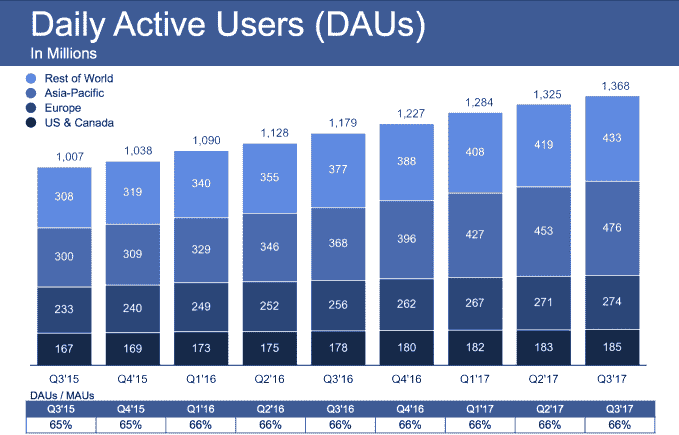
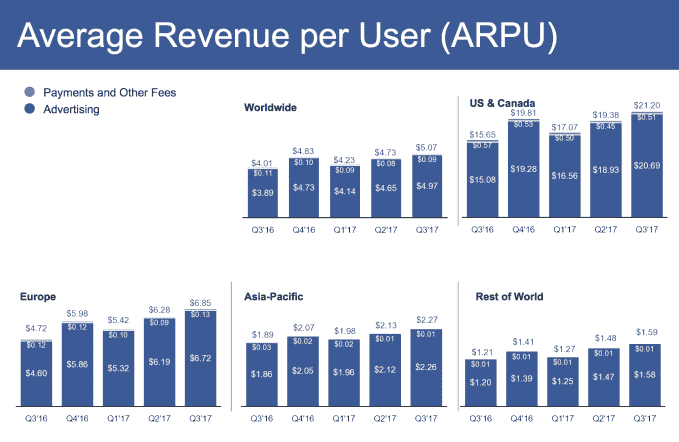

# 脸书第三季度盈利 47 亿美元，股价创历史新高

> 原文：<https://web.archive.org/web/https://techcrunch.com/2017/11/01/facebook-q3-2017-earnings/>

脸书仍在众议院情报委员会关于[干预俄罗斯选举](https://web.archive.org/web/20230404181111/https://techcrunch.com/2017/11/01/russia-senate-intel-hearing-facebook-google-twitter/)的听证会中，但对滥用的隐现担忧并没有影响其业务，因为利润继续飙升，股价创下历史新高。

尽管如此，首席执行官马克·扎克伯格认为打破他传统的“我们的业务做得很好”的脚本是合适的，并补充说“但如果我们的服务没有以拉近人们之间距离的方式使用，那就没有关系了。我们认真防止平台上的滥用。我们在安全方面投资太多，这将影响我们的盈利能力。保护我们的社区比最大化我们的利润更重要。”

但这些变化尚未影响脸书的盈利能力，该公司的盈利能力同比增长 79%，至 47 亿美元。脸书的[今天宣布了](https://web.archive.org/web/20230404181111/https://investor.fb.com/investor-news/press-release-details/2017/Facebook-Reports-Third-Quarter-2017-Results/default.aspx)2017 年第三季度的收益，继续其超出预期的连胜纪录。脸书的收入为 103 亿美元，每股实际收益为 1.59 美元，而预期收入为 98.4 亿美元，每股收益为 1.28 美元。脸书的每股收益比去年同期增长了 76%，显示出它已经成为一个多么高效的赚钱机器。

与 2016 年第三季度的 59%相比，收入同比增长 47%，这与脸书的警告相符，即其广告展示空间不足。本季度，移动广告占脸书广告收入的比例从 87%小幅上升至 88%，达到了向移动广告成功转移的稳定点。每名每日活跃用户的平均收入达到 7.51 美元，而一年前为 5.95 美元。这 26%的增长表明，尽管脸书的日用户增长率在过去一年里只有 16%，但脸书已经找到了越来越好的方法从人们身上榨取金钱。

至于用户数量，脸书现在拥有 20.6 亿月度活跃用户，比上一季度的 20.06 亿和 3.4%的增长率增长了 3.19%。日活跃用户达 13.7 亿，环比增长 3.8%。自 2016 年 Q1 以来，脸书的粘性，即每天返回的每月活跃用户的百分比，一直保持在 66%。但这实际上是一个巨大的成功，因为随着用户流失和参与度较低的长尾注册，大多数应用程序的粘性会逐渐降低。

在财报公布前，脸书的股价收于 182.66 美元，在盘后交易中上涨了 1.28%。脸书拥有充足的战争资金，以备进行任何大型收购，截至 2017 年第三季度末，该公司拥有 382.9 亿美元的现金有价证券。

## 收益电话会议亮点

在财报电话会议上，[扎克伯格表示支持政府对广告透明度](https://web.archive.org/web/20230404181111/https://techcrunch.com/2017/11/01/zuck-may-support-ad-regulation/)的潜在监管，称他认为这将是“非常好的，如果做得好的话”，即使脸书试图自我监管。

首席财务官大卫·韦纳(David Wehner)表示，脸书将在 2018 年将其支出增加 45%至 60%，以资助俄罗斯入侵后的安全工作，以及原创视频、人工智能、虚拟现实和增强现实。脸书将雇用 10，000 人来监控内容和广告，尽管一些人将成为承包商，并计划将其安全工程人员增加一倍。

扎克伯格表示，Instagram Stories 和 WhatsApp Status 现在都有 3 亿日活跃用户，高于 6 月和 7 月的 2.5 亿。这意味着这些 Snapchat 克隆几乎是整个 Snapchat 应用的两倍大，后者每天有 1.73 亿活跃用户。

虽然这项业务蒸蒸日上，但在媒体看来，这几个月对脸书来说是严峻的，因为它在俄罗斯干预选举后匆忙改善其滥用检测系统。与此同时，新闻出版商害怕测试一个新闻提要，删除所有页面，把它们放在一个单独的、隐藏的提要中。但优先考虑用户体验让脸书在面临诸多挑战和公众普遍反对的情况下继续茁壮成长。