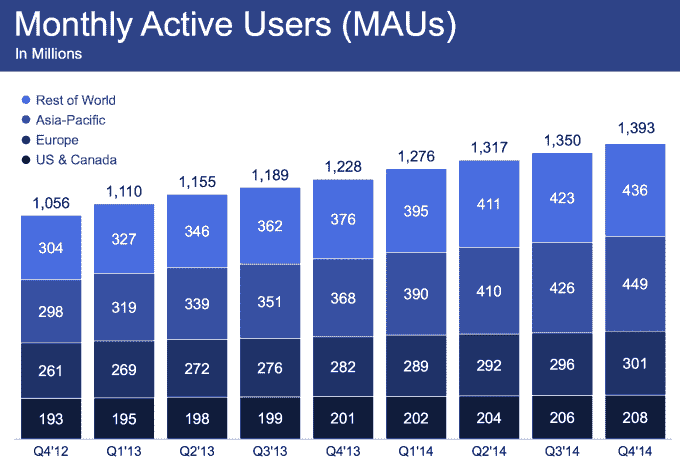
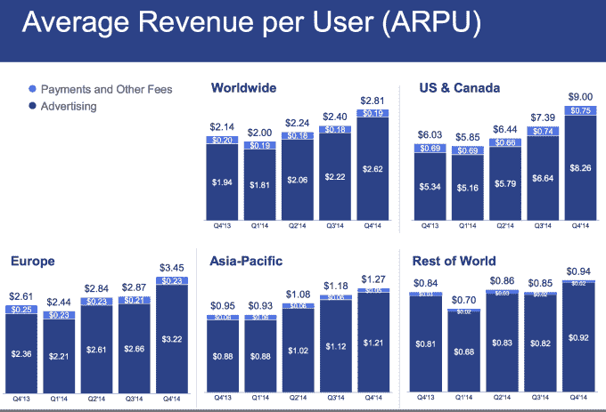

# 脸书第四季度收入 38.5 亿美元，用户增长 3.2%，达到 13.9 亿用户

> 原文：<https://web.archive.org/web/https://techcrunch.com/2015/01/28/facebook-q4-2014/>

2014 年第四季度[脸书连续第十个季度超过华尔街预期。它现在拥有 13.93 亿用户，环比增长 3.18%，略高于第三季度的 2.2%，但低于 Q2 的 3.125%。该公司收入 38.5 亿美元，每股收益 0.54 美元。移动广告收入占广告收入的 69%,而上个季度为 66%,这表明其业务现在已经稳固地移动化。](https://web.archive.org/web/20221007140642/http://investor.fb.com/releasedetail.cfm?ReleaseID=893395)

脸书目前拥有 8.9 亿日活用户，11.9 亿移动月活用户(增长 6.2%)，以及7.45 亿日活用户(增长 5.97%)。这意味着脸书的移动增长率实际上在增加。[纯移动用户飙升至 5.26 亿](https://web.archive.org/web/20221007140642/https://beta.techcrunch.com/2015/01/28/facebook-mobile-only-2/)，环比增长 15.3%，这得益于脸书在台式电脑稀缺的发展中国家的扩张努力。

华尔街预期收入为 37.8 亿美元，0.48 美元。其他脸书财务结果包括 27.2 亿美元的 GAAP 成本和费用，11.3 亿美元的 GAAP 收入，29%的 GAAP 营业利润率和 5.17 亿美元的资本支出。正如它警告投资者的那样，它的成本大幅上升，但它在 Oculus 和人工智能上的投资可能在几年内获得巨大回报。

就 2014 年整体而言，脸书达到 124.7 亿美元，同比增长 58%，日用户数从 7.57 亿增长 18%，总用户数从 2013 年底的 12.3 亿增长 13%。

脸书在第四季度专注于提高其新闻订阅质量，以便更多用户将更多时间花在它显示广告的地方。它还认真对待提供视频内容，导致视频浏览量大幅增加。现在每天有 30 亿的视频浏览量。通过提高有机视频收视率，脸书将能够把更有利可图的视频广告放入 feed。

脸书最近展示了一款名为“工作中的脸书”的企业社交网络产品的试点，但它还没有从中获得任何收入。

一个引人注目的数字是[脸书的广告和测量工具如何让 is 从同样数量的用户身上赚更多的钱。脸书在美国&的用户数量仅增长了 0.97%，从 2.04 亿增加到 2.06 亿，但它从这些用户身上获得的平均广告收入增长了 24%，从 6.64 美元增加到 8.26 美元。](https://web.archive.org/web/20221007140642/https://beta.techcrunch.com/2015/01/28/epic-ad-measurement/)

在财报电话会议上，首席执行官马克·扎克伯格提到，随着时间的推移，脸书的内容已经变得更加丰富——从文本到照片到视频。他说，脸书正在开发有助于丰富内容创作的工具。

我预计脸书会发布一款独立的视频讲故事应用，或者大幅改进其主应用中的视频和富媒体分享工具。这是我从 2013 年开始就一直在说的脸书应该做的事情。

目前，脸书的应用程序不允许你编辑视频，点击并按住以捕捉，在一个视频中拍摄多个镜头，设置封面框，稳定图像，或者用图画，贴纸或音频来活跃你的创作。这些特征中的任何一个都将是受欢迎的改进。

总的来说，从本季度的收益可以看出，脸书不仅仅是一家以移动为先的公司。它正在成为一家纯移动公司。超过 5 亿人现在只通过电话使用社交网络。不过，其中许多人都是功能手机用户。脸书的下一个大挑战将是如何从购买力较低的人群身上榨取更多的收入。这可能使其连接世界其他地区的努力成为一项非常有利可图的任务。