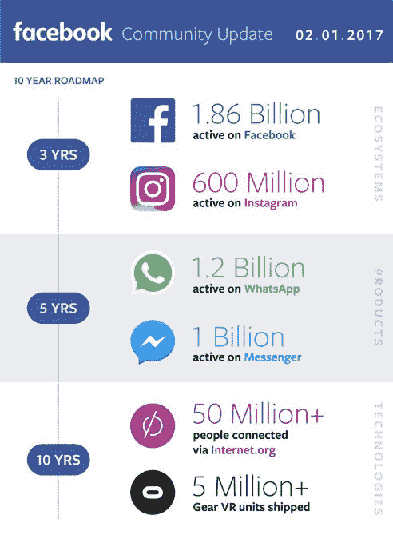
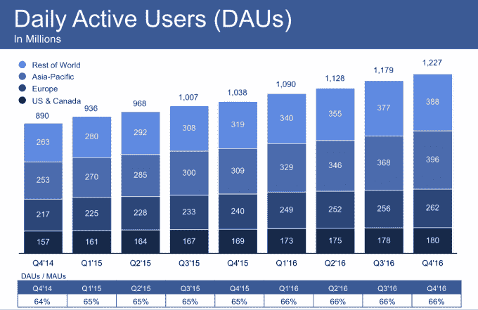
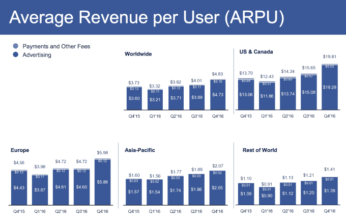

# 脸书第四季度收入 88.1 亿美元，增速放缓至 18.6 亿用户

> 原文：<https://web.archive.org/web/https://techcrunch.com/2017/02/01/facebook-q4-2016-earnings/>

脸书在 2016 年第四季度再次表现强劲，收入 88.1 亿美元，每股收益 1.41 美元。它从每月 18.6 亿用户中提取了这一数据，本季度增长了 3.91%，或从 17.9 亿用户中提取了 7000 万用户，但增速低于上个季度的 4.67%。移动广告收入现在占其广告收入的 84%，与上一季度持平，为 72.48 亿美元，这表明脸书已经成功完成了向移动广告的转变。

脸书打破了之前分析师的预期，之前的预期是  收入 85.1 亿美元，每股收益 1.31 美元。与上一季度的 23.79 亿美元相比，利润达到 35.68 亿美元，收入同比增长 177%。与上一季度的 56%和 Q2 的 59%相比，收入同比增长 51%。2016 年，脸书的总收入为 276 亿美元。

上个季度，脸书警告称，收入增长将放缓，因为它预计广告空间将在 2017 年年中告罄，尽管这似乎已经产生了影响。但尽管收入增长放缓，投资者在财报公布后的盘后交易中推动股价上涨 2.52%，至 136.69 美元，此前该股在今天早些时候收盘上涨 2.23%，至 133.23 美元。财报电话会议结束时，盘后股价仅上涨 0.94%。

日活跃用户达到 12.3 亿，高于上一季度的 11.8 亿，同比增长 18%，而上一季度为 17%。脸书现在有 17.4 亿移动每月用户，高于上一季度的 16.6 亿，和 11.49 亿纯移动每月用户，高于上一季度的 10.55 亿。

最重要也是最容易被忽视的一个数据是脸书的粘性，或者说每月有多少百分比的用户每天都会回来。这一比例保持在 66%，与上一季度相同。然而，美国和加拿大的用户增长开始放缓，脸书本季度日活和月活用户仅增加 200 万，日活和月活用户分别达到 1.8 亿和 2.31 亿。

脸书所有的参与和广告定位都得到了回报。在美国和加拿大，每用户平均收入高达 19.81 美元，同比增长 44%。全球范围内，ARPU 达到 4.83 美元，同比增长 29.5%。这意味着它每用户每年能赚将近 20 美元。在既定的西方市场，从每个用户身上榨取越来越多的现金，同时在发展中国家稳步赚取更多的现金，这表明脸书在可预见的未来有着强大的盈利潜力。

在财报电话会议上，首席执行官马克·扎克伯格被反复问及脸书的视频内容战略。他解释说[“我们开始关注更短形式的内容”](https://web.archive.org/web/20230404162250/https://techcrunch.com/2017/02/01/facetube-not-faceflix/)，该公司需要建立一个可持续的广告收入分享商业模式，向专业创作者支付费用，将这些内容带到脸书。扎克伯格还提到了视频在内容之外的进展，引用了每月有 [4 亿人使用 Facebook Messenger 音频和视频通话](https://web.archive.org/web/20230404162250/https://techcrunch.com/2017/02/01/facebook-video-calls/)。

脸书在新闻方面经历了一个动荡的季度，此前它受到指控，称通过其网络传播的假新闻帮助了唐纳德·特朗普当选。与此同时，Oculus 联合创始人帕尔默·卢奇(Palmer Luckey)与虚拟现实公司 ZeniMax 一起打破了一个 NDA，因此受到了 5 亿美元的罚款。

但与此同时，Instagram 大放异彩，并继续扩大其广告产品。它的 Snapchat Stories 克隆 Instagram Stories 在推出后仅 5 个月就达到了 1.5 亿日活用户， [TechCrunch 报道称，大量消息来源认为 Instagram Stories 正在从 Snapchat](https://web.archive.org/web/20230404162250/https://techcrunch.com/2017/01/30/attack-of-the-clone/) 窃取用户。

现年 13 岁的脸书表现出了非凡的毅力，尽管转向移动和更新、更注重视觉的社交媒体平台的出现，他仍让用户开心地分享和喜欢。随着脸书向 Messenger 和 WhatsApp 的聊天领域以及 Oculus 的虚拟现实领域进一步扩张，它有一个强大的核心业务可以依赖。如果它能够在其他应用中使用 Instagram Stories 和类似的模仿来抵御 Snapchat 的威胁，它可能会在未来十年继续主导社交媒体。