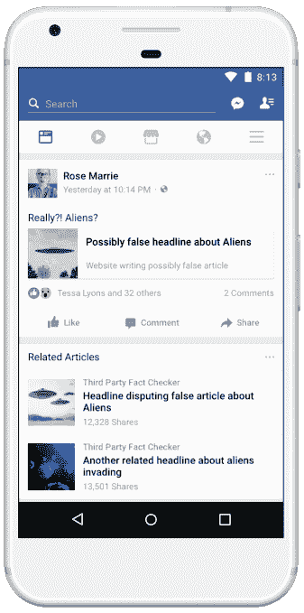
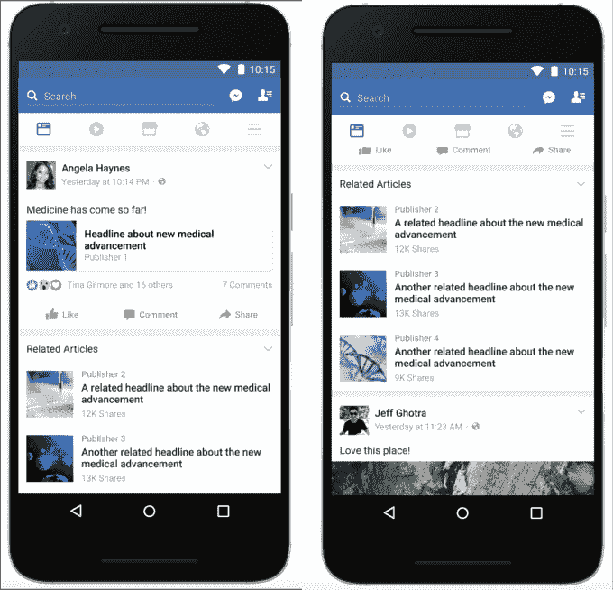

# 脸书用其他角度的链接对抗假新闻

> 原文：<https://web.archive.org/web/https://techcrunch.com/2017/08/03/facebook-related-articles/>

脸书将成为观点的建议者，以避免成为“真理的仲裁者”。这是[推出](https://web.archive.org/web/20230404132716/https://newsroom.fb.com/news/2017/04/news-feed-fyi-new-test-with-related-articles/)“相关文章”，出现在许多人在脸书发布的故事的新闻链接下方，或者被怀疑是虚假新闻并已由脸书的合作伙伴进行了外部事实核查。在有人阅读之前，相关文章会出现在同一主题的其他报道的表面链接上，以提供不同的观点，以及来自事实检查员的真实性报告。

如果用户在比较一个故事和它的相关文章时，看到截然不同的角度，他们可能会认为它可疑并跳过它，不太可能相信或分享它，或者可以点击相关文章并做出自己的决定。这可以减少虚假新闻的传播和影响，而脸书本身不必成为诚实的警察。相关文章也可以平衡一些可能微妙分化民众的激进谩骂。

点击前相关文章今天在美国、德国、法国和荷兰推出。选择这些国家首先推出，因为脸书已经在那里建立了事实核查伙伴关系。“我们不想也不是真理的仲裁者。事实检查器可以给出一个故事是真是假的信号，”脸书新闻 Feed integrity 产品经理 Tessa Lyons 说。

与此同时，脸书的机器学习算法已经提高了其准确性和速度，因此社交网络现在将让它向事实检查员发送更多潜在的恶作剧。莱昂斯解释说，速度很重要，因为“我们越早将潜在的虚假新闻交给事实审查员，他们就能越早审查它们，我们就越能减少实际接触到它们的人数。”

至少从 2014 年开始，脸书就在人们点击链接后显示相关文章。即使在那时，它也因散布假新闻而受到抨击。今年 4 月，脸书测试了新的点击前版本，作为其针对假新闻的[多管齐下攻击](https://web.archive.org/web/20230404132716/https://www.facebook.com/zuck/posts/10103253901916271)的一部分，此前有人批评错误信息影响了 2016 年美国总统大选。这包括[降低恶作剧和点击诱饵的排名](https://web.archive.org/web/20230404132716/https://techcrunch.com/2016/09/06/ultimate-guide-to-the-news-feed/)，减少对充满广告的垃圾网站的推荐流量以切断其资金来源，以及促进当地新闻业和新闻素养[。最直接的是，它与 Snopes、AP、PolitiFact 和其他外部机构合作，这样它就可以给被外部审查为虚假的报道添加警告标签。](https://web.archive.org/web/20230404132716/https://techcrunch.com/2017/04/06/facebook-puts-link-to-10-tips-for-spotting-false-news-atop-feed/)

“人们告诉我们，相关文章给了他们更多关于主题的背景知识，有更多的背景知识有助于他们做出更明智的决定，以及他们阅读的内容和他们决定分享的内容，”莱昂斯告诉我。“在相关文章中看到 Fact Checker 的文章实际上有助于人们识别他们正在阅读的内容是误导性的还是虚假的。”

脸书不会对相关文章进行个性化处理，这些文章会在链接故事下面显示一列缩略图和标题。然而，它确实利用了来自新闻订阅排名的其他质量信号来显示最佳的替代选择。谢天谢地，莱昂斯说脸书不打算在相关文章框中放任何广告。

那么，脸书如何避免在相关文章中意外出现更多假新闻呢？脸书告诉我，它使用相同的信号作为其趋势部分，并取消许多人评论或报告为虚假的帖子。没有人参与这个过程，这至少消除了直接偏见的可能性，尽管人类倾向于将他们的潜意识偏见编码到他们的算法中。

如果脸书不能让世界相信它已经真正处理了假新闻问题，它可能会看到人们收看新闻或点击其链接减少。这干扰了脸书广告驱动的商业模式及其使命。此外，它可能会因为未来的选举结果而受到指责。

虽然客观上假新闻得到了大多数的关注，但夸张和扭曲的观点更加普遍，因此可能会两极分化。如果极右和极左出版商的文章与中间派相关文章配对，它可能会劝阻人们不要盲目接受撕裂社会的咆哮和咆哮。