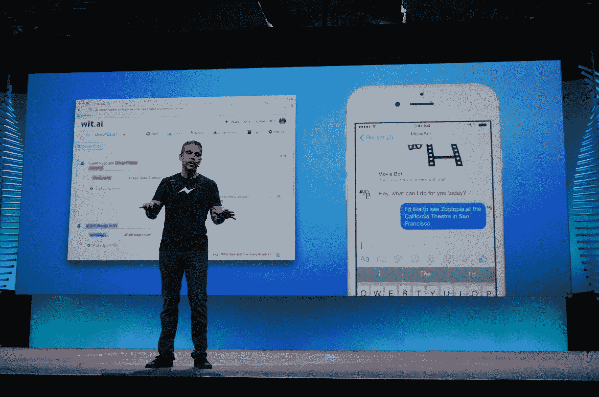

# 脸书发布机器人引擎，打造更智能的机器人 

> 原文：<https://web.archive.org/web/https://techcrunch.com/2016/04/12/facebook-releases-bot-engine-to-create-much-smarter-bots/>

# 脸书发布机器人引擎，创造更智能的机器人

Messenger 现在完全是关于机器人的。正如所料，脸书在其 [F8 会议](https://web.archive.org/web/20221005153328/https://beta.techcrunch.com/events/f8-2016/)上发布了发送和接收 API。它可以让你为 Messenger 创建机器人来搜索东西和与企业互动。但是如果你想使用机器学习，创造更复杂的场景呢？了解 bot 引擎，脸书更强大的 Bot 框架。

Bot 引擎基于 [Wit.ai 的作品](https://web.archive.org/web/20221005153328/https://wit.ai/)。脸书[去年收购了](https://web.archive.org/web/20221005153328/https://beta.techcrunch.com/2015/01/05/facebook-wit-ai/) Wit.ai，后来利用 Wit.ai 的平台为 Messenger 打造了 [M。](https://web.archive.org/web/20221005153328/https://beta.techcrunch.com/2015/08/26/facebook-is-adding-a-personal-assistant-called-m-to-your-messenger-app/)

但是脸书正在采用一种新的战略，即 Bot 引擎。如果开发者接受这个框架，Messenger 用户将会得到各种各样的小型专用机器人。

“发送接收 API 已经足够了，”脸书消息产品副总裁 David Marcus 说。"但是如果你想建立更复杂的机器人，你可以使用我们的机器人引擎."

机器人引擎依赖于机器学习。这意味着你可以给它一些简单的对话，这样它就可以处理相同问题的不同变化。

随着时间的推移，开发者可以改进他们的机器人，潜力是相当大的。例如，你可以和电影机器人展开对话，随便问一些关于电影放映时间、收视率等问题。它不会感觉像进入命令行，而更像是与人类交谈。

机器人引擎今天上线。剖析这个新框架，看看它有多强大，将会很有趣。它看起来已经比微软的同类产品[更强大了。但很明显，它为那些希望在通讯应用程序上构建更智能的机器人的初创公司开辟了一个全新的领域。](https://web.archive.org/web/20221005153328/https://beta.techcrunch.com/2016/03/30/microsoft-is-bringing-bots-to-skype-and-everywhere-else/)

