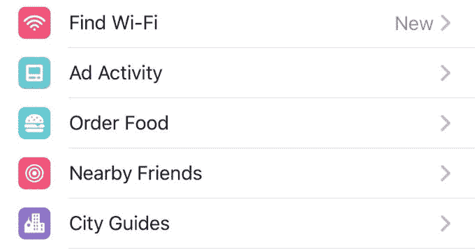
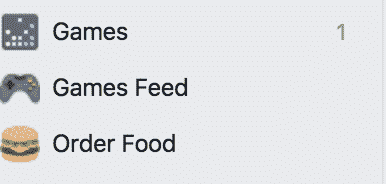
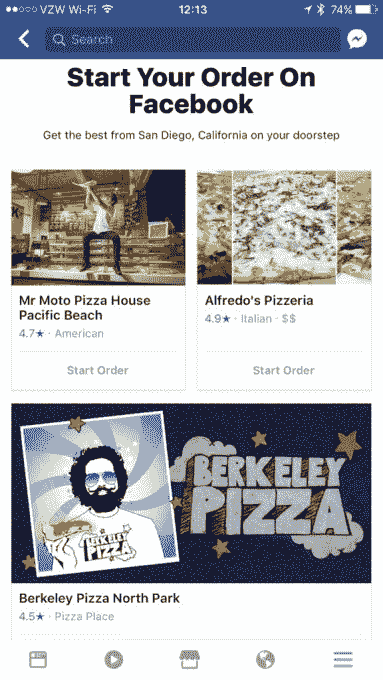
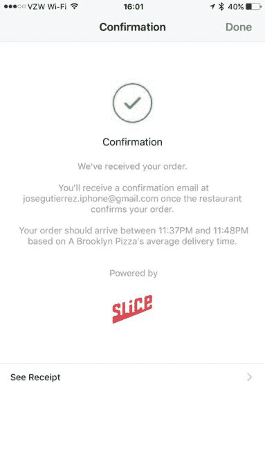

# 脸书在其主导航中推出新的“点餐”选项

> 原文：<https://web.archive.org/web/https://techcrunch.com/2017/05/19/facebook-rolls-out-a-new-order-food-option-in-its-main-navigation/>

脸书现在让你更容易直接在其应用程序中从你最喜欢的餐厅点餐，而不必导航到送货服务或餐厅自己的应用程序或网站。在网络和手机的脸书主导航中，一个名为“点餐”的新选项正在向精选用户推出。

通过桌面上的彩色汉堡图标和手机上的蓝白汉堡图标，该选项允许脸书用户使用 Delivery.com 或切片从餐馆订购食品。

*上图:手机上的“点餐”*

*上图:桌面上的“点餐”*

当您使用此菜单选项时，从订购到结账的整个过程都在脸书上进行。

该功能是之前宣布的与在线订购业务 Delivery.com 和 Slice 的交易的扩展，脸书在 10 月份详细介绍了该交易。当时，该公司表示，它将允许脸书用户通过“开始订购”按钮，从自己的脸书页面向受支持的餐厅下单。

主导航中的“订购食物”功能工作方式类似，但更方便，因为它将所有受支持的餐馆聚集在一个页面上。在这里，您可以找到一个餐馆列表，其中包括特色照片、价格范围(用美元符号表示)、星级和菜肴类型。它还会显示送货、提货或两者都可用。

然后你可以点击“开始点菜”开始点菜，就像你之前直接从餐厅的脸书页面点菜一样。

据昨晚在手机上成功使用该服务订购 calzone 的一位[用户](https://web.archive.org/web/20230329061655/http://www.twitter.com/fbjag)称，当你点击成为你的订单时，你可以浏览菜单，向购物车添加商品，编辑订单，添加建议的小费，然后在 Delivery.com 或 Slice 支持的移动体验中在脸书内支付。

[gallery ids="1493478，1493477，1493476，1493475，1493474"]

付款后，会出现一个确认屏幕，让您知道您还会收到一封确认订单的电子邮件，以及订单预计到达或准备提货的时间框架。

也许是因为该功能仍在推出，它的可用性开始有点不稳定。比如，期权本身已经消失，对某些人来说又重新出现；其他时候，它说现在没有地方可以给你送货；在我自己的测试中,“点餐”按钮出现在我的 iPhone 上，但点击时无法正常加载页面。

对于脸书的用户来说，这个功能很方便——他们不必离开脸书就能下单，也不必访问脸书的个人页面来查看是否可以在线订购。但对脸书来说，这是另一个例子，表明该网络旨在复制安装在用户设备上的其他应用程序的功能，并推出其他将用户留在墙内的功能。

在过去的几个月里，脸书推出了许多这样的功能，包括[天气](https://web.archive.org/web/20230329061655/https://techcrunch.com/2017/02/08/facebook-can-now-replace-your-weather-app/)，一个名为“[发现人物](https://web.archive.org/web/20230329061655/https://techcrunch.com/2017/02/01/facebooks-new-discover-people-section-wants-to-help-you-make-friends/)的网络部分，一个名为“[城市指南](https://web.archive.org/web/20230329061655/https://techcrunch.com/2017/03/03/facebook-adds-a-travel-planning-feature-called-city-guides/)，“政府信息通过”[市政厅](https://web.archive.org/web/20230329061655/https://techcrunch.com/2017/03/27/facebook-officially-launches-town-hall-for-contacting-government-reps-adds-local-election-reminders/)，“一个在线就业委员会，资金筹集者，即时游戏，等等。

记者联系到脸书请其置评，他证实“点餐”功能与 10 月份的 Slice 新闻和通过餐厅脸书页面的 Delivery.com 点餐功能有关，但没有提供任何细节，说明脸书导航中的新按钮何时开始向美国用户显示。

然而，我们从熟悉该产品的消息人士处了解到，其功能与 10 月份发布的相同，但脸书现在正在测试一个通过其主导航订购食品的新入口。因为这是一个测试，不是所有的脸书用户都可以看到这个选项。

*(图片鸣谢:@ fbjag@mattlynley)*