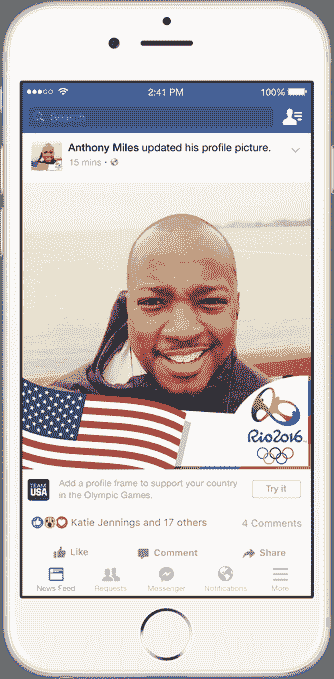

# 脸书在新闻订阅中推出了个性化的奥运版块，外加奥运滤镜和相框

> 原文：<https://web.archive.org/web/https://techcrunch.com/2016/08/03/facebook-rolls-out-a-personalized-olympics-section-in-the-news-feed-plus-olympic-filters-and-frames/>

Twitter 不甘落后，昨天推出了关注时刻和其他通过网络收听奥运新闻的方式。脸书本周宣布，该公司正在为用户推出多种方式来表达对他们喜爱的球队的支持，并在新闻提要的专门部分跟踪他们关心的奥运新闻。

自然地，这个社交网络再次为奥运会带回了个人资料框架。第一个[是去年推出的，](https://web.archive.org/web/20221007165832/https://beta.techcrunch.com/2015/10/09/facebook-now-lets-you-frame-your-profile-pic-to-show-support-for-your-favorite-college-football-team/)这个功能可以让你在脸书的个人资料图片周围放置一个定制框。新的奥林匹克镜框上印有 2016 年里约奥运会标志，同时也让你表达对你的国家或喜爱的球队的支持。这些将在周末到达。

与此同时，[最近脸书收购了](https://web.archive.org/web/20221007165832/https://beta.techcrunch.com/2016/03/09/facebook-acquires-video-filter-app-msqrd-to-square-up-to-snapchat/) [MSQRD](https://web.archive.org/web/20221007165832/http://msqrd.me/) ，一个照片和视频过滤应用程序，正在推出国旗面具，你可以从今天开始在你的照片或视频上覆盖它。今年夏天早些时候,[应用](https://web.archive.org/web/20221007165832/https://beta.techcrunch.com/2016/06/23/facebook-live-grows-up-with-two-person-broadcasts-and-waiting-rooms-for-viewers/)也扩展到支持脸书直播，所以你可以向你的朋友和家人展示你戴上奥运面具前后的样子，如果你愿意的话。

然而，在脸书奥运相关内容的集合中，最有趣的是在你的新闻订阅中首次出现了一个个性化的部分。从 8 月 1 日到 8 月 5 日，脸书将在用户的新闻提要顶部用一幅奥运插图和信息来迎接用户。(例如“为比赛而激动？，”接着是探索的提示。)

你可能已经看到了这个问候，并忽略了它，认为这只是脸书的另一个刺激，让你分享。

但相反，如果你点击进入，你会被带到一个提供“动态”奥运内容组合的页面，包括以奥运为主题的搜索结果和对话，以及赛事、里约直播视频等更多为你量身定制的内容。

报道称，脸书也将在 8 月 21 日为闭幕式发出类似的问候。

不幸的是，如果你拒绝或忽略这个问候，它就消失了，没有一个明显的方法可以再次找到这个奥运页面。事实上，这是脸书的缺点之一，当谈到今天在其网站上跟踪体育内容。

这不是该公司第一次投资让讨论直播体育更像是一个目的地，而不是一项活动。今年早些时候，[它推出了“体育场”，](https://web.archive.org/web/20221007165832/https://beta.techcrunch.com/2016/01/20/facebook-sports-stadium/)这是社交网络中的一个部分，粉丝可以在这里欣赏体育比赛的详细报道，查看朋友、专家和分析师的评论，并查看其他比赛和比赛信息。但是这一页同样很难找到，如果脸书不以某种明显的方式把它放在你面前。

由于这些导航上的挑战，当涉及到[跟踪奥运会](https://web.archive.org/web/20221007165832/https://beta.techcrunch.com/2016/08/02/twitter-revamps-moments-for-the-olympics-with-weeks-long-tracking-of-sports-and-events/)的现场评论、了解奖牌数或观看一些精彩赛事时，Twitter 实际上可能更容易使用。由于与 [NFL](https://web.archive.org/web/20221007165832/https://beta.techcrunch.com/2016/05/22/with-twitters-nfl-deal-social-networks-can-take-on-traditional-broadcasters-at-last/) 、 [MLB、NHL](https://web.archive.org/web/20221007165832/https://beta.techcrunch.com/2016/07/25/twitter-mlb-nhl/) 、 [NBA](https://web.archive.org/web/20221007165832/http://www.wsj.com/articles/twitter-signs-nba-deal-to-stream-new-shows-1468933202) 、[和](https://web.archive.org/web/20221007165832/https://beta.techcrunch.com/2016/07/06/twitter-started-its-live-coverage-of-wimbledon-today/) [more](https://web.archive.org/web/20221007165832/https://beta.techcrunch.com/2016/07/14/twitter-signs-a-live-streaming-deal-to-bring-pac-12-university-sports-to-its-service/) 达成协议，Twitter 最近几个月也一直在努力与更广泛的体育迷受众保持一致。