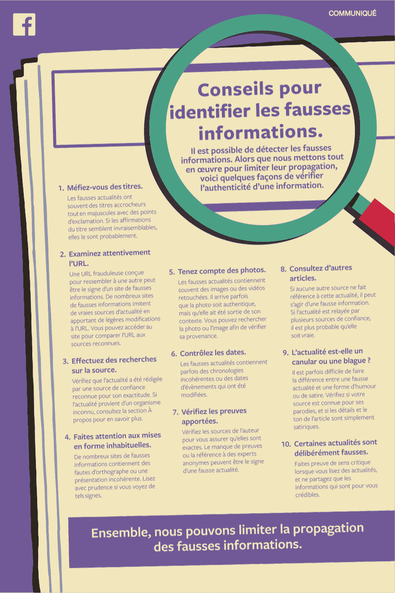

# 大选前，脸书在报纸上刊登整版广告反对假新闻

> 原文：<https://web.archive.org/web/https://techcrunch.com/2017/04/14/facebook-runs-full-page-newspaper-ads-against-fake-news-in-france-ahead-of-the-election/>

再过九天，法国将投票选举他们的下一任总统——三周后也将举行第二轮投票。看起来脸书想要避免另一个假新闻丑闻，因为该公司抢先在法国主要报纸上刊登整版广告。

这则广告给出了十个在互联网上辨别假新闻的技巧。今天你会在《世界报》、《选择报》、《解放报》、《巴黎人报》、《20 分钟》和其他报纸上看到它。脸书告诉你检查网址，日期，照片，文章中的事实等等。这类似于脸书应用程序中[开始出现在](https://web.archive.org/web/20230322161454/https://techcrunch.com/2017/04/06/facebook-puts-link-to-10-tips-for-spotting-false-news-atop-feed/)新闻提要顶部的提示。可以在文末查看一下。

昨天，脸书也在其安全博客上分享了打击假新闻[的最新进展。30，000 个脸书账户被封禁，因为他们分享“垃圾邮件、错误信息或其他欺骗性内容”脸书现在试图识别和阻止可疑活动，包括虚假的赞。](https://web.archive.org/web/20230322161454/https://www.facebook.com/notes/facebook-security/improvements-in-protecting-the-integrity-of-activity-on-facebook/10154323366590766)

美国总统唐纳德·特朗普当选后不久，脸书[承认](https://web.archive.org/web/20230322161454/https://techcrunch.com/2016/11/10/facebook-admits-it-must-do-more-to-stop-the-spread-of-misinformation-on-its-platform/)对错误信息的传播负有部分责任。报道希拉里·克林顿向 ISIS 出售武器的文章比报道竞选最后几天的文章更受欢迎。

如今，“假新闻”一词有了新的含义，因为特朗普一直指责负面报道是假新闻，尽管那些文章中的事实是正确的。这就是为什么脸书现在倾向于说“假消息”而不是“假新闻”

这些努力很有趣，原因有几个。首先，马克·扎克伯格多次表示他的公司对假新闻的传播没有责任。然而，脸书也宣布将在 12 月通过对平台的明确改变来解决假新闻[。今天是这些努力的继续。](https://web.archive.org/web/20230322161454/https://newsroom.fb.com/news/2016/12/news-feed-fyi-addressing-hoaxes-and-fake-news/)

其次，有点可悲的是，脸书自己不得不教每个人如何识别假新闻。我敢肯定，大多数人可以读一篇文章，说它看起来是假的。但问题是，太多的人仍然盲目分享脸书的一个标题，而没有阅读实际的文章。

最后，我不确定在主要报纸上进行协调的广告活动是否真的有效。大多数人不再看报纸了，至少不是纸质版的。我甚至会说，花时间看报的人可能比一般人消息更灵通，更容易发现假新闻。

所以我不认为这个广告活动是让人们了解假新闻。脸书希望表明，它正在选举前解决假新闻问题。我敢肯定，为所有这些出版物工作的记者会注意到这些广告，并下意识地认为脸书这次不会视而不见。

这样，如果像马林·勒·庞这样有争议的候选人获得足够的选票进入第二轮选举，记者们就不会考虑指责脸书。这是一场精心设计的公关活动，旨在保护脸书的形象。

