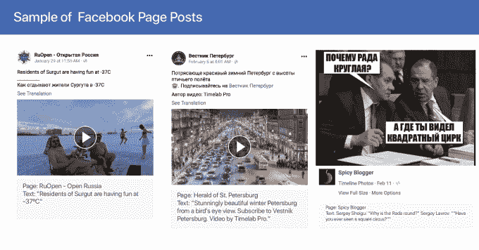
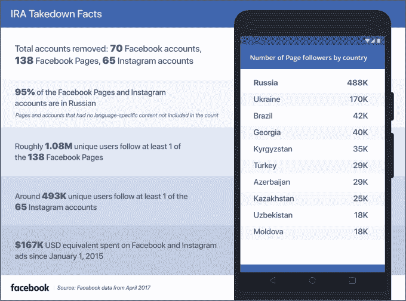

# 脸书披露俄罗斯巨魔内容，关闭 135 个爱尔兰共和军账户 

> 原文：<https://web.archive.org/web/https://techcrunch.com/2018/04/03/facebook-russia/>

# 脸书披露俄罗斯巨魔内容，关闭 135 个爱尔兰共和军账户

脸书正展现出前所未有的透明度，暂停试图影响选举和误导公众的俄罗斯巨魔的最新努力，试图重新获得用户和政府的信任。[该公司分享了](https://web.archive.org/web/20221204225053/https://newsroom.fb.com/news/2018/04/authenticity-matters/)关于账户删除的统计数据和他们分享的内容样本。

脸书已经删除了 70 个脸书账户、138 个脸书页面和 65 个 Instagram 账户，这些账户由俄罗斯政府关联的 troll farm 和互联网研究机构选举干预小组运营。脸书首席安全官 Alex Stamos 引用爱尔兰共和军使用“不真实的账户来欺骗和操纵人民”作为“为什么我们不希望他们在脸书”。我们删除了这些最新的页面和账户，仅仅是因为它们是由爱尔兰共和军控制的——而不是基于内容。”

95%的账户使用俄语，目标是俄罗斯或邻近国家的俄语用户，包括阿塞拜疆、乌兹别克斯坦和乌克兰。108 万用户关注了至少一个脸书页面，49.3 万用户关注了至少一个 Instagram 账户。自 2015 年初以来，这些账户在广告上总共花费了 16.7 万美元。

脸书首席执行官马克·扎克伯格[写道](https://web.archive.org/web/20221204225053/https://www.facebook.com/zuck/posts/10104771321644971)自从发现爱尔兰共和军干涉选举的努力，“我们已经改进了我们的技术，以防止民族国家干涉外国选举，我们已经建立了更先进的人工智能工具，以更普遍地消除虚假账户。”他接着详细介绍了脸书是如何实现其承诺的，即今年将安全和内容审查人员增加一倍，从 1 万人增加到 2 万人，目前有 1.5 万人在脸书工作。

“这些努力都让民族国家更难干涉外国选举，”扎克伯格在脸书上写道。“根据今天的最新消息，我们已经确认了爱尔兰共和军用来操纵俄罗斯人民的一个庞大网络。这是将他们完全赶出脸书的下一步。”

通过详细描述其努力的细节，而不是拖拖拉拉或等待政府的调查，脸书可能能够让人们相信它没有在社交网络的车轮上睡着。

脸书起初表示，只有 1000 万用户看过爱尔兰共和军购买的广告，但[后来解释说](https://web.archive.org/web/20221204225053/https://www.wired.com/story/facebook-does-not-know-how-many-followers-russian-trolls-had-on-instagram)当计算有机的未付费帖子时，1.26 亿人看过宣传小组的脸书帖子，另有 2000 万人看过其 Instagram 帖子。脸书此前关闭了爱尔兰共和军的 170 个 Instagram 账户，这些账户分享了 12 万条宣传信息，并关闭了 120 个脸书页面，这些页面分享了 8 万条内容。

涓涓细流的信息和最初的低球数让脸书似乎试图淡化平台滥用的严重性。但最近几周，自剑桥分析公司丑闻爆发以来，脸书似乎越来越透明，越来越容易接受批评。看起来坏消息的汇集真的把脸书摇醒了。