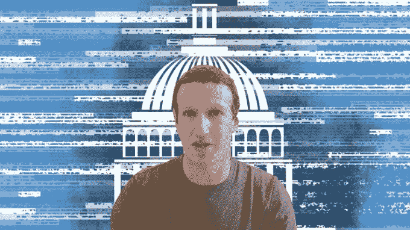
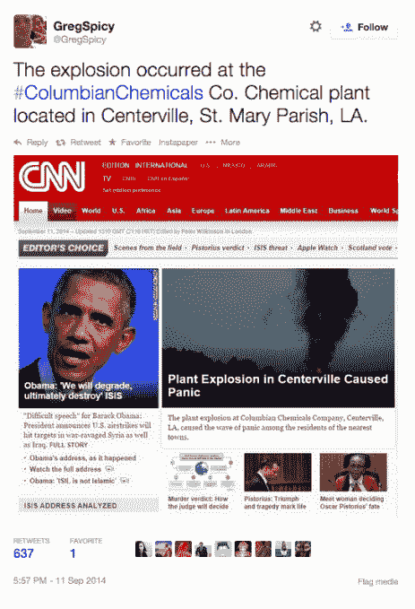
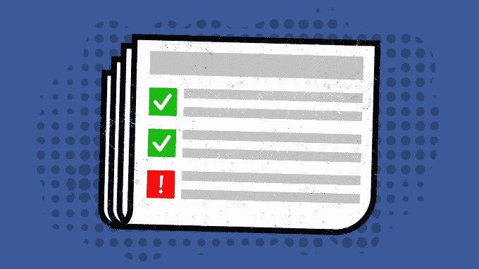

# 脸书明天将与国会分享俄罗斯购买的选举干扰广告

> 原文：<https://web.archive.org/web/https://techcrunch.com/2017/10/01/facebook-russian-ads/>

脸书发言人向 TechCrunch 证实，脸书将于太平洋时间明天早上 8 点与国会调查人员一起发布俄罗斯实体购买的 3000 多个广告，以干涉美国政治和 2016 年总统选举。脸书向众议院和参议院情报委员会以及参议院司法委员会披露的信息将包括广告内容和目标的信息，以及[支付](https://web.archive.org/web/20221209191820/https://newsroom.fb.com/news/2017/09/information-operations-update/)约 10 万美元让它们在 2015 年至 2017 年期间在美国运行的账户。It [此前宣布](https://web.archive.org/web/20221209191820/https://newsroom.fb.com/news/2017/09/providing-congress-with-ads-linked-to-internet-research-agency/)这些广告与 470 个账户和页面绑定，“与一个名为互联网研究机构的俄罗斯实体相关”

一位发言人表示，脸书认为，这三个委员会的国会调查人员最适合审查广告，并根据他们对所有相关公司和行业的机密情报和信息的访问权限对广告做出决定，而不是脸书自己的内部调查。脸书不打算公开发布广告数据。

国会调查人员可以将脸书的数据与[推特承诺提供的数据结合起来。](https://web.archive.org/web/20221209191820/https://blog.twitter.com/official/en_us/topics/company/2017/Update-Russian-Interference-in-2016--Election-Bots-and-Misinformation.html)这包括 201 个涉嫌在 Twitter 上参与错误信息活动的账户的数据，以及 2016 年俄罗斯政府相关新闻媒体俄罗斯在美国广告上花费的 274，100 美元。

谷歌、脸书和推特被邀请于 11 月 1 日就俄罗斯的调查向参议院情报委员会作证。然而，参议员马克·沃纳[说](https://web.archive.org/web/20221209191820/https://www.recode.net/2017/9/28/16381296/senate-congress-warner-twitter-russia-fake-news-2016-election)推特对参议院情报委员会的最初简报是“不充分的”。一名脸书发言人证实脸书收到了邀请，但没有更多关于脸书是否会出庭作证的信息。

大约在 9 月 15 日左右，脸书已经与特别顾问罗伯特·穆勒[分享了这些信息，华尔街日报首先报道，可能是因为它收到了搜查令，但最初向国会隐瞒了这些信息，以避免违反联邦隐私法或干扰穆勒调查。9 月 21 日，脸书宣布计划与国会分享这些广告，并确认明天早上将会实现。脸书还计划对其政治广告购买系统进行一系列改革，这可以被视为一种充分的自我监管，以阻止对官方政府监管的需求。](https://web.archive.org/web/20221209191820/https://beta.techcrunch.com/2017/09/15/report-facebook-gave-special-investigator-robert-mueller-detailed-info-on-russian-ad-buys/)

脸书说，目标是为国会调查人员提供必要的相关信息，以理解广告并将其置于背景中。这些广告被认为是俄罗斯特工有目的地试图影响美国总统选举。

## 互联网研究机构是谁？

一张伪造的 CNN 截图描绘了 2014 年虚构的 ISIS 对哥伦比亚化学公司的攻击，该攻击与互联网研究机构有关

这家互联网研究机构被《纽约时报》描述为“一群高薪的‘巨魔’”，总部设在俄罗斯圣彼得堡，他们试图通过协调的互联网活动传播错误信息，以干涉美国的外交政策，并为俄罗斯总统弗拉基米尔·普京造势。

该公司与 2014 年#ColumbianChemicals [骗局](https://web.archive.org/web/20221209191820/https://render.betaworks.com/media-hacking-3b1e350d619c)有关，在该骗局中，巨魔使用伪造的 CNN 截图、YouTube 视频和维基百科页面，让人们相信路易斯安那州一个虚构的化学加工厂被 ISIS 炸毁，并敦促美国轰炸伊拉克作为回应。俄罗斯报纸曾一度报道称，这家互联网研究机构有 400 名员工，每月预算为 40 万美元。他们还写道，这家互联网研究机构是由 Evgeny Prigozhin 资助的，他是一名餐馆老板和寡头，与俄罗斯政府有大笔合同，并与普京关系密切。

对脸书数据的调查可能会加强互联网研究机构、政治误导活动和克里姆林宫之间的已知联系。

## 脸书阻挠选举干预的现行计划

两周前，脸书首席执行官[马克·扎克伯格](https://web.archive.org/web/20221209191820/https://www.facebook.com/zuck/posts/10104052907253171?pnref=story)宣布了一项 [9 点计划](https://web.archive.org/web/20221209191820/https://beta.techcrunch.com/2017/09/21/election-interference/)，以遏制选举干扰，帮助人们和调查人员了解发生了什么，增加广告透明度，并提高选举的完整性。明天，我们可能会更多地了解脸书将如何实施这些计划，它们是:

1.  向国会提供俄罗斯购买的广告
2.  继续脸书自己的调查
3.  增强政治广告透明度
4.  实施更强的政治广告审查
5.  雇用 250 多名选举诚信工作者
6.  扩大与选举委员会的伙伴关系
7.  与其他科技公司合作
8.  保护政治话语免受恐吓
9.  监控德国大选

第一个计划将于明天实现。最后一个计划在选举中成功实施，德国总理安格拉·默克尔获得了第四个任期，但随着激进右翼政党 AfD 作为第三大党加入议会，其权力有所下降。

脸书采取的行动包括删除数万个可疑账户，打击 clickbait 中的假新闻，为政治家提供分享立场的途径，以及与德国选举委员会合作。脸书 EMEA·理查德·艾伦的公共政策副总裁写道，“这些行动并没有完全消除这次选举中的错误信息——但它们确实使错误信息更难传播，更不可能出现在人们的新闻报道中。”

图片:布莱斯·德宾/

脸书即将做出的改变可能会进一步降低滥用其平台影响选举的可能性，并为其他试图这么做的科技巨头提供战术援助。脸书可能需要让组织更难购买选举广告，这可能会减少它从这项业务中获得的收入。

但这似乎是一个很小的代价，为了防止它给每个人的声音被滥用来传播谎言和宣传。我已经呼吁脸书[更积极地预测最坏的情况](https://web.archive.org/web/20221209191820/https://beta.techcrunch.com/2017/10/01/anticipate-the-worst/)如何利用其平台，而不是假设人们只会善意地利用它，或者问题只是小规模的边缘情况。有了足够的技术，人类的节制，以及与政府和同行的合作，它可以将安全措施落实到位，以大幅降低这种不法行为再次出现在新闻中的可能性。