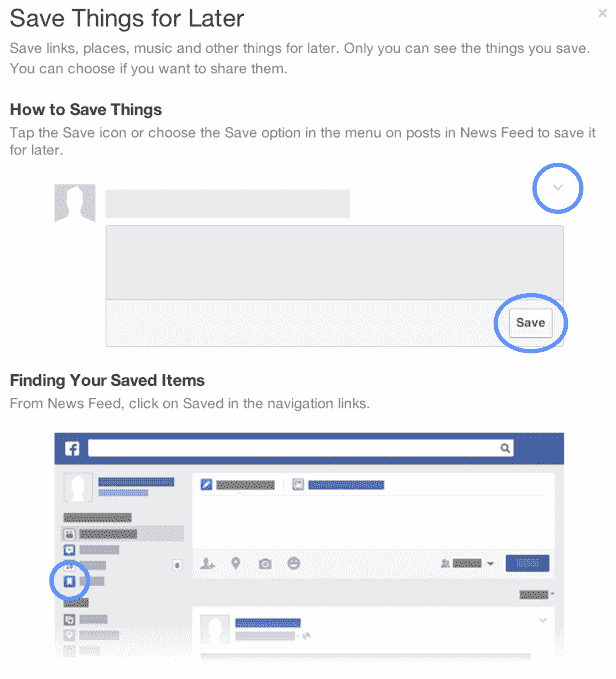

# 脸书推出了 Save，一个以后再读的链接、位置和媒体页面列表

> 原文：<https://web.archive.org/web/https://techcrunch.com/2014/07/21/facebook-save-feature/>

在 acqhiring read-it-later 初创公司 Spool 两年后，脸书今天推出了一款名为 [Save 的基本款掌上电脑。这是一个适用于 iOS、Android 和 web 的功能](https://web.archive.org/web/20230404073123/http://newsroom.fb.com/news/2014/07/introducing-save-on-facebook/),它可以让你将新闻源和脸书页面中关于地点、事件、电影、电视节目和音乐的链接存储到一个列表中，供你以后查看。

虽然 Save 不会缓存像 [Pocket](https://web.archive.org/web/20230404073123/https://techcrunch.com/tag/pocket/) 或 [Instapaper](https://web.archive.org/web/20230404073123/https://techcrunch.com/tag/instapaper/) 这样的链接后面的内容，但它应该给所有脸书用户一个快速的方法来储存他们找到的链接和内容，这样他们就不必中断他们的新闻阅读流。随着它在未来几天的推出，Save 可以让人们在更短的时间内浏览提要，而不用担心忘记他们没有时间立即浏览的内容。

脸书在 2012 年测试了一个版本的 [Save，今年三月我报道说脸书正在](https://web.archive.org/web/20230404073123/http://www.imore.com/facebook-iphone-and-ipad-gain-new-save-later-feature)[尝试一个新的设计](https://web.archive.org/web/20230404073123/https://techcrunch.com/2014/03/27/facebook-save/)，看起来和今天发布的非常相似。

## 保存如何工作

“保存”按钮或一个小书签图标按钮位于移动和网络新闻订阅源中故事的右下角，您也可以通过使用每个故事右上角的箭头访问的下拉菜单进行保存。在脸书关于地点、电影、电视节目、音乐人以及活动的页面上，在“喜欢”或“回复”选项旁边会有一个更突出的保存按钮。网页主页左侧边栏的书签列表和移动设备上的“更多应用”列表中会显示已保存项目的链接。更多的列表是像附近的地方和附近的朋友这样的功能被埋没的地方，Save 也可能被普通用户遗忘。

您保存的内容只有您自己可以看到。从按内容类型分类的保存列表中，您可以选择与朋友共享某个项目，或将其存档。你将需要网络连接来访问你保存的任何链接，因为脸书目前没有缓存它们。脸书会提醒你检查一下你储存了什么，偶尔会有新的帖子，上面有你储存内容的传送带。

回头阅读你没有时间的链接是有意义的，保存位置可以帮助你收集你所在城市或旅行中的餐馆和景点。但我敢打赌，很少有人会用 Save 来存储电影和电视节目，以便以后阅读。记住“所有人都说我应该看《权力的游戏》”有多难？如果你考虑去参加一个活动，你可以回复“也许”,除非你真的很偏执，喜欢在黑暗的掩护下旅行。

脸书的博客文章宣布了这项新功能，内容简短，并留下了一些未解决的问题。

我已经问过脸书，网站和页面管理员是否会获得保存频率的分析，这可能有助于完善他们的内容和推广策略，并更好地了解在脸书上分享什么。它告诉我“现在不行。”目前还没有开发 API 或外部保存按钮的计划，开发者可以使用它们让脸书以外的人添加到他们的保存列表中。你也不能直接从 Save 导出到其他以后阅读的应用程序，这很好。

当我问 Saved 是否可以增强广告定位时，脸书告诉我“我们使用收到的信息来增强我们提供的所有服务，包括为人们创造更相关的广告和为营销人员创造有吸引力的价值。目前，您不能将广告专门针对已保存的内容。我们将在未来几个月对此进行更多探索，但目前没有更多消息可以宣布。”

如果 Save 被证明很受欢迎，脸书可能会考虑剥离自己独立的稍后阅读应用程序，或者至少将其集成到其 [feed 和新闻阅读应用程序 Paper](https://web.archive.org/web/20230404073123/https://techcrunch.com/tag/facebook-paper/) 中。

## 晚，但潜力大

奇怪的是，脸书花了这么长时间才发布这项功能，尤其是因为最终版本与 2012 年的测试没有太大不同。从那时起，Pocket(原名 Read It Later)的注册用户已经增长到了 1200 万。由于脸书有 12.8 亿用户，这与 Save 的潜在市场相比相形见绌。尽管如此，一些早期用户可能已经适应了口袋。它提供内容缓存以供离线查看，以及内容建议、标签、收藏夹和收件箱，外加每月 5 美元的高级服务，在内容从网络上删除时提供永久副本。

脸书不缓存内容有一个很好的理由:这会抢走其出版商合作伙伴的广告浏览量。如果脸书只是简单地抓取了文本、图片和视频链接的目的地，并让你在 Save 中的一个精简页面上查看它们，你为什么还要去实际的页面呢？脸书可能不想激怒这些出版商，因为他们通过页面向其服务提供内容，并购买脸书的广告来增加观众。

Save 可能没有铁杆“以后再看”用户喜欢的缓存，但脸书可能不会专注于这一人群。相反，它的重点可能是创建一个对每个人都足够简单的稍后阅读功能，旨在增加跨平台使用和移动订阅源阅读。通过向脸书教授你和所有人都认为是高质量的故事，储蓄可以让饲料变得更好。

“从网上保存”可以让用户把他们在上下班途中或休息时间找到的链接保存在手机上。这为脸书的应用程序创造了一个新的用例，你可以访问它，专门阅读更长的内容，并实际学习一些东西，而不只是浏览一下提要。

当你只有一点时间的时候，比如在排队买咖啡的时候，从手机上保存信息会让阅读更有价值。现在，如果你忙着从新闻源中获取信息可能会有点困难。知道你可以保存链接以备后用，并浏览照片和状态更新等快速消费的内容，这可能会让简短的 feed 会话更令人愉快。脸书只需要向你展示几个有机的故事，就可以在你的亲密环境中插入广告。