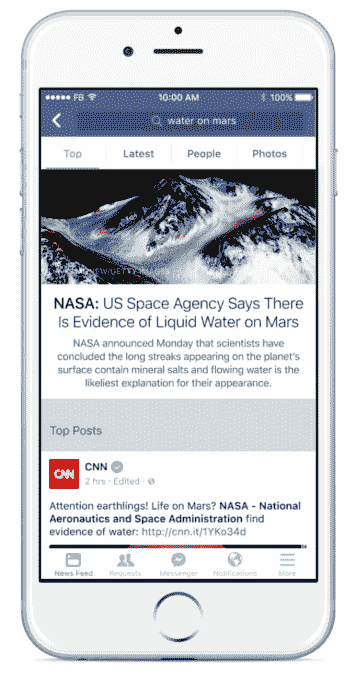

# 脸书将搜索范围扩大到所有 2 万亿条帖子，公开实时新闻

> 原文：<https://web.archive.org/web/https://techcrunch.com/2015/10/22/facebook-search/>

脸书准备挑战谷歌和推特对实时新闻搜索和新闻本身的控制。从今天开始向美国英语用户推出，[脸书搜索将从其 2 万亿条帖子中返回任何你可以看到的内容。这包括所有人和页面的公开帖子，而不仅仅是你的朋友和你以前喜欢的页面。](https://web.archive.org/web/20221006180716/http://newsroom.fb.com/news/2015/10/search-fyi-find-what-the-world-is-saying-with-facebook-search/)

个性化的结果将被分解，以突出来自可信新闻来源的帖子，然后是你网络中的人，最受欢迎的链接列表或关于某个主题的引用，然后是陌生人。

类似于 Twitter 搜索的工作方式，这一举措解锁了围绕重大新闻故事和现场事件在脸书分享的所有新闻和聊天，但更加人性化。

这不仅能让脸书成为人们寻找新闻观点的地方。这反过来可能会激励更多的人公开发布世界上正在发生的事情，因为发现这些内容的方式会比 feed 中的更多。

此外，正如谷歌已经证明的那样，搜索查询表明了意图，这可以用来在赞助搜索结果中出售非常有利可图的关键词广告。

脸书的搜索副总裁汤姆·斯托奇向我承认，它还没有把重点放在盈利上，但“因为搜索的商业模式非常好理解，我们知道它会在有意义的时候到来。”考虑到脸书每天已经处理 15 亿次搜索，赚点钱的机会很多。

## 向完全搜索发展

脸书搜索最初只是一种寻找潜在朋友或浏览他们个人资料的方式。然后[图形搜索](https://web.archive.org/web/20221006180716/https://beta.techcrunch.com/2013/01/15/facebook-announces-its-third-pillar-graph-search/)让你在网上找到企业、照片和电影，后来移动(它仍然可以工作)。最终在去年年底，脸书的工程团队克服了巨大的挑战，即[索引所有的个人帖子](https://web.archive.org/web/20221006180716/https://beta.techcrunch.com/2014/12/08/facebook-keyword-search/)以实现关键词搜索。但搜索结果只包括可能出现在你的新闻源中的帖子。

一路走来，[脸书尝试了一些搜索广告，](https://web.archive.org/web/20221006180716/https://beta.techcrunch.com/2012/08/22/facebook-search-ads/)比如当你搜索一个像 FarmVille 这样的特定游戏时，会显示竞争游戏。但脸书最终关闭了这些测试，因为它专注于创造人们想要反复使用的搜索体验。

今天的更新给了脸书一个完整的内部搜索引擎。以前，它很适合怀旧，查找朋友们说的有趣的事情或他们发布的酷照片。现在，它是一个实时新闻的发现引擎，只是从未来溜到了现在。

## 不仅仅是提及的列表

为了帮助用户熟悉搜索，搜索下拉列表 typeahead 现在会建议热门的关键字字符串，以完成您正在搜索的内容，同时匹配的人或事物会出现在它们的下方。一旦你选择了一个或者输入了，你会得到一个基于大约 200 个因素的个性化结果页面，包括你喜欢和参与的内容，你搜索的内容，以及你的身份信息。

脸书不会像谷歌那样给你一份最相关的链接或提及的完整列表，也不会像 Twitter 那样给你一份精彩的或实时的聊天内容，它会在你向下滚动的时候把搜索结果分成几个部分。Stocky 告诉我，它的工作原理与脸书的热门话题相同。

为了让你对新闻有一个大致的了解，脸书首先在可能的情况下对一个话题进行总结。然后它会显示像 CNN 这样可信的新闻来源的提及。一个专门的脸书团队会查看参与度、垃圾邮件报告等信息，并确定每个渠道或记者的声誉得分，搜索引擎会使用该得分对帖子进行排名。

因为朋友们说的话通常很有趣，所以接下来会显示来自您网络中的人和组的帖子。然后是与该主题相关的最受欢迎链接的汇总计数，就像脸书内部的一个小型 Digg。最后，你不认识的人的公开帖子会被显示出来，但会被排列得尽可能与你相关。

## 默默无闻不再有隐私

虽然人们帖子的隐私没有改变，但你说过的话现在更容易找到了。这意味着多年前的黄色笑话和错误的隐私设置可能会给你的雇主带来麻烦。我认为脸书可以做得更多，告诉用户他们应该回去检查他们公开分享的内容，用自己的名字搜索一些攻击性的词语，并向公众隐藏任何有问题的内容。

至少 Stocky 告诉我，当有人第一次通过搜索喜欢或关注你的帖子时，脸书会提醒你，人们现在可以找到这种内容了。虽然在此之前，你可以打赌陌生人不会不厌其烦地在你的个人资料中搜寻任何不负责任的内容，但搜索意味着人们需要对他们的脸书上的内容更加小心。

## 如果你能搜索到，他们会发布

新的公共搜索功能可以反驳脸书只是一个回音室的批评。Stocky 解释说“你不只是看到你的朋友和你周围的人在说什么。你看到地面上人们的故事。这给了我们不同层次的视角。”虽然 Twitter 似乎是今天分享这些想法的默认场所，但如果人们从脸书搜索中获得对他们公共帖子的参与，他们可能会更倾向于在该应用的全球舞台上发表意见。

Stocky 的结论是，网络搜索的出现导致了人们生产内容的巨大转变，特别是可索引的网站。现在，对于脸书和实时新闻搜索，他说“更多地访问这些内容会让人们分享更多的内容。”

https://vimeo.com/143213455