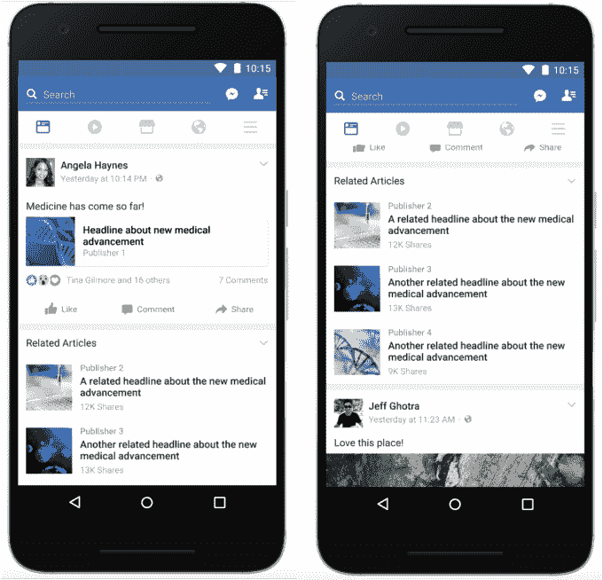

# 在你打开链接之前，脸书会显示相关文章和事实核查

> 原文：<https://web.archive.org/web/https://techcrunch.com/2017/04/25/facebook-shows-related-articles-and-fact-checkers-before-you-open-links/>

# 在你打开链接之前，脸书会显示相关的文章和事实检查

脸书希望你在阅读文章之前，思考一下一个标题是否真实，看看关于这个话题的其他观点。在打击假新闻的下一步中，脸书今天开始测试其相关文章插件的不同版本，该插件通常会在你打开一个链接后返回新闻提要时出现。现在，在你阅读一篇关于许多人正在讨论的话题的文章之前，脸书还将展示相关文章，包括第三方事实检查器。

脸书说，“这应该让人们更容易获得额外的观点和信息，包括第三方事实审查员的文章。”

本质上，脸书不是试图说服某人他们刚刚读到的可能是夸大的、过度偏见的或彻头彻尾的错误，而是想在人们被灌输谎言和修饰之前引起他们的怀疑。这一功能可以在你陷入更深的过滤泡沫之前打破它。

如果你看到一个链接说“巧克力治愈癌症！”在一个鲜为人知的博客中，相关文章框可能会在你点击之前出现，显示来自《纽约时报》或医学杂志的链接，指出虽然巧克力含有抗氧化剂，可以降低癌症风险，但它不是治愈方法。如果像 Snopes 这样的外部事实检查者揭穿了最初的帖子，那也会出现在相关的文章中。

脸书说，这只是一个测试，所以它不一定会推广到每个人，除非它证明是有用的。它指出，脸书网页应该不会看到他们的新闻供稿覆盖范围的重大变化。相关文章中不会出现广告。

脸书最初在 2013 年发布了[相关文章](https://web.archive.org/web/20221006115504/https://newsroom.fb.com/news/2013/12/news-feed-fyi-helping-you-find-more-news-to-talk-about/),为你刚刚阅读的话题提供更多有趣的链接。但在 2016 年美国总统选举期间因允许假新闻泛滥而受到批评后，脸书开始与[第三方事实检查员](https://web.archive.org/web/20221006115504/https://beta.techcrunch.com/2016/12/15/facebook-now-flags-and-down-ranks-fake-news-with-help-from-outside-fact-checkers/)合作，在有争议的文章中添加警告。

马克·扎克伯格后来在他的[人道主义宣言](https://web.archive.org/web/20221006115504/https://www.facebook.com/notes/mark-zuckerberg/building-global-community/10154544292806634)中说，解决这个问题的一个方法是[拓宽人们的视野](https://web.archive.org/web/20221006115504/https://beta.techcrunch.com/2017/02/16/building-the-world-we-all-want/)。“更有效的方法是展示一系列观点，让人们看到他们的观点在光谱中的位置，并得出他们认为正确的结论。随着时间的推移，我们的社区将确定哪些来源提供了完整的视角范围，因此内容将自然地浮出水面。”

一些出版商可能不会对他们更知名的竞争对手可能通过相关文章劫持他们的读者感到兴奋。但由于脸书寻求在不一定成为真相仲裁者的情况下打击假新闻的祸害，其最佳选择可能是曝光关于某个话题的一系列观点，并希望人们明白最古怪(和病毒性)的观点可能不值得一读。