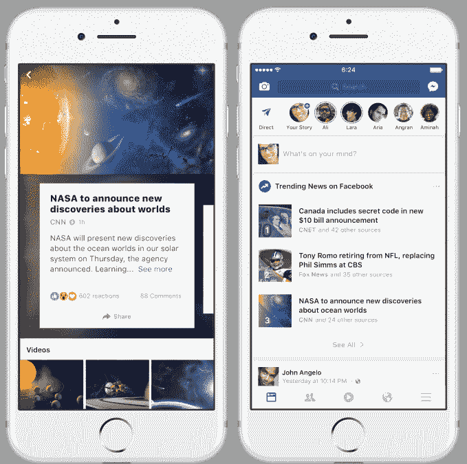

# 脸书在 Trending TechCrunch 中使用替代新闻来源缩小过滤泡沫

> 原文：<https://web.archive.org/web/https://techcrunch.com/2017/05/24/facebook-shrinks-filter-bubbles-with-alternate-news-sources-in-trending/>

# 脸书缩小过滤泡沫与替代新闻来源的趋势

如果你只从一个来源获取新闻，你很容易受到偏见和两极分化的影响。因此，当你点击一个热门话题时，[脸书现在会](https://web.archive.org/web/20221230060154/https://newsroom.fb.com/news/2017/05/update-on-trending/)展示由不同出版商撰写的关于该主题的其他最受欢迎的文章，而不是突出显示单个新闻渠道。

与此同时，脸书在手机上更多地曝光了热门话题。当你在脸书的移动应用上搜索某些东西时，该公司不会只在下拉列表中显示热门话题，而是会测试显示一个框，里面有新闻提要中当前排名前三的热门话题。通过这种方式，人们将更有可能在移动设备上发现流行内容，而以前这些内容被埋没在一个不直观的地方。

脸书告诉 TechCrunch,“趋势来源”传送带不是个性化的，不会有目的地向你展示你不关注的出版商，或者可能会与你通常点击和分享的内容形成对比。但该公司表示，通过浏览你不关注的不同新闻来源，它可以向你展示同一主题的不同观点。

当然，这可能会适得其反，向你展示比你通常读到的更多有偏见的来源。并非每一个事实都需要一个“替代”视角。这可能导致被误导的热门话题和毫无意义的逆向思维。脸书将不得不从算法上关注它在这些传送带上显示的出版商。

自川普当选以来，脸书一直被批评扩大了美国的政治分歧。新闻提要允许人们从他们喜欢的来源创建他们自己的报纸，而不是更通才的媒体。但是，如果有人被引诱去追随有偏见的或耸人听闻的消息来源，并在自己周围有同样政治立场的朋友，他们可能会强化错误的观点。

脸书测试了一种追踪主题而不是特定出版商的方法

马克·扎克伯格喜欢引用脸书【2015 年的一项研究[,该研究显示，23%的用户朋友属于相反的政治派别，而新闻订阅中近 29%的报道显示的观点与用户的意识形态不一致。但是让 70%以上的食物刺激你现有的信念仍然是个问题。在](https://web.archive.org/web/20221230060154/https://www.nytimes.com/2015/05/08/technology/facebook-study-disputes-theory-of-political-polarization-among-users.html)[扎克伯格的人道主义宣言](https://web.archive.org/web/20221230060154/https://techcrunch.com/2017/02/16/building-the-world-we-all-want/)中，他写道，一个解决方案是“展示一系列观点，让人们看到他们的观点在光谱上的位置，并得出他们认为正确的结论。”

脸书最近尝试了另一种方法来消除这些过滤泡沫，让人们[关注一个主题](https://web.archive.org/web/20221230060154/https://techcrunch.com/2017/05/04/facebook-topics-to-follow/)，然后看到来自各种出版商的帖子，而不仅仅是关注单个出版商。今天的更新进一步推进了这一努力。即使脸书并不真的认为过滤泡沫是一个大问题，它也需要新闻提要被视为一个积极的信息来源，以保持人们网络浏览习惯的中心。