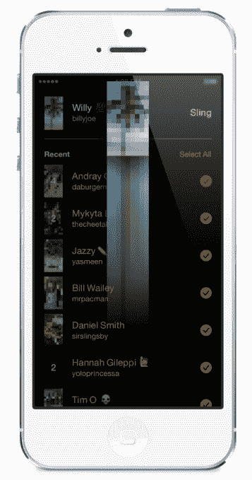

# 脸书的弹弓用“回复解锁”挑战 Snapchat

> 原文：<https://web.archive.org/web/https://techcrunch.com/2014/06/17/facebook-slingshot/>

脸书想要打破互联网文化中的“1%规则”，即一小部分用户为其他人创造内容。因此，在上周[短暂泄露](https://web.archive.org/web/20230404062842/https://techcrunch.com/2014/06/09/facebook-has-another-go-at-snapchat-with-slingshot/)之后，今天脸书[正式在美国为](https://web.archive.org/web/20230404062842/http://newsroom.fb.com/news/2014/06/introducing-slingshot-a-creative-labs-app/) [iOS](https://web.archive.org/web/20230404062842/https://itunes.apple.com/us/app/slingshot/id878681557?mt=8) 和 [Android](https://web.archive.org/web/20230404062842/https://play.google.com/store/apps/details?id=com.facebook.slingshot) 推出弹弓，这是一款应用程序，朋友可以向你发送照片和视频，但[你必须回复自己的](https://web.archive.org/web/20230404062842/http://blog.sling.me/post/89070036152/introducingslingshot)才能看到它们。“每个人都是创造者，没有人是旁观者”，产品经理威尔·鲁本说，这使它不同于 Snapchat。

Slingshot 的成功将取决于人们是否认为回复解锁机制是一个不必要的麻烦，还是一个保持分享的有趣激励。人们可能不想工作来查看他们的内容。

这款应用的名字上个月泄露给了《金融时报》,现在已经可以在美国的 iOS 系统和安卓系统上使用。

在我深入讨论之前，先总结一下，Slingshot 可以让你发送照片和 15 秒的视频给一个朋友、许多或者所有你最近联系过的人。内容是短暂的，被浏览后就会消失，尽管你可以自动保存你创建的内容。你可以通过脸书或你手机上的联系人找到朋友，尽管这款应用使用了一种有点弱的隐私隐藏模式，任何拥有你用户名的人都可以找到你。它有一个轻松的设计，你可以在有趣的音乐和愚蠢的音效背景下绘制或发送分屏反应镜头。

诞生于黑客马拉松并在过去六个月内建成的 Slingshot 对脸书来说是一个大胆的举动，因为它可以通过新闻订阅、Messenger 和 Instagram 来瓜分分享。但通过设计一个真正独特的“回复解锁”机制，脸书[可能最终找到了 Snapchat 的竞争对手，而不是 Snapchat 的克隆](https://web.archive.org/web/20230404062842/https://techcrunch.com/2014/06/17/facebook-snapchat-slingshot/)。

下面是脸书的弹弓介绍视频:

[vimeo 98214265 w=500 h=444]

## 单边共享的解决方案

“我的兄弟们在任何方面都不专业，”弹弓发明者、在脸书工作了四年的产品设计师[乔伊·弗林](https://web.archive.org/web/20230404062842/https://www.facebook.com/wjfthree/posts/10103123055503638)告诉我。“我会拍张照片，上传到 iMessage，然后发给他们。我会看到“看过”，或者一个月后我看到他们，他们会说“这是一张很酷的照片”。但是，嘿，我想看看你在做什么！他解释道:“这种互惠缺失了。那是弹弓的火花。

2013 年 12 月，脸书举办了为期三天的黑客马拉松，以开发独立的应用程序来构建其新的[创意实验室计划](https://web.archive.org/web/20230404062842/https://techcrunch.com/2014/01/30/facebook-creative-labs/)，该计划在今年早些时候产生了论文。移动用户渴望精简、单一用途的体验，而脸书的主应用程序“瑞士军刀”无法提供这种体验。

因此，在完成家庭工作后，弗林与在脸书工作了三年的软件工程师洛基·史密斯合作，构建了一个后来成为弹弓的原型，旨在推动人们在收到信息时分享一些东西。两人与几个同事分享了这份礼物，并在节日期间看着彼此打开礼物和与家人建立联系，玩得很开心。

回到位于门洛帕克的脸书 1 Hacker Way 总部后，他们招募了 Ruben 作为项目经理以及 iOS 和 Android 的工程师，这使得 Slingshot 团队的人数达到了 5 人。在接下来的六个月里，他们开始开发一个应用程序，在这个程序中“创建的压力会更小，因为每个人都在创建，”鲁本说。

“使用这款应用真的让我们感觉更亲密了。安德鲁喜欢在周末做牛排，洛奇在旧金山附近玩滑板，乔伊剃掉了几处胡子。他们知道我去了圣地亚哥动物园，”鲁本说。“在这个空间里，每个人都可以相互分享他们生活中的亮点。”

与脸书或 Instagram 不同，愚蠢、短暂、Snapchat 式的性质意味着你的帖子不必看起来完美，因为它们不会永远反映你。

随着如此多的移动应用争夺人们的注意力，Slingshot 自我延续参与的能力可能是牵引力的关键。一个朋友不需要做所有的工作来娱乐其他人，他们可以消费而不用创造，打破链条。有了 Slingshot，对话永远不会消失，因为最后一条消息总是等待被解锁。

## 弹弓是如何工作的

如果脸书很有趣，信使很有用，纸很漂亮，那么弹弓很有趣。在与团队一起玩了一个小时的时候，我确实从这个新应用中得到了一些微笑。

你用你的电话号码注册了这个独立的应用程序，并通过扫描你手机上的联系人或脸书的朋友来创建一个新的社交图谱。这意味着你不需要脸书帐户加入。Slingshot 会偶尔重新同步你的联系人以保持最新，除非你停止它。如果你想通过用户名添加某人，你可以在相机屏幕上向下拖动并点击“添加人”。

从那时起，Slingshot 打开摄像头，顶部有一个小计数器，记录下你可以通过回复解锁多少未决信息。点击拍摄，点击并按住以录制视频，点击“自拍”按钮以翻转相机远离或朝向您。您可以轻按以添加最多五行文本，如果您将文本拖到快照上的其他位置，文本会在顶部显示为小文本或显示为大文本。

Slingshot 还有一个设计良好的绘图工具。将手指在右边的轨道上上下拖移以选取完美的颜色，向左或向右拖移以放大或缩小画笔大小，从而在胡须、日落或任何您想要的东西上绘画。每一次触摸都伴随着卡通流行和嗖嗖的噪音，打开绘图工具会弹出一段古怪的配乐，听起来像狂欢节上的电梯音乐。

一旦你点击使用，你就会被带到最近给你发短信的人的经典黑名单中，然后是通过短信邀请朋友的选项，以及更多你还没有联系过的朋友的名字。每个显示悬而未决的吊索显示为一个微小的，高度像素化的缩略图乞求解读与答复。

轻按任意多个姓名，或者一键选择您最近的所有联系人，将您的姓名发送给他们并解锁他们的姓名。一个动画将你的照片或视频甩出屏幕，你会看到一个接一个你解锁的吊索系列，就像 Snapchat 故事一样。您可以随意查看照片，视频会循环播放，直到您将当前照片拖开并永久删除，并显示其下方的下一张照片，直到您查看完所有照片。

如果你看到一个特别鼓舞人心的广告，你可以回复一个可以立即观看的反应镜头或视频。你将得到原始吊索的上半部分，并可以与屏幕的下半部分作出反应。该团队一直很喜欢反应面部网格，在那里你把下巴排在你朋友面部的上半部，制作一个照片弗兰肯斯坦或视频，假装像他们一样说话。

总的来说，这款应用给人的感觉很流畅，令人愉快，而且相对直观，可以教人们一种新的重要的分享机制。内部测试没有发现人们回复垃圾照片只是为了解锁吊索，尽管我们将看看这是否适用于更广泛的受众。

## 小心吊索，我的朋友们

模糊隐私模型有点令人担忧。如果你的用户名被公开发布或者很容易被猜到，你可能会被不需要的吊索淹没，因为任何人都可以通过用户名添加你。幸运的是，你可以通过向左滑动他们的名字来隐藏你不想看到的人(你可以从设置中取消隐藏人)。如果有人给你扔了一个鸡巴图片或其他令人反感的内容，你可以举报他们。

至于你的内容会发生什么，一旦你发布内容的每个人都查看了它，或者如果 30 天没有查看，它会自动从他们的应用程序中消失，脸书说它会从服务器上删除照片或视频。如果它必须调查虐待报告，会有七天的延迟，但该团队表示，之后内容就消失了。用户是否相信脸书会信守诺言取决于他们。过去的隐私失误可能会吓到人们，但脸书正受到联邦贸易委员会的严密审查，以遵守其提出的隐私政策。

## 弹弓会击中目标吗？

就感觉和功能而言，Slingshot 是可靠的，但成败的因素是社区。有两种可能。

回复解锁的机制可以激发分享的动力，满足我们天生的好奇心。是游戏化的分享。揭示隐藏内容的满足感可能足以诱使人们找到值得捕捉的东西。完美的照片可能会出现在脸书和 Instagram 上，特别亲密的照片可能会出现在 Snapchat 上，而 Slingshot 可以记录我们的日常生活

或者，回复解锁可能会被视为一个恼人的噱头，带来太多的摩擦。当你可以给朋友发短信时，为什么要让他们为你的照片工作呢？家务可能会让弹弓浪费在你屏幕上的某个文件夹里。

虽然对脸书来说打破 1%的规则似乎很难，但这并非不可能。Instagram 做到了这一点，它让巧妙的创作变得如此简单，以至于每个人都可以分享。弹弓进入了一个更加拥挤的空间。但如果它能抛弃吊带必须漂亮甚至有趣的想法，让人们舒服地分享他们生活中的随机片段，我们可能会继续拍摄。