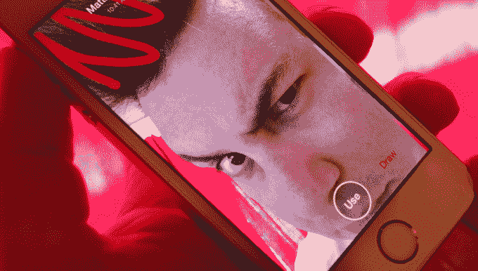

# 脸书弹弓第三次是一个魅力还是三振出局？

> 原文：<https://web.archive.org/web/https://techcrunch.com/2014/06/17/facebook-snapchat-slingshot/>

脸书已于今日用[弹弓](https://web.archive.org/web/20230404124414/https://techcrunch.com/2013/03/08/facebook-snapchat/)发动了打击三反阵营 Snapchat。正如脸书最近的许多产品[(像纸)](https://web.archive.org/web/20230404124414/https://techcrunch.com/2014/02/02/with-facebooks-paper-all-the-mobile-news-thats-fit-to-print/)，弹弓是一个已经被证明的想法，它披着昂贵的用户界面，拥有一个已经建立的价值*十亿*的分销网络。尽管大多数社交应用都失败了，但它应该是一个全垒打。

但不会的。不是因为它与 Snapchat 不同，也不是因为它相同。不是因为它更漂亮，也不是因为它有很酷的“往复”功能。弹弓会失败的原因，就像纸、戳、相机和其他东西一样，是因为脸书。

Slingshot 标志着脸书在两年内第三次试图抓住 Snapchat 的观众。这是一个未定义的群体，但被认为是年轻的——从青少年一直到“保持真实”的 35 岁的人这是一个令人垂涎的引领潮流的未来消费者群体，也是这个群体已经慢慢从全能的脸书平台上迁移出来。

该公司对昙花一现的无休止的尝试，以及吸引这种神奇的引领潮流的人口统计，是显而易见的……有[戳](https://web.archive.org/web/20230404124414/https://techcrunch.com/2012/12/21/facebook-poke-vs-snapchat-what-is-the-difference/)和[纸](https://web.archive.org/web/20230404124414/https://techcrunch.com/2014/01/30/facebook-paper/)的热点分钟，然后是传言的[30 亿美元收购 Snapchat 的尝试](https://web.archive.org/web/20230404124414/http://blogs.wsj.com/digits/2013/11/13/snapchat-spurned-3-billion-acquisition-offer-from-facebook/)。到目前为止，[没有任何东西卡住](https://web.archive.org/web/20230404124414/https://techcrunch.com/2013/03/08/facebook-snapchat/)。

脸书十岁了。我们不再看着 Zuck 涉入广告的广阔世界。脸书是一家大型跨国公司。只要看看该公司在过去几年中的战略举措就知道了:脸书为在可穿戴设备和虚拟现实领域落后于谷歌而向[支付了 20 亿美元](https://web.archive.org/web/20230404124414/https://techcrunch.com/2014/03/25/facebook-to-buy-oculus-vr-maker-of-the-rift-headset-for-around-2b-in-cash-and-stock/)。脸书为没有移动操作系统向 T4 支付 190 亿美元。脸书支付了 10 亿美元来确保它是世界照片的中心。我没有看到改变世界的想法。我看到我们四个平台骑士中的一个正在冷战。

因此，当我们嘲笑脸书在 Snapchat 上的第一拳(或者我应该说戳戳)时，扎克伯格放松了钱包，据报道他出价 30 亿美元收购了它。公平地说，从技术上讲，收购并不是试图“克隆”，但意图是一样的。当脸书第一次不能半心半意地克隆 Snapchat 时，它就砸钱解决这个问题。

快进到今天，我们都有前排座位观看脸书的第三次击球，以赢得 Snapchat 船员。正如它经常发生的那样，历史将再次重演。

诚然，脸书的弹弓不仅仅是 Snapchat 的克隆。

不像 Poke，它模仿 Snapchat 的每一个 T2 特征，Slingshot 试图成为另一种短暂的 T4。Slingshot 通过强迫你在看到内容之前回复信息来承诺回报。这是一个巧妙的区分技巧，但算不上什么新想法。Povio 很久以前就做了类似的事情，最近在洛杉矶推出了一款名为 [Look](https://web.archive.org/web/20230404124414/http://www.look.vu/) 的应用，具有相同的核心功能集。

所以你可能会想，现在脸书对 Snapchat 的攻击包括了一种新武器，也许命运会对蓝色而不是黄色微笑。但是没有。我现在下注:[弹弓是下一个戳](https://web.archive.org/web/20230404124414/https://techcrunch.com/2013/03/08/facebook-snapchat/)。

看，问题不在于时机。这并不是说 Snapchat 打败了脸书，尽管这当然也起到了一定的作用。它也不是短暂性本身，或者照片或视频或短信。问题不在于 Poke 与 Snapchat 太过相似，也不在于 Slingshot 太过不同。问题甚至不在于回报，尽管这是一个多么吸引人的特征。

问题在于脸书。

脸书所追逐的群体是一个永远不会安心成为大多数人的一部分的群体。

“Snapchat 人口统计”如此有价值是有原因的:他们引领潮流，然后被世界其他地方追随。我说的不仅仅是青少年，尽管青少年在这个群体中扮演着重要的角色。我只是在说本质上支持弱者的那一类人。那些讨厌星巴克和苹果的人只是因为他们是星巴克和苹果。想尝试不同事物的人。当这种与众不同的东西也吸引了一群痴迷于合群的人(比如青少年)时，你就真的成功了。

但是，一群人如何在不违背现任者的情况下引领潮流呢？如果每个人都盲目地(lol)一辈子去找 LensCrafters，甚至从来没想过去别处看看，就不会有 Warby Parker 了。但是因为有一群人愿意尝试新的和不同的东西，所以像 Airbnb 和 Tom's 和 *Snapchat* 这样的公司存在。

这一潮流引领者逃离脸书的证据是轶事。但是这种情绪在[和](https://web.archive.org/web/20230404124414/https://techcrunch.com/2014/01/15/even-president-obama-thinks-that-facebook-isnt-cool-anymore/)中反复回响:[到酷小孩](https://web.archive.org/web/20230404124414/http://www.slate.com/blogs/future_tense/2013/11/14/facebook_s_cool_kids_problem_instagram_snapchat_and_the_anti_facebook_phenomenon.html)，[脸书不再那么酷了](https://web.archive.org/web/20230404124414/http://readwrite.com/2013/12/27/facebook-teens-no-big-deal)。脸书甚至承认去年青少年的使用率下降了。

技术的世界发展很快，这是一个懒惰的保守说法。不眨眼，脸书从一个本土的、地下的、排他性的社交网络变成了可口可乐。去美林证券。敬那个人。

同样是这些孩子，他们不顾一切地满 13 岁，只是为了获得脸书的个人资料，现在他们明白了所发生的事情的复杂性。他们的友谊、照片、位置、关系、年龄以及其他一切关于他们的信息都被用来向他们推销广告。他们看着脸书上市。他们看到了亿万富翁扎克穿着帽衫的故事。他们见证了 10 亿美元的 Instagram 收购案和 190 亿美元的 WhatsApp 收购案。这个行业的微妙之处不再那么微妙了。

但是 Snapchat 感觉还不像一个企业。

还记得最初的 Snapchat 吗？又丑又冒泡？它看起来像是某个东西的初稿，尽管如此，随着 Snapchat 的用户数量增加，该公司发现自己出现在《纽约时报》的特写中，丑陋的用户界面仍然存在。该公司让这款应用程序显得粗糙是有原因的:它让用户感觉自己置身于某个事物的底层。

最终，这款应用已经超越了它幼稚的用户界面(某种程度上)，最终它将超越时髦和酷的人群。每一个新潮的事物都是如此。

不幸的是，弹弓可能不会有这样的机会。