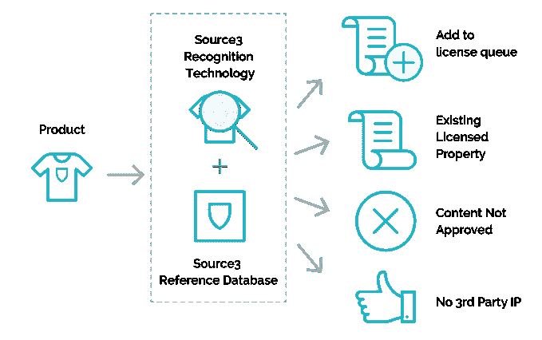

# 脸书收购 Source3，让内容创作者获得报酬

> 原文：<https://web.archive.org/web/https://techcrunch.com/2017/07/24/facebook-source3/>

脸书正处于吸引独立内容创作者通过新闻源分享其作品的风口浪尖。但它需要证明，它可以帮助创作者在不允许盗版猖獗的情况下将其内容货币化。这就是为什么它收购了内容版权管理初创公司 [Source3](https://web.archive.org/web/20230316161016/http://www.source3.io/) ，包括它的团队和技术。

这家初创公司解释说:“在 Source3，我们开始识别、组织和分析用户生成内容中的品牌知识产权，我们很自豪能够识别包括体育、音乐、娱乐和时尚在内的各个领域的产品。”它的技术使它能够识别用户创建的内容和商业市场中的品牌知识产权，使品牌能够衡量自己的存在或对侵犯其版权和商标的人采取行动。

现在，脸书发言人 Vanessa Chan 告诉 TechCrunch，“我们很高兴与 Source3 团队合作，并学习他们在知识产权、商标和版权方面的专业知识。”Source3 在其网站上宣布了这笔交易，被 [Recode](https://web.archive.org/web/20230316161016/https://www.recode.net/2017/7/24/16021448/facebook-acquisition-source3-video-rights-management-ip) 发现。该公司写道，“我们决定继续我们与脸书的旅程，”其团队将在脸书的纽约办公室工作。

 Source3 已经筹集了超过 400 万美元，主要来自 2015 年由 [Contour Venture Partners 牵头的种子轮融资。联合创始人 Patrick F. Sullivan 、 Benjamin Cockerham 和 Scott Sellwood 此前将他们的音乐版权管理平台 RightsFlow 出售给了谷歌。Source3 于 2014 年在纽约成立，最初是一家 3D 打印版权管理公司。但是在 3D 打印在消费市场停滞不前之后，它似乎已经将其范围扩大到了数字娱乐领域。](https://web.archive.org/web/20230316161016/https://www.crunchbase.com/organization/source3#/entity)

这个团队和技术可以增强脸书的版权管理软件，它像 YouTube 的内容 ID 一样工作，允许创作者对他们的视频进行指纹识别，然后阻止未经授权的上传到脸书 T2，或者从这些非官方拷贝中收取收入分成。Source3 可能有助于品牌和创作者通过 Rights Manager 识别其内容或知识产权未经批准的外观。

在上个月的视频会议上，[脸书宣布](https://web.archive.org/web/20230316161016/http://www.tubefilter.com/2017/06/23/facebook-launching-standalone-app-video-creators/)它正在开发一款特殊的独立应用，只为创作者与粉丝分享内容。虽然脸书已经拥有最大的受众群，每月 20 亿用户，但它必须证明，它可以向创作者支付足够的费用，使他们在社交网络上的投资值得。

这样做的一个机会是使用 Source3 的技术来识别这些网络名人穿着或使用的品牌，并将他们与这些品牌或类似的品牌联系起来，以达成赞助内容或植入式广告交易。脸书可以从这些交易中分一杯羹，允许它在不插入更多干扰性广告的情况下，将创作者的内容货币化。

随着 Vine 的消亡，Snapchat 的缓慢增长，以及 YouTube 在 PewDiePie 丑闻中与广告商的混乱，脸书和 Instagram 已经准备好成为内容创作者试图接触粉丝的中心枢纽。问题是，专为朋友照片和新闻链接打造的脸书，能否适应未来移动迷你电影明星的独特需求。